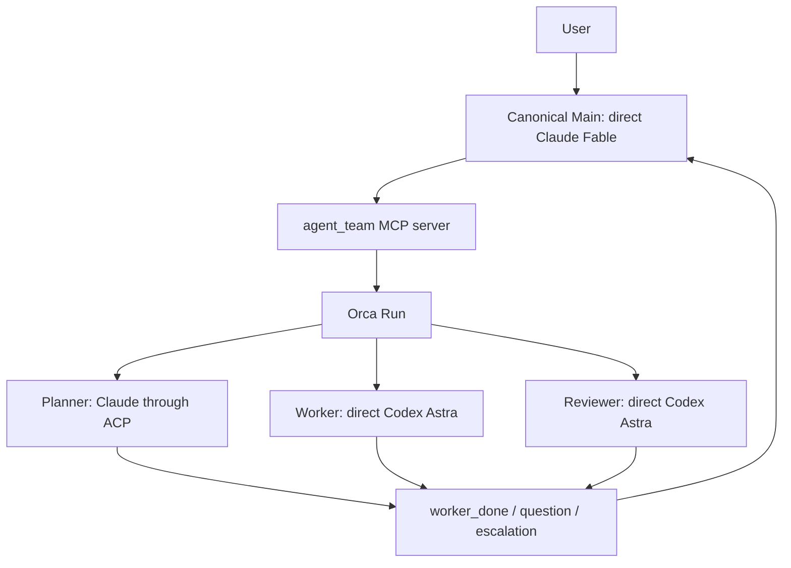

# Architecture

[日本語](architecture_JA.md) · [README](../README.md) ·
[Configuration](configuration.md)

## Runtime selection is explicit

`agent-team` separates orchestration from agent execution and selects the
backend from the version-3 `runtime` field. `runtime = "orca"` keeps the
existing four-role Orca contract. `runtime = "tmux"`, `"herdr"`, or `"zellij"`
selects an experimental native
path that requires direct Claude Main and accepts optional verified Claude ACP
Planner, Worker, and Reviewer roles. Native Worker assignments require an
exact TaskSpec from the config's `[[tasks]]` catalog. Other unsupported native
profiles are rejected before state, Task, Dispatch, or process effects are
created.

### Orca runtime

Orca owns the Run, Tasks, Dispatches, messages, and terminals. The launcher owns
role-specific arguments, private runtime state, and the bridge between ACP
completion and an Orca `worker_done` message.



### Experimental native terminal runtimes

`NativeBackend` owns the common Main/ACP/task lifecycle, while the selected
`TmuxBackend`, `HerdrBackend`, or `ZellijBackend` supplies the terminal driver.
`native_main` supervises the owned Main or program coordinator process group.
Native ACP Planner,
Worker, and Reviewer turns run as launcher-owned background processes. They
publish completion through `publish_completion`; terminal pane text or provider
status is never interpreted as a lifecycle event. Agent teams attach to Main;
Mainless program teams use `attach --coordinator`. ACP background roles do not
provide an attachable TTY.

The Herdr driver was verified with exact version 0.8.2 and protocol 20. It owns
a private headless server and uses a normal-shell bootstrap without faking
`HERDR_ENV`. Natural Main exit can remove Herdr's pane and workspace. An absent
pane is not stop proof: the owned server/socket and trusted Main process cleanup
must still be verified.

The Zellij driver was tested for compatibility with 0.44.1. Its preflight does
not require an exact CLI version; it uses detached mode with no persistent
client and no `--max-panes 1`. It holds Main metadata and accepts one terminal
plus the expected suppressed `zellij:link` plugin; unknown panes/plugins remain
unknown.

Named agent/serial and program/serial graphs are connected through version 5.
Native program/parallel is also connected as a Mainless version-5 program mode;
it does not create a second task ledger. The selected terminal hosts the
existing `native_main` supervisor, which supervises the fixed `_program-run`
coordinator argv. Main-agent parallel, named Orca graphs, and most of the ten
harnesses remain unfinished. Giving two systems ownership of the same worker
would make completion and cleanup ambiguous.

Native Claude ACP questions stay within the existing Task/Dispatch assignment.
Real-model question acceptance covers tmux; Herdr and Zellij have fake-provider
contract coverage for this feature. The named-native Reviewer consultation
answer path and serial/parallel program coordinator are connected by focused
tests. Bounded terminal/fake-provider parallel coverage is recorded below;
real-model parallel acceptance, named Orca, and all-harness requirements remain
pending.

### Named nodes and explicit TaskSpec routes

[Version 5](configuration-v5.md) separates `NodeRef(node_id, kind)` from the
fixed `Role` kinds. IDs identify nodes, assignments, resources, questions,
results, and deliveries; kinds determine stage and permission rules. Each node
has its own provider/model/effort/prompt/permission settings. Main uses exact
node IDs in MCP requests, and task routes bind each plan or implementation
stage to a particular writer/reviewer pair. A declared plan pair must be
approved before implementation; a route without that pair can omit Planner.

The configuration version is 5; named native serial state uses version 4, while
native program/parallel state uses version 5. The graph and `role_specs` cover
all configured nodes. Version-5 `roles` retains active assignments with a
per-node result, question, and pending Delivery container. Native runtime Task
UUIDs differ from logical `TaskSpec.task_id`; dispatch IDs bind their results to
the right logical task. State readers, publishers, and task gates reject missing
or mismatched IDs/kinds. Version-3 state retains its own contract and is not
migrated in place.

Real tmux run `ea85a811-dd06-4bd3-a1d6-f6156f5670ef` used direct Claude Main
`lead`, Workers `write-sum`/`write-product`, and Reviewers
`review-sum`/`review-product`, all explicitly Fable/high. Main was not the first
configured node. Both writers finished before either review began. The
`write-sum` assignment asked two questions and resumed in the same ACP session
after Main's answers and acknowledgment. Four distinct sessions produced typed
success/cleanup receipts. Both tasks were approved and verified by their
declared fixed argv at integrated revision
`73f695e5defd84158855ea581793b125263b7cac884d336bbba34637e4647f07`.
The observer confirmed only the two allowed fixture files changed, with the
workspace HEAD/index and other manifest entries unchanged. Public stop worked
after deleting the input config/prompts; independent checks found no owned
processes, groups, state, provider roots, snapshots, or fixture resources.

This is native agent/serial acceptance. Native program/serial coordination is
also connected in the implementation and has focused contract coverage. Native
program/parallel uses state version 5 with a delivery container for each active
node. `max_active`, exact node identity, and non-overlapping Worker write scopes
control admission; a pending question holds only its own assignment, so an
independent peer may continue when admitted. Completion delivery uses
`role_read` → `role_release` → `delivery_ack`, and a released assignment stays
in state until its matching acknowledgment. The private parallel Stop path
persists `native.phase=stopping`, drains safe assignments in that order, and
retains unknown identity, missing typed result, or unproven cleanup while
continuing safe peers.

Both program modes use the selected terminal and recorded coordinator identity;
they do not invent a Main role, Main model, or separate CLI. Program wave state
keeps declared `task_ids`, `phase`, and `revision`, and advances in declaration
and dependency order. All writers finish before the wave is sealed; all
same-revision reviewers must approve before fixed-argv verification, and only
then can the successor wave begin. Focused checks and bounded
real-terminal/fake-provider cases cover the native parallel contract; real-model
parallel acceptance remains pending. Agent/parallel and named Orca execution
are still rejected before dependency probes or resource creation.

Reviewer consultation is a separate named-native operation. `status` exposes
the opaque consultation ID, findings, task/stage, and answer state. The CLI
accepts `answer --consultation-id ID --body ...` for both named `agent` and
`program` teams. The ID is bound to the run, TaskSpec digest, review stage, and
exact review Dispatch. The body is limited to 16,000 characters. An answer is
idempotent only for the same body, and must redispatch the original writer
followed by another bounded review; it is never an implicit approval. At the
review-round limit, it may be recorded but cannot authorize another dispatch.

### Bounded native program trial

The real serial program trial `b239945b-283e-403b-aba5-84ba984c8469` used the
selected tmux terminal and the declared `write-sum` task. The task asked two
questions; two CLI `--message-id` answers were accepted, and the same ACP
session `b43cc938-c08a-432d-99ec-f6a4c6c2a8bd` reached `received`. Claude then
reported a Fable usage-limit failure. The coordinator published the failed
result, completed its `read` → `release` → `ack` handling, and exited with code
1. Implementation, review, and fixed-argv verification were not reached, so
this is a lifecycle/failure trial and not a successful end-to-end program
acceptance.

After the config and prompts were removed, public `stop` returned code 0 in
0.406 seconds. Independent `ps` and path checks found no owned PID, process
group, private path, fixture, or virtual environment. The observer itself
reported a command-identity error, so independent typed receipt fields were not
retained; the cleanup claim is limited to the native client accepted result,
the public stop result, and those process/path checks. No model switch or
billing change was made, and normal-auth write coverage was not verified. A
real-model read-only plan-only trial was not run after the usage-limit failure.

Focused program-contract checks now cover the serial and parallel program
paths, including admission, per-assignment state, delivery order, canonical
wave transitions, and private Stop cases. They validate the implementation and
contracts; they do not turn the failed serial trial into a real-model provider
run.

### Bounded native program/parallel terminal acceptance

An independent audit covers eight successful cases using real tmux, Herdr, and
Zellij terminal drivers with fake Node, client, and provider processes. This is
terminal and lifecycle evidence. It does not establish SDK-wire behavior,
real-model behavior, authentication, provider billing, or an operating-system
sandbox.

| Scenario | Terminal / Python | Run ID |
|---|---|---|
| Writers → review → fixed-argv verification → stop | Zellij / 3.13 | `ab237f28-c06f-4922-913a-2d4e4e776e11` |
| Writers → review → fixed-argv verification → stop | Herdr / 3.13 | `b321d505-0fef-475b-b546-446f59601ccb` |
| Writers → review → fixed-argv verification → stop | tmux / 3.13 | `0b1b54ab-4f03-4a45-94d0-fe556c6cc64c` |
| Writers → review → fixed-argv verification → stop | tmux / 3.11 | `6a22a03f-43da-47d8-9840-c5f65e554491` |
| Unanswered question A; peer B progresses; stop | Zellij / 3.13 | `ca873b0e-b63d-47e5-a78b-7e5f9a23a57b` |
| Unanswered question A; peer B progresses; stop | Herdr / 3.13 | `9262e0da-041d-4dfc-a4b1-d1b010bfac2e` |
| Unanswered question A; peer B progresses; stop | tmux / 3.13 | `1b0fb484-2b37-4878-a9b7-f34fb5adf92c` |
| Unanswered question A; peer B progresses; stop | tmux / 3.11 | `62b0e835-2c43-4e70-8cff-dd08051d5bd4` |

In each normal case, two writers were active simultaneously, wrote disjoint
files, drained before the canonical wave seal, reviewed the same integrated
revision `98795fc4bcb4f6e7e15d48e8d8470b73160bd858382ce1349103d3f6e9bdb082`,
passed fixed-argv reads and output assertions, completed both tasks, and
finished public Stop. The independent audit found 11 known PIDs, 9 process
groups, and 20 paths absent per normal run. Fixture roots were gone and source
manifests were unchanged.

In each question case, the audit captured both runner and client PID/argv,
process group, and kernel-parent evidence before the B-side barrier release.
Assignment A stayed unanswered while B produced output and acknowledged its
completion. Public Stop preserved the unanswered state and did not fabricate an
answer or acknowledgment. The pre-stop snapshots showed A running and B
awaiting implementation review; neither snapshot was treated as Task
completion. The audit found 7 known PIDs, 5 process groups, and 12 paths absent
per question run. Fixture roots were gone and source manifests were unchanged.

The latest matrix includes two shared guard fixes: the atomic read
`lstat` → `open` path allows up to three attempts (initial read plus two
retries) for a legitimate rename under the same guard, and `_wait` performs a fresh state read after process exit before
accepting a matching publication. Reproduce a selected case with:

```
AGENT_TEAM_RUN_LIVE_NATIVE=1 AGENT_TEAM_RUN_LIVE_PROGRAM=1 \
AGENT_TEAM_LIVE_RUNTIME=tmux \
uv run --locked --project scripts/agent-team python -m unittest discover \
-s scripts/agent-team/tests -p live_parallel_program.py -v
```

The latest focused checks passed 263 tests on each of Python 3.11 and 3.13.
The formal `tests/run.sh` suite also passed on both versions: 1,025 package
tests, 33 CLI tests, 33 MCP tests, 8 compact-runner tests, and all applicable
shell, source-state, rendered-home, and Nix checks. The 194 source-manifest
entries stayed unchanged during these runs. Only documentation wording was
updated afterward and rechecked. Build, clean-install, and current-head CI
results are tracked in [PR #7](https://github.com/iamtatsuki05/dotfiles/pull/7).
Real-model parallel acceptance remains pending separately from this bounded
terminal/fake-provider coverage.

The first Zellij run `f678e9f5-9fbb-4376-a18a-1855612ba69b` exited before
review; its exact reason was not preserved. A later startup capture
`1d4a1e5b-9c8f-4c4e-be00-84eb69a12df1` had no child receipt and public Stop
failed. Manual exact-owned-server cleanup verified the known PID, process-group,
path, and workload-scope checks; `descendants_stopped=false` remains retained.
These failed artifacts do not prove an unobserved descendant cleanup or a
causal explanation for the first exit. State and terminal resources are gone,
while inert failed fixtures remain retained.

The earlier terminal/fake-provider suite is historical evidence separate from
the eight-case parallel audit above. It passed five lifecycle and question
cases on tmux, Herdr, and Zellij without provider or authentication calls.
Zellij's startup test also covered a temporary-name suffix beginning with an
underscore; the producer supplied a valid prefix while the strict path
validator remained unchanged. It does not replace the pending real-model
parallel acceptance. Full validation uses the documented Python 3.11 and 3.13
suites, lint, type checking, build, and clean install; current-head results
and CI are tracked in [PR #7](https://github.com/iamtatsuki05/dotfiles/pull/7).

### Bounded live question acceptance

The real-model tmux run `dc101afd-87bf-4697-9bbb-0d1339d381a8` used Fable at high effort
for Main, Worker, and Reviewer, with Planner omitted. Main answered and
acknowledged a batch of two Worker questions; the same Worker ACP session
continued. Reviewer approved revision `983bcea3d92dcdd37212f3ba72f6e54092f2323aa1170a11da67cbbe98dc900e`,
the declared fixed-argv verification passed on that revision, and the Task
completed in 86.762 seconds. Only the declared calculator file changed. Public
stop completed in 1.513 seconds after config and prompt deletion; the two
assignment result artifacts confirmed ACP session cleanup, and independent
checks found no owned processes, groups, paths, state, fixture, or environment.
This acceptance used the cooperative cancellation and publication-wait fixes.

A separate run, `e808db06-50b0-4744-a24d-0ebf7408b63d`, held two questions unanswered
and unacknowledged, then stopped through the public command in 1.435 seconds.
The typed ACP receipt reported `cleanup_confirmed=true`, and native-result
validation confirmed the bound session and client exit status. Independent
checks found all seven observed owned processes and three process groups gone,
with no state, private paths, fixture, environment, or process references left.
The tested wheel matched all 63 runtime source files. Its Python 3.11 clean
install contained only `dotfiles-agent-team`.

Earlier pending-stop attempts `1000018d-3ae0-4d62-b2af-a5c89be31c6a` and
`c945f3f5-8dcf-4643-a05a-72d1a62bab78` failed. Although their ACP receipts
reported `cleanup_confirmed=true`, Python lost the client exit status, so
publication remained unconfirmed. The public stop's `returncode=1` does not
identify the client exit code. Their workload processes exited and the owned
idle tmux terminals were later removed; the failed state, private root,
snapshot, artifact, and fixture remain retained. The successful reruns do not
change those earlier outcomes.

## Components have narrow responsibilities

| Component | Responsibility |
|---|---|
| `config.toml` | Declares fixed roles, providers, transports, models, efforts, prompts, permissions, and native `[[tasks]]` entries. |
| `agent_team/config_v4.py`, `topology.py` | Validate named team catalogs and render their graphs. Runnable catalog entries explicitly reference a matching version-3 launch configuration. |
| `agent_team/config_roles.py`, `config_v5.py`, `named_graph.py` | Validate node-local role settings, exact graph identities and task routes; compile selected version-5 teams and render their graphs. |
| `agent_team/cli.py` | Parses and validates config/arguments, selects `WorkflowEngine(OrcaBackend)` or the selected native terminal backend, renders compatibility JSON, and runs ACP turns. |
| `agent_team/backend.py` | Owns the Orca `start`/`status`/`attach`/`stop` workflow adapter, state-v3 identity checks, and compatibility receipts. |
| `agent_team/native_backend.py` | Owns the shared native `start`/`status`/`attach`/`stop` path, ACP assignments, completion publication, and cleanup checks. |
| `agent_team/native_terminal.py` | Defines the shared terminal receipt, inspection, presence, and close protocol. |
| `agent_team/tmux_backend.py`, `herdr_backend.py`, `zellij_backend.py` | Bind NativeBackend to the selected terminal driver. |
| `agent_team/herdr.py`, `zellij.py` | Verify the exact Herdr 0.8.2/protocol-20 handshake and the Zellij driver identity/cleanup contract tested with 0.44.1. |
| `agent_team/native_main.py` | Supervises the owned native Main process group or the program coordinator child and publishes its exit receipt. |
| `agent_team/native_program.py`, `program_policy.py` | Drive a saved native `program` graph through serial or parallel TaskSpec waves without a Main model or a second task ledger. |
| `agent_team/native_delivery.py` | Resolves version-3/4 root deliveries and version-5 per-node result, question, and pending Delivery containers. |
| `agent_team/parallel_admission.py` | Applies version-5 `max_active`, exact-node, and non-overlapping Worker-scope admission checks. |
| `agent_team/orca.py` | Owns the fixed Orca argv/envelope decoder. It does not own MCP role operations. |
| `agent_team/tmux.py` | Creates and inspects one private, nonce-tagged tmux server and its Main pane. |
| `agent_team/locking.py` | Owns the stable per-team lifecycle reservation, shared by state writes and runtime operations without importing a backend. |
| `agent_team/cleanup.py` | Owns the private stop journal, startup-recovery sidecar, and exact local cleanup/rollback phases. |
| `agent_team/mcp_protocol.py` | Owns shared MCP schemas, JSON-RPC framing, and lazy backend-independent serving. |
| `agent_team/mcp_server.py`, `native_mcp.py` | Map the ten Main-facing tools to the selected Orca or native backend while preserving the shared lifecycle reservation. Native task tools are implemented by the native backend; Orca does not silently emulate them. |
| `agent_team/task_spec.py` | Validates the exact immutable TaskSpec schema and its path/verification fields. |
| `agent_team/task_execution.py` | Persists TaskSpec digests, dependency admission, review decisions, and per-stage round limits. |
| `agent_team/task_verification.py` | Runs declared fixed argv against the approved workspace revision and records bounded evidence. |
| `agent_team/workspace_revision.py` | Creates a bounded Git workspace revision and rejects symlinks and special files. |
| `agent_team/scoped_acp.py`, `scoped_policy.mjs` | Bind native role profiles and share TaskSpec path-policy checks. |
| `agent_team/claude_scoped_agent.mjs`, `scoped_file_tools.mjs` | Enforce Claude tool hooks and the four Codex host file tools, respectively. |
| `agent_team/scoped_acp_client.mjs`, `scoped_question_client.mjs` | Open one direct public ACP SDK connection per native assignment, handle the selected Claude form elicitation, and confirm cleanup. |
| `agent_team/native_question_channel.py`, `native_questions.py` | Own the bounded private question socket and the durable native question outbox/receipt contract. |
| `agent_team/native_acp_dependencies.py` | Resolves only the selected native provider's Node, ACP adapter, SDK, and required provider binary with exact fingerprints. |
| `agent_team/codex_preflight.py`, `codex_acp.py` | Validate existing file authentication/configuration and bind private Codex launch artifacts. The public Codex ACP profile remains disabled. |
| `agent_team/codex_scoped_launch.mjs`, `codex_scoped_inspect.mjs`, `codex_scoped_transport.mjs`, `codex_scoped_bridge.mjs` | Fix app-server startup, inspect effective configuration, and mediate bounded ACP/app-server traffic and file-tool requests. See the [Codex ACP implementation status](acp.md#scoped-codex-acp-implementation-not-enabled). |
| `agent_team/runtime.py` | Shares identity, private-file, state-v3/v4/v5, command, environment, and cleanup safety helpers; state writes take the shared reservation unless the caller already holds it. |
| `agent_team/process_identity.py` | Reads exact argv tuples on Linux and macOS so native ownership checks do not rely on display text. |
| `agent_team/registry.py` | Records recognized harnesses and exact verified role profiles; it never falls through to another provider. |
| `agent_team/adapters.py` | Provides the provider-independent background seam, bounded process runner, exact identity checks, and Copilot/OpenCode read-only adapters. It has no Orca lifecycle authority. |
| `agent_team/acp_dependencies.py` | Resolves selected ACP dependencies, verifies exact package manifests, and records absolute executable paths with SHA-256 fingerprints. |
| `agent_team/defaults/` | Bundled config and Japanese prompts used when no user config is selected. |
| `prompts/*.md` | Defines the Japanese role contracts. |
| Orca | Stores the Run/Task/Dispatch lifecycle and owns managed terminals. |
| Node.js, `acpx`, `claude-agent-acp` | Run the pinned Orca Claude ACP adapter through the saved executable binding and return final text plus an exit status. |

Orca's Copilot read-only Planner and Reviewer profiles run through the common
Orca lifecycle and state-v3 snapshot integration. The OpenCode provider adapter
is also implemented, but remains rejected until its profile-specific boundary
and lifecycle are verified live. Native runtimes do not enable these profiles: they
accept only direct Claude Main and optional verified Claude ACP
read-only Planner/Reviewer roles plus the scoped workspace-write Worker. The
direct background profiles run one fixed provider invocation against a fresh
read snapshot rather than a TUI terminal or ACP session. That snapshot excludes
`.git`, symlinks, special files, ignored files, secret-like paths, provider
configuration, and agent instructions; native Worker scope is derived from its
declared TaskSpec instead.

## Canonical Main is direct Claude and the only user-facing agent

In the canonical config, Main starts as a direct Claude process with the
`agent_team` MCP server and no Bash tool. A custom config may select direct
Codex Main; it keeps the same fixed MCP surface but uses Codex-specific launch
and permission settings. In either case, Main is the only user-facing role.
Native Main receives the user-declared `[[tasks]]` catalog in its startup
instructions and cannot invent a task ID, scope, dependency, or verification
command at dispatch time.

The bundled defaults use `fable` for Main and Planner and `gpt-6-astra` for
Worker and Reviewer. The role graph does not change those launch-config model
choices.

The MCP server exposes ten tools:

- `task_get`
- `task_verify`
- `task_dispatch`
- `role_get`
- `role_prompt`
- `role_wait`
- `role_read`
- `role_release`
- `delivery_ack`
- `message_reply`

Main cannot choose an arbitrary command or role name through this MCP surface.
For native runtimes, `task_dispatch` accepts only an exact TaskSpec from the
config-declared catalog. The fixed surface keeps agent output separate from
process-control authority.

## Orca direct roles use Orca-supervised terminals

In `runtime = "orca"`, Worker and Reviewer use direct Codex.

1. The MCP bridge creates an Orca Task.
2. It starts a launcher-owned Codex terminal with an isolated `CODEX_HOME`.
3. It waits for the TUI and configured model/effort to become ready.
4. `worker-start` binds the terminal to the Task and creates a Dispatch.
5. Orca injects the task and lifecycle commands.
6. The role reports `worker_done`, `question`, or `escalation`.

Codex roles inherit either the built-in `:workspace` or `:read-only` profile.
Only the current Orca Unix socket is added to the profile; no external domain
is allowed by agent-team.

In a native runtime, direct Claude Main runs under the selected terminal backend
and the `native_main` supervisor. Native Worker and Reviewer roles are Claude
ACP background assignments; native runtimes do not provide direct Worker or
Reviewer roles.

## ACP roles use a bare Dispatch and a trusted runner

In `runtime = "orca"`, the canonical Planner uses Claude through ACP. acpx is
not an Orca-recognized TUI, so agent-team uses a bare terminal without
pretending that it is a supervised native agent. In a native runtime, each
selected Claude ACP Planner, Worker, or Reviewer uses the native public SDK
client, without a TTY or pane-based completion path.

Before starting an Orca ACP role, startup requires Node.js `22.13.0` or newer
and the exact `acpx@0.13.2` and
`@agentclientprotocol/claude-agent-acp@0.70.0` packages. It resolves only the
selected Orca roles' `node`, `acpx`, and `claude-agent-acp` files, verifies
their package manifests, and stores absolute paths with SHA-256 fingerprints.
The Orca role-start path rechecks that binding before creating the Orca Task.

Native runtimes have a separate dependency binding: Node.js `22.0.0` or newer,
`@agentclientprotocol/claude-agent-acp@0.70.0`, and its dependency
`@agentclientprotocol/sdk@1.3.0`. It resolves and fingerprints `node`, the
Claude ACP entrypoint and `dist/lib.js`, and the SDK entrypoint. Native does not select or invoke
`acpx`, `npm`, or `npx`. Both paths use saved files and fail closed on missing
or changed dependencies; direct-only launches do not resolve ACP dependencies.

For the Orca path:

1. The MCP bridge creates a Task and a private prompt sidecar.
2. It creates a launcher-owned bare terminal.
3. `orchestration dispatch` binds the Task and terminal with `injected=false`.
4. The bridge saves the assignment before sending the trusted runner command.
5. The runner creates an acpx session, selects model and effort, submits the
   prompt through stdin, and reads `--format quiet` output.
6. The runner closes and prunes its exact acpx session.
7. The runner, not the agent text, sends one matching Orca `worker_done`.

For the native path, a private pipe gate holds the child until the backend
has validated and durably saved its PID, private process group, and exact argv.
Only then does the gate execute the ACP runner. Startup rollback signals a
process group only when ownership is proven; uncertain state remains retained.
Native dependency binding stores Node, the Claude ACP entry, its actual
`dist/lib.js` import, and the nested SDK entry with four fingerprints. The
runner imports the saved public SDK entry and
uses one direct connection for the assignment:

```text
initialize -> session/new -> set model/effort -> prompt -> session/close
-> connection close and bounded child cleanup
```

It then calls `publish_completion` with the matching Run, Task, Dispatch,
terminal, and nonce identity. `native_backend` turns that durable result into
the shared `worker_done` event; terminal pane text is never used as completion
evidence. Native SDK persistence is disabled with `persistSession=false` and
`autoMemoryEnabled=false`; the interactive Main's normal Claude history remains
in the normal store. This is a direct SDK connection, not the provider's
direct/model transport.

The agent command includes a team/role/nonce marker. Orca pruning is restricted
to that exact command, so unrelated acpx sessions are not removed. Native
cleanup instead verifies the runner's exact argv and private process group;
there is no native acpx session store to prune.

### Native Claude questions stay inside the assignment

When the selected native provider is Claude ACP 0.70.0, the SDK 1.3.0 client
can expose Claude's `AskUserQuestion` through the existing ACP form elicitation
request. This capability is enabled only when the assignment owns its private
`q.sock`; the Task, Dispatch, role, permission, and TaskSpec do not change.
Codex ACP has no question socket or question capability.

The exchange is deliberately ordered:

```text
AskUserQuestion/form -> private q.sock -> durable native question outbox
  -> role_wait(question) -> message_reply for every message_id
  -> delivery_ack -> answer on q.sock -> Node received
  -> Python durable receipt (IDs/hashes; protected outbox retained)
  -> Node recorded
  -> the same ACP session resumes
```

`message_reply` stores each answer before it is released to Node. Retrying the
same `message_id` with the same body is idempotent; reusing it with a different
body is rejected. Main must answer every question in the batch before
`delivery_ack`. A batch contains one to four questions; each question or answer
is at most 20,000 characters, each JSONL frame is at most 512 KiB, and one
assignment may receive at most 64 batches. After consumption, the assignment
receipt keeps the message, session, delivery, and tool-call identities plus
question/answer hashes. The protected outbox may retain the raw question and
answer text until the next question or terminal completion so a post-replace
fsync or `recorded` publication failure can be recovered; the receipt itself
does not contain that raw text.

While a question Delivery is pending, that assignment's `role_read`,
`role_release`, and another dispatch for that assignment are rejected. A
question is communication in the same assignment; it does not widen the
existing file scope, Bash policy, or other external-tool policy. A successful
completion is also rejected until the question has been consumed by the ACP
client. In version-3/4 native serial state, the pending question also blocks
the next dispatch for the run. In version-5 native `program`/`parallel`, an
independent assignment may continue when it passes `max_active` and
write-scope admission, but `task_verify` remains run-global blocked until every
active assignment and Delivery is drained.
The normal completion path stays
`role_wait(worker_done)` → `role_read` → `role_release` → `delivery_ack`.

`role_wait` waits for question/completion publication locks within its own
deadline. It rechecks the state and notification identity after acquiring the
lock. An expired wait does not observe or acknowledge a notification; a saved
stop or an invalid lock remains an error.

Stopping during a question marks the outbox as explicitly cancelling. It does
not fabricate an acknowledgment. The assignment and state are removed only
after provider, process-group, socket, and private-root cleanup are proven;
unknown cleanup preserves the state for inspection. A Main answerable question
is separate from a question that only the user can decide. For a named-native
Reviewer `decision=consult`, the saved status exposes a bounded opaque
consultation ID and the actual findings. `answer --consultation-id ID --body ...`
stores one answer bound to the current review Dispatch; same-body replay is
idempotent, replacement and stale IDs are rejected, and the original writer
must run again before another Reviewer decision. Review-round limits are not
reset; an answer at the limit cannot authorize another dispatch.

The native client publishes a fixed private-root `client-result.json` before
writing ordinary stdout. It is a current-user-owned mode-0600 file, created
atomically without overwrite, limited to 1 MiB, and bound to the launch nonce,
requested model, and effort. Exit code 0 means a typed success, 1 a typed
failure, and 2 publication uncertainty. Python must retrieve and verify the
artifact, client exit status, stdout parity at retrieval, session identity,
and process-group proof together. A signal, an Event, or an artifact by itself
is not cleanup evidence. Missing, damaged, mismatched, uncertain, or
cleanup-unconfirmed evidence retains the assignment and private root.

The scoped native runner's signal handler only sets the per-run
`threading.Event`. An explicit ProcessRunner checkpoint starts cleanup exactly
once; once cleanup starts, asynchronous exceptions do not interrupt it. The
runner signals the Node client leader first so it can cancel the ACP prompt and
close the session, drains the client streams for a bounded period, and only
then escalates to the owned process group when the leader is still live. The
Event is a control request, not proof that cleanup completed. No separate raw
signal management API is exposed.

The channel stores `received` after validating the client receipt and stores
`recorded` only after the `recorded` frame is sent successfully. A failure while
only `received` retains the raw protected outbox; the wire fields do not change.

Native publication writers use a bounded 1.5-second reservation wait for
contention and do not retry provider or state operations. Status, attach,
resume, and stop preparation inspect resources read-only outside the lock,
then reacquire and recheck the current `run_id`, `main_process`, phase, and
receipt; final stop remains serialized where required. Callback exceptions are
converted to bounded non-sensitive typed failures. Result memory retains only
the typed receipt/artifact information needed to reconcile publication,
cleanup, and stdout parity.

`process_attempted` is captured before `Popen`, and `completed_returncode` is
recorded only after process exit and process-group proof. Public stop writes
`native.phase=stopping` before signaling. Under the publication reservation,
`stopping` takes precedence over a concurrent provider success: Reviewer
evidence is discarded, the saved outcome is `failed`, and no answer or
acknowledgment is fabricated. The CLI's 0/1 result is derived from that saved
outcome.

Native Claude provider-private roots are allocated directly below `/tmp` (the
canonical `/private/tmp` path on macOS), rather than below the caller's
possibly deep `TMPDIR`. This keeps the private `q.sock` within the Unix socket
path limit even when `TMPDIR` is long; the root remains mode 0700 and the socket
mode 0600. Codex allocation continues to use its configured temporary
directory. Existing temporary-provider cleanup checks still validate the
current UID, object type, and directory-descriptor ownership; this is not a
user configuration knob.

The previously completed real Claude workflows, their successful completion
receipts, and their verified stop observations remain valid for those runs.
This boundary narrows the interpretation of historical active-cancel evidence;
it does not retract the completed workflow evidence.

## Native TaskSpec and review gates are durable

Native users declare complete TaskSpecs in the version-3 config as
`[[tasks]]` tables, with one or more `[[tasks.verification]]` tables for each
fixed-argv check. The exact fields are `task_id`, `objective`,
`acceptance_criteria`, `allowed_paths`, `forbidden_paths`, `dependencies`,
`verification`, `evidence_requirements`, and `consultation_conditions`.

Startup validates unique task IDs, exact fields, declared dependencies, and
dependency cycles before state or provider effects. The catalog is included in
Main's native instructions. `task_dispatch` must exactly match one declared
TaskSpec; it cannot add a task ID or change paths, dependencies, evidence, or
verification argv. When no `[[tasks]]` catalog is present, read-only
`role_prompt` remains available but structured task dispatch is rejected. Orca
rejects the `tasks` field.

The native flow is:

```text
task_dispatch(Planner or Worker)
  -> role_wait -> role_read -> role_release -> delivery_ack
  -> task_get
  -> task_dispatch(Reviewer) for plan or implementation review
  -> task_dispatch(Planner or Worker) after request_changes
  -> task_verify after implementation approval
```

Planner and Worker results become `awaiting_plan_review` and
`awaiting_implementation_review`. Reviewer output is one exact JSON object with
`task_id`, `stage`, `revision`, `decision`, and `findings`. `approve` advances
the stage, `request_changes` returns to the original writer, and `consult`
requires user input. Plan and implementation review rounds are separate and
both obey `max_review_rounds`.

Implementation review binds to the workspace revision captured when its
Reviewer assignment is prepared. `task_verify` requires implementation
approval, no active role or Delivery, and the same revision. It runs every
declared argv with `shell=False`, checks the revision before and after commands,
and stores bounded errors plus stdout/stderr SHA-256 hashes. The task becomes
`completed` only when all commands pass and cleanup is confirmed.

Program waves use the same gates across all tasks in a declared integration
wave. A plan review may unblock its implementation writer during the writers
phase. A plan-only route (a route with only `plan_writer` and `plan_reviewer`)
keeps the plan body SHA-256 in `record.revision` and stores the code snapshot
reviewed by the final plan Reviewer in `workspace_revision`. In a mixed wave,
the final plan-only review waits until every writer finishes and is sealed to
the same workspace revision as the implementation review. Fixed-argv
verification uses that exact revision. A plan retry returns to the exact
Planner, preserves the plan review round, and never synthesizes an
implementation writer.

## Lifecycle advances only on matching identities

For Orca and native serial state (version 3/4), at most one background role can
be active. A new role cannot start while an assignment or an unacknowledged
Delivery exists. Version-5 native `program`/`parallel` may hold up to
`max_active` admitted assignments.

```text
role_prompt
  -> role_wait
     -> worker_done: role_read -> role_release -> delivery_ack
     -> question: message_reply(all) -> delivery_ack
        -> q.sock answer -> received -> recorded -> same ACP session -> role_wait
     -> escalation: retain evidence and stop for user review
```

`worker_done` is accepted only when Task, Dispatch, sender terminal, and Run
match the active assignment. `question` and `escalation` are not completion.
A failed worker outcome is terminal for that Dispatch but is not successful
work.

The native backend follows the same `role_read` → `role_release` →
`delivery_ack` order. Its `native.last_ack` field stores the one acknowledged
Delivery receipt marker; it is an audit marker, not Task completion or proof
that the user's overall goal is complete.

For a native question, the Delivery remains pending until every answer is
durably saved and acknowledged. The backend then releases the saved answers
through the owned socket and records the client's `received`/`recorded`
handshake before the ACP prompt may continue. The same assignment and ACP
handshake before the ACP prompt may continue. The `received` receipt records
the hash-only receipt while the protected outbox remains available until the
next question or terminal completion. The same assignment and ACP session
resume; a new Dispatch is not created.

The channel has an internal `received` → `recorded` phase. It stores
`received` after the client receipt is validated, and stores `recorded` only
after the `recorded` frame is sent successfully. A failure while the phase is
only `received` keeps the raw protected outbox for recovery. The wire fields do
not change.

## State is private and launch-scoped

The launcher writes version-3 runtime state below:

```text
$XDG_STATE_HOME/agent-team/<team-id>/state.json
```

The default base is `~/.local/state/agent-team/`. The state snapshot records the
workspace, config path, Run, Main terminal, role specifications, and active
assignment. Model, effort, permission, and instructions are copied at launch;
an ACP runner does not reinterpret a changed config during the same team run.

An Orca ACP role specification stores the resolved absolute `node`, `acpx`, and
`claude-agent-acp` paths and their SHA-256 fingerprints. A native ACP role
stores absolute `node`, Claude ACP entry and library, and SDK dependency paths with the same binding
check. Each runner uses and verifies its saved binding; missing or changed
files fail closed.

ACP prompt sidecars and state files are current-user-owned private files.
State writes are atomic and fsync their parent directory after replace. Prompt
reads use non-following file descriptors.
Codex runtime homes are isolated below the same team directory.
If the replacement succeeds but directory durability is unknown, the state is
treated as published and the startup marker is retained for management retry.

Native state stores a selected-terminal receipt and the supervised Main process
receipt. Native ownership checks compare the saved executable, private process
group, exact argv, and frozen `supervisor_argv`; `process_identity.py` supports
these argv checks on Linux and macOS. ACP assignments store their runner PID,
process group, argv, prompt sidecar, TaskSpec scope, question socket, and
private cleanup roots until `role_release` or explicit cancellation confirms
cleanup. Consumed question receipts retain identities and hashes; raw question
and answer text remains only in the protected outbox until the next question or
terminal completion allows its removal.

## Failure handling is fail-closed

- If role startup cannot confirm remote rollback, it retains the assignment and
  private resources. Before a complete assignment exists, `pending_role_start`
  records only known resource identities. `status` shows `cleanup_pending`, and
  another role launch or team-state deletion is blocked. Resolving this unknown
  outcome is not automated; deleting the record to force a restart is unsafe.
- A partial start stops or closes only resources whose exact IDs were returned.
- Cleanup errors are reported together with the original failure.
- CLI and MCP stateful operations share a stable per-team reservation outside
  the removable state root; management operations re-read state under that
  lock and MCP holds it through remote effects and save/rollback.
- Worker-stop and terminal-close require typed identity/process-stop verdicts;
  an agent terminal already closed by worker-stop is not closed twice, and an
  unconfirmed PTY keeps the journal and local resources for recovery.
- Method-specific `terminal_*`, `dispatch_not_found`, `run_not_found`, and
  `task_not_found` absence codes are normalized as read-only absence; stop
  persists the affected stage as unknown and never treats absence as process
  success.
- A durable startup marker is written before Main terminal creation; a lost
  create response keeps local preparation and blocks the next start until an
  explicit no-tab close receipt proves `ptyKilled=true`.
- Startup recovery never treats a stale/gone read-only terminal show as process
  stop proof; local homes remain until a verified close receipt is durable.
- Signaling an active Main requires a saved supervisor argv, PID/PGID, launch
  nonce, and phase. Older native state lacking these fields is retained and
  fails closed; it is not reconstructed or migrated automatically. Stop it
  with the matching executable/version before upgrading.
- CLI runtime errors use fixed classifications and the existing `ERROR: <message>`
  body with an explicit bound; Orca stderr/stdout, argv, IDs, paths, and control
  characters are never rendered. The redaction/legacy-body golden is covered by
  the CLI compatibility tests.
- ACP subprocesses and native Main run in private process groups; normal exit,
  cancellation, and timeout/output-limit paths verify and reap descendants
  before returning.
- Native Worker Read/Glob/Grep can read the workspace with protected-path and
  link/file-type checks. TaskSpec `allowed_paths` and `forbidden_paths` restrict
  Write/Edit only, with forbidden paths taking precedence for writes. Bash, terminal, and
  other RPC operations are denied. This is an in-band tool boundary rather than
  an operating-system sandbox, and does not protect against a hostile same-user
  process swapping files concurrently.
- Workspace revisions reject symlinks and special files and are limited to
  5,000 files, 10 MB per file, and 100 MB total. The guard does not cover an
  arbitrary repository.
- The Orca and native runtimes fail fast on Windows. Their contracts
  require POSIX Unix-socket or process-group semantics.
- Orca CLI selection is deterministic: `orca` on macOS and `orca-ide` on Linux;
  there is no silent PATH fallback or environment override.
- The ACP child receives a small environment allowlist, including `HOME` for
  ambient Claude login but excluding API keys and Orca control variables.
- `stop` validates the exact private team root and removes entries without
  following symlinks. Special files and ownership mismatches are rejected.
- The Orca Run remains after stop as an audit record. Native runtimes remove their
  local state only after the owned Main and ACP resources have verified exit.
- If verification is interrupted or cleanup is unconfirmed, the task remains
  `verifying` or `verification_failed` with the available evidence. New roles,
  verification, and stop are blocked as required; automatic recovery is not
  claimed. A `verification_failed` task with valid executed-command evidence and confirmed
  cleanup may return to Worker within the implementation review-round limit.

CLI lifecycle operations use `WorkflowEngine` with the backend selected by
`runtime`. Orca role operations use `mcp_server`; native role operations use
`native_backend` through `native_mcp`. Both paths share the typed contract,
state, and reservation helpers. The role methods on the abstract backend
contract are not a separate user-facing protocol.

The shared MCP protocol records each observed Delivery and enforces reading the
result, releasing the owned role resources, and then acknowledging completion.
Native questions require every `message_reply` before acknowledgment; only
after `delivery_ack` does the private channel release the answers and record
the consumed receipt. The question assignment's `role_read`, `role_release`,
another dispatch, and verification are blocked while that question Delivery is
pending. In version-5 native `program`/`parallel`, an independent admitted
assignment may continue, but `task_verify` remains blocked until every active
assignment and Delivery is drained. Escalations remain pending. Failed operations retain
their pending state. MCP framing and tool schemas load
without selecting a backend; the first stateful call selects Orca or the
selected native runtime from saved state. Native `status`, `attach`, and `stop`
inspect or operate the selected driver's owned resources.

When Orca returns `retained`, the assignment stays pending and the launcher does
not close the terminal. A `no_owned_resource` result for an Orca launcher-created
background terminal still needs an ownership-aware release path; its cleanup is
not treated as successful. Native release requires the ACP runner to have
exited and its cleanup receipt to be confirmed before the assignment is removed.

If a role-start or release response is lost, inspect the recorded Dispatch and
terminal before retrying. Role operations do not provide automatic crash
replay or an exactly-once guarantee. SQLite coordination, schema migration,
and general backup/restore are outside this runtime; Orca owns coordination
and the launcher retains its existing private version-3 state.

## Security limits remain explicit

ACP is a communication protocol, not a sandbox. The native Worker therefore
uses an in-band policy around public SDK tool calls. Read/Glob/Grep can read
the workspace with protected-path and link/file-type checks; they are not
limited by TaskSpec path lists. Write/Edit are limited to `allowed_paths`,
with `forbidden_paths` taking precedence for writes. Bash, terminal, and other RPC calls are
denied. The policy does not provide kernel-level protection from a hostile
same-user concurrent file swap. Orca workspace-write remains direct Codex with
provider-native permissions; native write is limited to the scoped Worker.
Question handling is additional communication only: it does not widen
TaskSpec file scope or enable Bash, terminal, or other external tools. The
question socket is private to the owned assignment and is enabled for Claude
only; Codex question capability remains disabled.

The earlier model-free tmux terminal lifecycle was verified with Orca and Codex absent,
including a workspace path containing spaces and a deleted config. On
2026-09-07, a Python 3.13.15 wheel-only environment with real Claude Code
2.1.261 `fable`/`high` completed six native Planner/Worker/Reviewer assignments:
the intentional `a-b` implementation was rejected, `a+b` was approved at the
same revision, and trusted fixed-argv verification succeeded. Public stop
after removing the original config and prompts found no owned processes or
artifacts. The repeat included the startup catalog, the durable
PID/PGID/argv gate, and the four-file dependency binding. Its separate npm
installation had only selected Claude ACP packages and dependencies. A separate
active-cancel probe using the same final runtime stopped a live Worker with zero owned processes and
artifacts. A direct SDK probe confirmed allowed-path edit and forbidden-path
denial with SDK persistence and auto-memory disabled. This was the earlier
tmux-generation proof at `308b1ba`. The historical active-cancel probe verified
owned OS process-group and path cleanup, but did not prove an explicit ACP
session close; the earlier Python stop path promoted process-group exit to
session cleanup, so it is not session-close evidence.
Separate public CLI tests with fake Main and fake Node passed for each of tmux,
Herdr, and Zellij under Python 3.11 and 3.13: read/release/ack, active
cancellation, and natural Main exit followed by original config/prompt deletion
and cold status/stop. Independent checks found no owned PIDs, sockets, state,
config, or private roots. These are fake-provider terminal proofs.

Separate real Claude Code 2.1.261 workflow runs for Herdr and Zellij used
isolated Python 3.13.15 wheel-only environments with Node 22.23.2, Claude ACP
0.70.0, SDK 1.3.0, and Claude SDK 0.3.232 selected. Each direct Claude Main
used Fable 5.1 at high effort with the Claude Max header and completed six
autonomous Planner/Reviewer/Worker assignments. Trusted fixed-argv verification
returned `FIXED_ARGV_OK`; the TaskSpec catalog, Worker scopes, protected files,
and kernel identities remained consistent. Public stop after deleting the
original config and prompts left no owned PID/PGID, state, socket, or private
path; normal interactive Main history remained and automated SDK calls used
`persistSession=false`. The 51 runtime package files byte-matched the built
wheel (`655c3bc3c24a278c366cd6282bb2870d10129806f6f312d765329463b47afb7b`);
the selected ACP dependency audit inspected 122 package metadata records.
The dependency inventory confirmed no unselected packages; separate runtime
`PATH` checks confirmed no unselected CLIs, `npm`, `npx`, or `uv`.
Herdr's first attempt pasted the text and Enter together
but left the text in the paste field; a separate Enter then submitted that same
initial message. No additional instructions were sent; typed verification
completed, but its final `NATIVE_WORKFLOW_OK` screen marker was not observed.
Zellij accepted the complete initial submission automatically and its final
marker was observed. The earlier real-model tmux proof remains the run at
`308b1ba`.

A separate real Herdr active-cancel probe dispatched a Worker through public
MCP, observed `CANCEL_STARTED`, rechecked the live kernel PID/PGID and native
result absence immediately before stop, and independently confirmed that no
owned PID/PGID, process reference, or path remained. This is representative
Claude ACP cancellation evidence for Herdr, not all-harness coverage. It
verified OS group/path cleanup only and did not prove an explicit ACP session
close; the old process-group-based cleanup promotion has the same limitation.
The earlier 2.1.112 rejection was `claude_code_version_too_old`; the same
`fable` alias succeeded with the already-installed 2.1.261 executable.
The ambient `claude.ai` login path worked without an API key, but the
provider's subscription billing ledger is not verified.

## Agreed requirements and remaining evidence

The following are remaining implementation and evidence goals, not exclusions
from the agreed scope. They are tracked in Issues #8, #9, and #11.

- The required profiles and real execution evidence for all ten harnesses
- Successful real-model program execution through implementation, review, and
  fixed-argv verification; the bounded trial above stopped at provider failure
- A real-model read-only plan-only run
- A live real-model native `program`/`parallel` acceptance
- Main-agent parallel, named Orca execution, and shared Orca/native progression
- Automatic recovery after crash or unproven cleanup

## Intentional exclusions

- No arbitrary ACP server command in config
- No automatic provider or transport fallback
- No automatic commit, push, publishing, or deployment
- No support for running two configs concurrently in the same workspace
