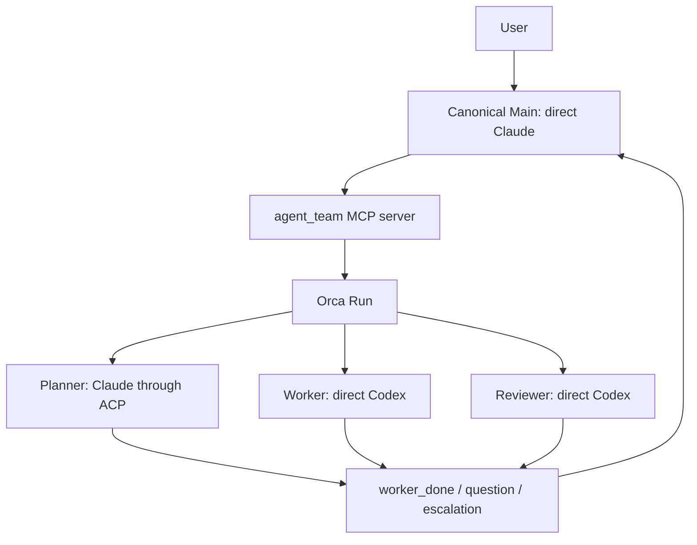

# Architecture

[日本語](architecture_JA.md) · [README](../README.md) ·
[Configuration](configuration.md)

## Runtime selection is explicit

`agent-team` separates orchestration from agent execution and selects the
backend from the version-3 `runtime` field. `runtime = "orca"` keeps the
existing four-role Orca contract. `runtime = "tmux"` is an experimental native
path that requires Main and accepts only optional verified Claude ACP
read-only Planner/Reviewer roles. Worker and every other native profile are
rejected before state, Task, Dispatch, or process effects are created.

### Orca runtime

Orca owns the Run, Tasks, Dispatches, messages, and terminals. The launcher owns
role-specific arguments, private runtime state, and the bridge between ACP
completion and an Orca `worker_done` message.



### Experimental native tmux runtime

`TmuxBackend` owns one private tmux server for Main. `native_main` supervises
the owned Main process group, while the shared MCP framing layer lazily selects
the Orca or native backend from saved state. Native ACP Planner/Reviewer turns
run as launcher-owned background processes. They publish completion through
`publish_completion`; tmux pane text is never interpreted as a lifecycle event.
Only Main has a TTY to attach. The native path has passed a model-free
start/status/stop smoke with Orca and Codex absent, a workspace path containing
spaces, and a deleted config. That does not establish a native/provider
end-to-end turn.

Herdr and Zellij are not current agent-team runtimes. The broader direction
still includes them, together with native Worker support, all ten harnesses,
arbitrary role graphs, no-Main configurations, and TaskSpec/review/verification/
parallel workflows; those capabilities are not implemented here. Giving two
systems ownership of the same worker would make completion and cleanup
ambiguous.

## Components have narrow responsibilities

| Component | Responsibility |
|---|---|
| `config.toml` | Declares fixed roles, providers, transports, models, efforts, prompts, and permissions. |
| `agent_team/config_v4.py`, `topology.py` | Validate named team catalogs and render their graphs. Runnable catalog entries explicitly reference a matching version-3 launch configuration. |
| `agent_team/cli.py` | Parses and validates config/arguments, selects `WorkflowEngine(OrcaBackend)` or `WorkflowEngine(TmuxBackend)`, renders compatibility JSON, and runs ACP turns. |
| `agent_team/backend.py` | Owns the Orca `start`/`status`/`attach`/`stop` workflow adapter, state-v3 identity checks, and compatibility receipts. |
| `agent_team/native_backend.py` | Owns the experimental tmux `start`/`status`/`attach`/`stop` path, native ACP assignments, completion publication, and native cleanup checks. |
| `agent_team/native_main.py` | Supervises the owned native Main process group and publishes its exit receipt. |
| `agent_team/orca.py` | Owns the fixed Orca argv/envelope decoder. It does not own MCP role operations. |
| `agent_team/tmux.py` | Creates and inspects one private, nonce-tagged tmux server and its Main pane. |
| `agent_team/locking.py` | Owns the stable per-team lifecycle reservation, shared by state writes and runtime operations without importing a backend. |
| `agent_team/cleanup.py` | Owns the private stop journal, startup-recovery sidecar, and exact local cleanup/rollback phases. |
| `agent_team/mcp_protocol.py` | Owns shared MCP schemas, JSON-RPC framing, and lazy backend-independent serving. |
| `agent_team/mcp_server.py`, `native_mcp.py` | Map the seven fixed Main-facing tools to the selected Orca or native backend while preserving the shared lifecycle reservation. |
| `agent_team/runtime.py` | Shares identity, private-file, state-v3, command, environment, and cleanup safety helpers; state writes take the shared reservation unless the caller already holds it. |
| `agent_team/process_identity.py` | Reads exact argv tuples on Linux and macOS so native ownership checks do not rely on display text. |
| `agent_team/registry.py` | Records recognized harnesses and exact verified role profiles; it never falls through to another provider. |
| `agent_team/adapters.py` | Provides the provider-independent background seam, bounded process runner, exact identity checks, and Copilot/OpenCode read-only adapters. It has no Orca lifecycle authority. |
| `agent_team/acp_dependencies.py` | Resolves selected ACP dependencies, verifies exact package manifests, and records absolute executable paths with SHA-256 fingerprints. |
| `agent_team/defaults/` | Bundled config and Japanese prompts used when no user config is selected. |
| `prompts/*.md` | Defines the Japanese role contracts. |
| Orca | Stores the Run/Task/Dispatch lifecycle and owns managed terminals. |
| Node.js, `acpx`, `claude-agent-acp` | Run the pinned Claude ACP adapter through the saved executable binding and return final text plus an exit status. |

Orca's Copilot read-only Planner and Reviewer profiles run through the common
Orca lifecycle and state-v3 snapshot integration. The OpenCode provider adapter
is also implemented, but remains rejected until its profile-specific boundary
and lifecycle are verified live. Native tmux does not enable these profiles: it
accepts only direct Claude Main and the optional verified Claude ACP
read-only Planner/Reviewer roles. A background profile runs one fixed provider
invocation against a fresh read snapshot rather than a TUI terminal or ACP
session. The snapshot excludes `.git`, symlinks, special files, ignored files,
secret-like paths, provider configuration, and agent instructions.

## Canonical Main is direct Claude and the only user-facing agent

In the canonical config, Main starts as a direct Claude process with the
`agent_team` MCP server and no Bash tool. A custom config may select direct
Codex Main; it keeps the same fixed MCP surface but uses Codex-specific launch
and permission settings. In either case, Main is the only user-facing role.

The bundled defaults use `fable` for Main and Planner and `gpt-6-astra` for
Worker and Reviewer. The role graph does not change those launch-config model
choices.

The MCP server exposes only:

- `role_get`
- `role_prompt`
- `role_wait`
- `role_read`
- `role_release`
- `delivery_ack`
- `message_reply`

Main cannot choose an arbitrary command or role name through this MCP surface.
The fixed surface keeps agent output separate from process-control authority.

## Orca direct roles use Orca-supervised terminals

In `runtime = "orca"`, Worker and Reviewer use direct Codex.

1. The MCP bridge creates an Orca Task.
2. It starts a launcher-owned Codex terminal with an isolated `CODEX_HOME`.
3. It waits for the TUI and configured model/effort to become ready.
4. `worker-start` binds the terminal to the Task and creates a Dispatch.
5. Orca injects the task and lifecycle commands.
6. The role reports `worker_done`, `question`, or `escalation`.

Codex roles inherit either the built-in `:workspace` or `:read-only` profile.
Only the current Orca Unix socket is added to the profile; no external domain
is allowed by agent-team.

In `runtime = "tmux"`, direct Claude Main runs under the private tmux server and
the `native_main` supervisor. Native tmux does not provide a direct Worker or
Reviewer role.

## ACP roles use a bare Dispatch and a trusted runner

In `runtime = "orca"`, the canonical Planner uses Claude through ACP. acpx is
not an Orca-recognized TUI, so agent-team uses a bare terminal without
pretending that it is a supervised native agent. In `runtime = "tmux"`, the
same trusted runner is used for each selected Planner or Reviewer, without a
TTY or pane-based completion path.

Before starting an ACP role, startup requires Node.js `22.13.0` or newer and
the exact `acpx@0.13.2` and
`@agentclientprotocol/claude-agent-acp@0.70.0` packages. It resolves only the
selected ACP roles' `node`, `acpx`, and `claude-agent-acp` files, verifies their
package manifests, and stores absolute paths with SHA-256 fingerprints. The
Orca role-start path rechecks that binding before creating the Orca Task; the
native role-start path rechecks it before starting its ACP runner. The runner
uses the same files for each session operation. It never invokes `npm` or
`npx`; a direct-only launch does not resolve ACP dependencies.

For the Orca path:

1. The MCP bridge creates a Task and a private prompt sidecar.
2. It creates a launcher-owned bare terminal.
3. `orchestration dispatch` binds the Task and terminal with `injected=false`.
4. The bridge saves the assignment before sending the trusted runner command.
5. The runner creates an acpx session, selects model and effort, submits the
   prompt through stdin, and reads `--format quiet` output.
6. The runner closes and prunes its exact acpx session.
7. The runner, not the agent text, sends one matching Orca `worker_done`.

For the native path, the backend saves the assignment before starting the
launcher-owned ACP runner. The runner performs the same pinned ACP operations
and calls `publish_completion` with the matching Run, Task, Dispatch, terminal,
and nonce identity. `native_backend` turns that durable result into the shared
`worker_done` event; tmux pane text is never used as completion evidence.

The agent command includes a team/role/nonce marker. Pruning is restricted to
that exact command, so unrelated acpx sessions are not removed. Native cleanup
also requires the runner's exact argv and private process group to be proven.

## Lifecycle advances only on matching identities

At most one background role can be active. A new role cannot start while an
assignment or an unacknowledged Delivery exists.

```text
role_prompt
  -> role_wait
     -> worker_done: role_read -> role_release -> delivery_ack
     -> question: message_reply -> delivery_ack -> role_wait
     -> escalation: retain evidence and stop for user review
```

`worker_done` is accepted only when Task, Dispatch, sender terminal, and Run
match the active assignment. `question` and `escalation` are not completion.
A failed worker outcome is terminal for that Dispatch but is not successful
work.

The native backend follows the same `role_read` → `role_release` →
`delivery_ack` order. Its `native.last_ack` field stores the one acknowledged
Delivery receipt marker; it is an audit marker, not Task completion or proof
that the user's overall goal is complete.

## State is private and launch-scoped

The launcher writes version-3 runtime state below:

```text
$XDG_STATE_HOME/agent-team/<team-id>/state.json
```

The default base is `~/.local/state/agent-team/`. The state snapshot records the
workspace, config path, Run, Main terminal, role specifications, and active
assignment. Model, effort, permission, and instructions are copied at launch;
an ACP runner does not reinterpret a changed config during the same team run.

An ACP role specification also stores the resolved absolute `node`, `acpx`, and
`claude-agent-acp` paths and their SHA-256 fingerprints. The runner uses and
verifies this saved binding for every ACP lifecycle operation; missing or
changed files fail closed.

ACP prompt sidecars and state files are current-user-owned private files.
State writes are atomic and fsync their parent directory after replace. Prompt
reads use non-following file descriptors.
Codex runtime homes are isolated below the same team directory.
If the replacement succeeds but directory durability is unknown, the state is
treated as published and the startup marker is retained for management retry.

Native state stores a nonce-tagged tmux receipt and the supervised Main process
receipt. Native ownership checks compare the saved executable, private process
group, and exact argv; `process_identity.py` supports these argv checks on Linux
and macOS. ACP assignments store their runner PID, process group, argv, prompt
sidecar, and private cleanup roots until `role_release` confirms cleanup.

## Failure handling is fail-closed

- If role startup cannot confirm remote rollback, it retains the assignment and
  private resources. Before a complete assignment exists, `pending_role_start`
  records only known resource identities. `status` shows `cleanup_pending`, and
  another role launch or team-state deletion is blocked. Resolving this unknown
  outcome is not automated; deleting the record to force a restart is unsafe.
- A partial start stops or closes only resources whose exact IDs were returned.
- Cleanup errors are reported together with the original failure.
- CLI and MCP stateful operations share a stable per-team reservation outside
  the removable state root; management operations re-read state under that
  lock and MCP holds it through remote effects and save/rollback.
- Worker-stop and terminal-close require typed identity/process-stop verdicts;
  an agent terminal already closed by worker-stop is not closed twice, and an
  unconfirmed PTY keeps the journal and local resources for recovery.
- Method-specific `terminal_*`, `dispatch_not_found`, `run_not_found`, and
  `task_not_found` absence codes are normalized as read-only absence; stop
  persists the affected stage as unknown and never treats absence as process
  success.
- A durable startup marker is written before Main terminal creation; a lost
  create response keeps local preparation and blocks the next start until an
  explicit no-tab close receipt proves `ptyKilled=true`.
- Startup recovery never treats a stale/gone read-only terminal show as process
  stop proof; local homes remain until a verified close receipt is durable.
- CLI runtime errors use fixed classifications and the existing `ERROR: <message>`
  body with an explicit bound; Orca stderr/stdout, argv, IDs, paths, and control
  characters are never rendered. The redaction/legacy-body golden is covered by
  the CLI compatibility tests.
- ACP subprocesses and native Main run in private process groups; normal exit,
  cancellation, and timeout/output-limit paths verify and reap descendants
  before returning.
- The Orca and native tmux runtimes fail fast on Windows. Their contracts
  require POSIX Unix-socket or process-group semantics.
- Orca CLI selection is deterministic: `orca` on macOS and `orca-ide` on Linux;
  there is no silent PATH fallback or environment override.
- The ACP child receives a small environment allowlist, including `HOME` for
  ambient Claude login but excluding API keys and Orca control variables.
- `stop` validates the exact private team root and removes entries without
  following symlinks. Special files and ownership mismatches are rejected.
- The Orca Run remains after stop as an audit record. Native tmux removes its
  local state only after the owned Main and ACP resources have verified exit.

CLI lifecycle operations use `WorkflowEngine` with the backend selected by
`runtime`. Orca role operations use `mcp_server`; native role operations use
`native_backend` through `native_mcp`. Both paths share the typed contract,
state, and reservation helpers. The role methods on the abstract backend
contract are not a separate user-facing protocol.

The shared MCP protocol records each observed Delivery and enforces reading the
result, releasing the owned role resources, and then acknowledging completion.
Questions must be answered before acknowledgment; escalations remain pending.
Failed operations retain their pending state. MCP framing and tool schemas load
without selecting a backend; the first stateful call selects Orca or native
tmux from saved state. Native `status`, `attach`, and `stop` inspect or operate
the owned tmux resources.

When Orca returns `retained`, the assignment stays pending and the launcher does
not close the terminal. A `no_owned_resource` result for an Orca launcher-created
background terminal still needs an ownership-aware release path; its cleanup is
not treated as successful. Native release requires the ACP runner to have
exited and its cleanup receipt to be confirmed before the assignment is removed.

If a role-start or release response is lost, inspect the recorded Dispatch and
terminal before retrying. Role operations do not provide automatic crash
replay or an exactly-once guarantee. SQLite coordination, schema migration,
and general backup/restore are outside this runtime; Orca owns coordination
and the launcher retains its existing private version-3 state.

## Security limits remain explicit

ACP is a communication protocol, not a sandbox. A compatibility probe showed
that Codex internal tools could still write when the ACP client advertised
read-only/deny-all settings. For that reason, Codex ACP and workspace-write ACP
are rejected. The write-capable role remains direct Codex with provider-native
permissions.

The native model-free tmux lifecycle was verified with Orca and Codex absent,
including a workspace path containing spaces and a deleted config. On
2026-09-06, real Claude Code 2.1.261 with `fable`/`high` completed the native
Main-to-Claude-ACP-Planner MCP cycle and public stop. Independent checks found
no owned processes, state, socket, prompts, or private directories remaining.
The earlier 2.1.112 rejection was `claude_code_version_too_old`; the same
`fable` alias succeeded with the already-installed 2.1.261 executable.
This verifies the read-only cycle, not the unfinished write/review workflow.
The ambient `claude.ai` login path worked without an API key, but the
provider's subscription billing ledger is not verified.

## Agreed requirements remain unfinished

The following are remaining implementation goals, not exclusions from the
agreed scope. They are tracked in Issues #8, #9, and #11.

- Herdr and Zellij runtimes
- Native Worker and the required Reviewer paths
- The required profiles and real execution evidence for all ten harnesses
- Arbitrary role graphs, no-Main execution, and explicit parallel tasks
- TaskSpec, review decisions and limits, dependency order, and fixed-argv
  verification of the reviewed revision before completion

## Intentional exclusions

- No arbitrary ACP server command in config
- No automatic provider or transport fallback
- No automatic commit, push, publishing, or deployment
- No support for running two configs concurrently in the same workspace
