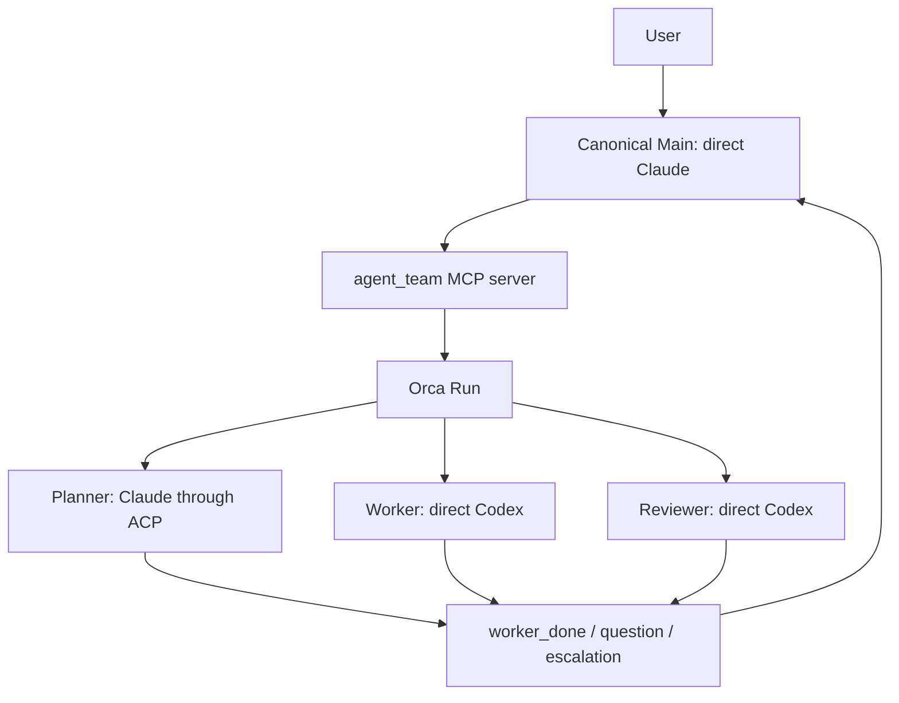

# Architecture

[日本語](architecture_JA.md) · [README](../README.md) ·
[Configuration](configuration.md)

## Orca is the only orchestration backend

`agent-team` separates orchestration from agent execution. Orca owns the Run,
Tasks, Dispatches, messages, and terminals. The launcher owns role-specific
arguments, private runtime state, and the bridge between ACP completion and an
Orca `worker_done` message.



Herdr and Zellij can host an outer terminal, but they are not agent-team
orchestration backends. Giving two systems ownership of the same worker would
make completion and cleanup ambiguous.

## Components have narrow responsibilities

| Component | Responsibility |
|---|---|
| `config.toml` | Declares fixed roles, providers, transports, models, efforts, prompts, and permissions. |
| `agent_team/cli.py` | Validates config, starts/stops Main, creates state snapshots, and runs ACP turns. |
| `agent_team/mcp_server.py` | Exposes seven fixed Main-facing tools and maps role operations to Orca. It is launched through the same `agent-team _mcp-server` entrypoint. |
| `agent_team/runtime.py` | Shares identity, private-file, state, command, environment, and cleanup safety helpers. |
| `agent_team/registry.py` | Records recognized harnesses and exact verified role profiles; it never falls through to another provider. |
| `agent_team/adapters.py` | Provides the provider-independent background seam, bounded process runner, exact identity checks, and Copilot/OpenCode read-only adapters. It has no Orca lifecycle authority. |
| `agent_team/defaults/` | Bundled config and Japanese prompts used when no user config is selected. |
| `prompts/*.md` | Defines the Japanese role contracts. |
| Orca | Stores the Run/Task/Dispatch lifecycle and owns managed terminals. |
| acpx | Runs the pinned Claude ACP adapter and returns final text plus an exit status. |

Copilot read-only Planner and Reviewer profiles run through the common Orca
lifecycle and state-v3 snapshot integration. The OpenCode provider adapter is
also implemented, but remains rejected until its profile-specific boundary and
lifecycle are verified live. A background profile runs one fixed provider
invocation against a fresh read snapshot rather than a TUI terminal or ACP
session. The snapshot excludes `.git`, symlinks, special files, ignored files,
secret-like paths, provider configuration, and agent instructions.

## Canonical Main is direct Claude and the only user-facing agent

In the canonical config, Main starts as a direct Claude process with the
`agent_team` MCP server and no Bash tool. A custom config may select direct
Codex Main; it keeps the same fixed MCP surface but uses Codex-specific launch
and permission settings. In either case, Main is the only user-facing role.

The MCP server exposes only:

- `role_get`
- `role_prompt`
- `role_wait`
- `role_read`
- `role_release`
- `delivery_ack`
- `message_reply`

Main cannot choose an arbitrary command or role name through this MCP surface.
The fixed surface keeps agent output separate from process-control authority.

## Direct roles use Orca-supervised terminals

Worker and Reviewer currently use direct Codex.

1. The MCP bridge creates an Orca Task.
2. It starts a launcher-owned Codex terminal with an isolated `CODEX_HOME`.
3. It waits for the TUI and configured model/effort to become ready.
4. `worker-start` binds the terminal to the Task and creates a Dispatch.
5. Orca injects the task and lifecycle commands.
6. The role reports `worker_done`, `question`, or `escalation`.

Codex roles inherit either the built-in `:workspace` or `:read-only` profile.
Only the current Orca Unix socket is added to the profile; no external domain
is allowed by agent-team.

## ACP roles use a bare Dispatch and a trusted runner

Planner currently uses Claude through ACP. acpx is not an Orca-recognized TUI,
so agent-team uses a bare terminal without pretending that it is a supervised
native agent.

1. The MCP bridge creates a Task and a private prompt sidecar.
2. It creates a launcher-owned bare terminal.
3. `orchestration dispatch` binds the Task and terminal with `injected=false`.
4. The bridge saves the assignment before sending the trusted runner command.
5. The runner creates an acpx session, selects model and effort, submits the
   prompt through stdin, and reads `--format quiet` output.
6. The runner closes and prunes its exact acpx session.
7. The runner, not the agent text, sends one matching Orca `worker_done`.

The agent command includes a team/role/nonce marker. Pruning is restricted to
that exact command, so unrelated acpx sessions are not removed.

## Lifecycle advances only on matching identities

At most one background role can be active. A new role cannot start while an
assignment or an unacknowledged Delivery exists.

```text
role_prompt
  -> role_wait
     -> worker_done: role_read -> role_release -> delivery_ack
     -> question: message_reply -> delivery_ack -> role_wait
     -> escalation: retain evidence and stop for user review
```

`worker_done` is accepted only when Task, Dispatch, sender terminal, and Run
match the active assignment. `question` and `escalation` are not completion.
A failed worker outcome is terminal for that Dispatch but is not successful
work.

## State is private and launch-scoped

The launcher writes version-3 runtime state below:

```text
$XDG_STATE_HOME/agent-team/<team-id>/state.json
```

The default base is `~/.local/state/agent-team/`. The state snapshot records the
workspace, config path, Run, Main terminal, role specifications, and active
assignment. Model, effort, permission, and instructions are copied at launch;
an ACP runner does not reinterpret a changed config during the same team run.

ACP prompt sidecars and state files are current-user-owned private files.
State writes are atomic. Prompt reads use non-following file descriptors.
Codex runtime homes are isolated below the same team directory.

## Failure handling is fail-closed

- A partial start stops or closes only resources whose exact IDs were returned.
- Cleanup errors are reported together with the original failure.
- ACP subprocesses run in their own process group and are terminated on timeout.
- The ACP child receives a small environment allowlist, including `HOME` for
  ambient Claude login but excluding API keys and Orca control variables.
- `stop` validates the exact private team root and removes entries without
  following symlinks. Special files and ownership mismatches are rejected.
- The Orca Run remains after stop as an audit record.

## Security limits remain explicit

ACP is a communication protocol, not a sandbox. A compatibility probe showed
that Codex internal tools could still write when the ACP client advertised
read-only/deny-all settings. For that reason, Codex ACP and workspace-write ACP
are rejected. The write-capable role remains direct Codex with provider-native
permissions.

The Claude ACP turn was verified with an ambient `claude.ai` Max login and no
API-key environment. This proves the observed authentication path, not the
provider's subscription billing ledger.

## Non-goals keep the runtime small

- No Herdr fallback
- No arbitrary role graph or concurrent background roles
- No arbitrary ACP server command in config
- No automatic provider or transport fallback
- No automatic commit, push, publishing, or deployment
- No support for running two configs concurrently in the same workspace
