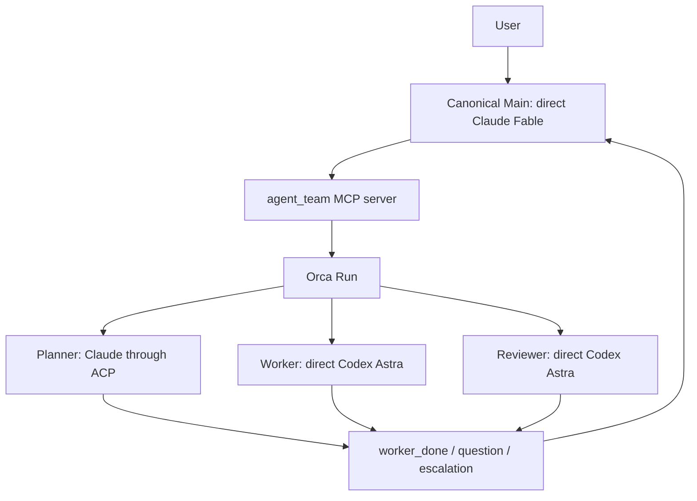

# Architecture

[日本語](architecture_JA.md) · [README](../README.md) ·
[Configuration](configuration.md)

## Runtime selection is explicit

`agent-team` separates orchestration from agent execution and selects the
backend from the version-3 `runtime` field. `runtime = "orca"` keeps the
existing four-role Orca contract. `runtime = "tmux"`, `"herdr"`, or `"zellij"`
selects an experimental native
path that requires direct Claude Main and accepts optional verified Claude ACP
Planner, Worker, and Reviewer roles. Native Worker assignments require an
exact TaskSpec from the config's `[[tasks]]` catalog. Other unsupported native
profiles are rejected before state, Task, Dispatch, or process effects are
created.

### Orca runtime

Orca owns the Run, Tasks, Dispatches, messages, and terminals. The launcher owns
role-specific arguments, private runtime state, and the bridge between ACP
completion and an Orca `worker_done` message.



### Experimental native terminal runtimes

`NativeBackend` owns the common Main/ACP/task lifecycle, while the selected
`TmuxBackend`, `HerdrBackend`, or `ZellijBackend` supplies the terminal driver.
`native_main` supervises the owned Main process group. Native ACP Planner,
Worker, and Reviewer turns run as launcher-owned background processes. They
publish completion through `publish_completion`; terminal pane text or provider
status is never interpreted as a lifecycle event. Only Main can be attached.

The Herdr driver was verified with exact version 0.8.2 and protocol 20. It owns
a private headless server and uses a normal-shell bootstrap without faking
`HERDR_ENV`. Natural Main exit can remove Herdr's pane and workspace. An absent
pane is not stop proof: the owned server/socket and trusted Main process cleanup
must still be verified.

The Zellij driver was tested for compatibility with 0.44.1. Its preflight does
not require an exact CLI version; it uses detached mode with no persistent
client and no `--max-panes 1`. It holds Main metadata and accepts one terminal
plus the expected suppressed `zellij:link` plugin; unknown panes/plugins remain
unknown.

Arbitrary role graphs, no-Main configurations, explicit parallel workflows,
most of the ten harnesses, and native ACP question handling remain unfinished.
Giving two systems ownership of the same worker would make completion and
cleanup ambiguous.

## Components have narrow responsibilities

| Component | Responsibility |
|---|---|
| `config.toml` | Declares fixed roles, providers, transports, models, efforts, prompts, permissions, and native `[[tasks]]` entries. |
| `agent_team/config_v4.py`, `topology.py` | Validate named team catalogs and render their graphs. Runnable catalog entries explicitly reference a matching version-3 launch configuration. |
| `agent_team/cli.py` | Parses and validates config/arguments, selects `WorkflowEngine(OrcaBackend)` or the selected native terminal backend, renders compatibility JSON, and runs ACP turns. |
| `agent_team/backend.py` | Owns the Orca `start`/`status`/`attach`/`stop` workflow adapter, state-v3 identity checks, and compatibility receipts. |
| `agent_team/native_backend.py` | Owns the shared native `start`/`status`/`attach`/`stop` path, ACP assignments, completion publication, and cleanup checks. |
| `agent_team/native_terminal.py` | Defines the shared terminal receipt, inspection, presence, and close protocol. |
| `agent_team/tmux_backend.py`, `herdr_backend.py`, `zellij_backend.py` | Bind NativeBackend to the selected terminal driver. |
| `agent_team/herdr.py`, `zellij.py` | Verify the exact Herdr 0.8.2/protocol-20 handshake and the Zellij driver identity/cleanup contract tested with 0.44.1. |
| `agent_team/native_main.py` | Supervises the owned native Main process group and publishes its exit receipt. |
| `agent_team/orca.py` | Owns the fixed Orca argv/envelope decoder. It does not own MCP role operations. |
| `agent_team/tmux.py` | Creates and inspects one private, nonce-tagged tmux server and its Main pane. |
| `agent_team/locking.py` | Owns the stable per-team lifecycle reservation, shared by state writes and runtime operations without importing a backend. |
| `agent_team/cleanup.py` | Owns the private stop journal, startup-recovery sidecar, and exact local cleanup/rollback phases. |
| `agent_team/mcp_protocol.py` | Owns shared MCP schemas, JSON-RPC framing, and lazy backend-independent serving. |
| `agent_team/mcp_server.py`, `native_mcp.py` | Map the ten Main-facing tools to the selected Orca or native backend while preserving the shared lifecycle reservation. Native task tools are implemented by the native backend; Orca does not silently emulate them. |
| `agent_team/task_spec.py` | Validates the exact immutable TaskSpec schema and its path/verification fields. |
| `agent_team/task_execution.py` | Persists TaskSpec digests, dependency admission, review decisions, and per-stage round limits. |
| `agent_team/task_verification.py` | Runs declared fixed argv against the approved workspace revision and records bounded evidence. |
| `agent_team/workspace_revision.py` | Creates a bounded Git workspace revision and rejects symlinks and special files. |
| `agent_team/scoped_acp.py`, `claude_scoped_agent.mjs` | Create the native Worker policy and enforce TaskSpec scope for model tool calls. |
| `agent_team/scoped_acp_client.mjs` | Opens one direct public ACP SDK connection per native assignment and confirms cleanup. |
| `agent_team/native_acp_dependencies.py` | Resolves Node, Claude ACP 0.70.0, and its SDK 1.3.0 dependency with exact fingerprints. |
| `agent_team/runtime.py` | Shares identity, private-file, state-v3, command, environment, and cleanup safety helpers; state writes take the shared reservation unless the caller already holds it. |
| `agent_team/process_identity.py` | Reads exact argv tuples on Linux and macOS so native ownership checks do not rely on display text. |
| `agent_team/registry.py` | Records recognized harnesses and exact verified role profiles; it never falls through to another provider. |
| `agent_team/adapters.py` | Provides the provider-independent background seam, bounded process runner, exact identity checks, and Copilot/OpenCode read-only adapters. It has no Orca lifecycle authority. |
| `agent_team/acp_dependencies.py` | Resolves selected ACP dependencies, verifies exact package manifests, and records absolute executable paths with SHA-256 fingerprints. |
| `agent_team/defaults/` | Bundled config and Japanese prompts used when no user config is selected. |
| `prompts/*.md` | Defines the Japanese role contracts. |
| Orca | Stores the Run/Task/Dispatch lifecycle and owns managed terminals. |
| Node.js, `acpx`, `claude-agent-acp` | Run the pinned Orca Claude ACP adapter through the saved executable binding and return final text plus an exit status. |

Orca's Copilot read-only Planner and Reviewer profiles run through the common
Orca lifecycle and state-v3 snapshot integration. The OpenCode provider adapter
is also implemented, but remains rejected until its profile-specific boundary
and lifecycle are verified live. Native runtimes do not enable these profiles: they
accept only direct Claude Main and optional verified Claude ACP
read-only Planner/Reviewer roles plus the scoped workspace-write Worker. The
direct background profiles run one fixed provider invocation against a fresh
read snapshot rather than a TUI terminal or ACP session. That snapshot excludes
`.git`, symlinks, special files, ignored files, secret-like paths, provider
configuration, and agent instructions; native Worker scope is derived from its
declared TaskSpec instead.

## Canonical Main is direct Claude and the only user-facing agent

In the canonical config, Main starts as a direct Claude process with the
`agent_team` MCP server and no Bash tool. A custom config may select direct
Codex Main; it keeps the same fixed MCP surface but uses Codex-specific launch
and permission settings. In either case, Main is the only user-facing role.
Native Main receives the user-declared `[[tasks]]` catalog in its startup
instructions and cannot invent a task ID, scope, dependency, or verification
command at dispatch time.

The bundled defaults use `fable` for Main and Planner and `gpt-6-astra` for
Worker and Reviewer. The role graph does not change those launch-config model
choices.

The MCP server exposes ten tools:

- `task_get`
- `task_verify`
- `task_dispatch`
- `role_get`
- `role_prompt`
- `role_wait`
- `role_read`
- `role_release`
- `delivery_ack`
- `message_reply`

Main cannot choose an arbitrary command or role name through this MCP surface.
For native runtimes, `task_dispatch` accepts only an exact TaskSpec from the
config-declared catalog. The fixed surface keeps agent output separate from
process-control authority.

## Orca direct roles use Orca-supervised terminals

In `runtime = "orca"`, Worker and Reviewer use direct Codex.

1. The MCP bridge creates an Orca Task.
2. It starts a launcher-owned Codex terminal with an isolated `CODEX_HOME`.
3. It waits for the TUI and configured model/effort to become ready.
4. `worker-start` binds the terminal to the Task and creates a Dispatch.
5. Orca injects the task and lifecycle commands.
6. The role reports `worker_done`, `question`, or `escalation`.

Codex roles inherit either the built-in `:workspace` or `:read-only` profile.
Only the current Orca Unix socket is added to the profile; no external domain
is allowed by agent-team.

In a native runtime, direct Claude Main runs under the selected terminal backend
and the `native_main` supervisor. Native Worker and Reviewer roles are Claude
ACP background assignments; native runtimes do not provide direct Worker or
Reviewer roles.

## ACP roles use a bare Dispatch and a trusted runner

In `runtime = "orca"`, the canonical Planner uses Claude through ACP. acpx is
not an Orca-recognized TUI, so agent-team uses a bare terminal without
pretending that it is a supervised native agent. In a native runtime, each
selected Claude ACP Planner, Worker, or Reviewer uses the native public SDK
client, without a TTY or pane-based completion path.

Before starting an Orca ACP role, startup requires Node.js `22.13.0` or newer
and the exact `acpx@0.13.2` and
`@agentclientprotocol/claude-agent-acp@0.70.0` packages. It resolves only the
selected Orca roles' `node`, `acpx`, and `claude-agent-acp` files, verifies
their package manifests, and stores absolute paths with SHA-256 fingerprints.
The Orca role-start path rechecks that binding before creating the Orca Task.

Native runtimes have a separate dependency binding: Node.js `22.0.0` or newer,
`@agentclientprotocol/claude-agent-acp@0.70.0`, and its dependency
`@agentclientprotocol/sdk@1.3.0`. It resolves and fingerprints `node`, the
Claude ACP entrypoint and `dist/lib.js`, and the SDK entrypoint. Native does not select or invoke
`acpx`, `npm`, or `npx`. Both paths use saved files and fail closed on missing
or changed dependencies; direct-only launches do not resolve ACP dependencies.

For the Orca path:

1. The MCP bridge creates a Task and a private prompt sidecar.
2. It creates a launcher-owned bare terminal.
3. `orchestration dispatch` binds the Task and terminal with `injected=false`.
4. The bridge saves the assignment before sending the trusted runner command.
5. The runner creates an acpx session, selects model and effort, submits the
   prompt through stdin, and reads `--format quiet` output.
6. The runner closes and prunes its exact acpx session.
7. The runner, not the agent text, sends one matching Orca `worker_done`.

For the native path, a private pipe gate holds the child until the backend
has validated and durably saved its PID, private process group, and exact argv.
Only then does the gate execute the ACP runner. Startup rollback signals a
process group only when ownership is proven; uncertain state remains retained.
Native dependency binding stores Node, the Claude ACP entry, its actual
`dist/lib.js` import, and the nested SDK entry with four fingerprints. The
runner imports the saved public SDK entry and
uses one direct connection for the assignment:

```text
initialize -> session/new -> set model/effort -> prompt -> session/close
-> connection close and bounded child cleanup
```

It then calls `publish_completion` with the matching Run, Task, Dispatch,
terminal, and nonce identity. `native_backend` turns that durable result into
the shared `worker_done` event; terminal pane text is never used as completion
evidence. Native SDK persistence is disabled with `persistSession=false` and
`autoMemoryEnabled=false`; the interactive Main's normal Claude history remains
in the normal store. This is a direct SDK connection, not the provider's
direct/model transport.

The agent command includes a team/role/nonce marker. Orca pruning is restricted
to that exact command, so unrelated acpx sessions are not removed. Native
cleanup instead verifies the runner's exact argv and private process group;
there is no native acpx session store to prune.

## Native TaskSpec and review gates are durable

Native users declare complete TaskSpecs in the version-3 config as
`[[tasks]]` tables, with one or more `[[tasks.verification]]` tables for each
fixed-argv check. The exact fields are `task_id`, `objective`,
`acceptance_criteria`, `allowed_paths`, `forbidden_paths`, `dependencies`,
`verification`, `evidence_requirements`, and `consultation_conditions`.

Startup validates unique task IDs, exact fields, declared dependencies, and
dependency cycles before state or provider effects. The catalog is included in
Main's native instructions. `task_dispatch` must exactly match one declared
TaskSpec; it cannot add a task ID or change paths, dependencies, evidence, or
verification argv. When no `[[tasks]]` catalog is present, read-only
`role_prompt` remains available but structured task dispatch is rejected. Orca
rejects the `tasks` field.

The native flow is:

```text
task_dispatch(Planner or Worker)
  -> role_wait -> role_read -> role_release -> delivery_ack
  -> task_get
  -> task_dispatch(Reviewer) for plan or implementation review
  -> task_dispatch(Planner or Worker) after request_changes
  -> task_verify after implementation approval
```

Planner and Worker results become `awaiting_plan_review` and
`awaiting_implementation_review`. Reviewer output is one exact JSON object with
`task_id`, `stage`, `revision`, `decision`, and `findings`. `approve` advances
the stage, `request_changes` returns to the original writer, and `consult`
requires user input. Plan and implementation review rounds are separate and
both obey `max_review_rounds`.

Implementation review binds to the workspace revision captured when its
Reviewer assignment is prepared. `task_verify` requires implementation
approval, no active role or Delivery, and the same revision. It runs every
declared argv with `shell=False`, checks the revision before and after commands,
and stores bounded errors plus stdout/stderr SHA-256 hashes. The task becomes
`completed` only when all commands pass and cleanup is confirmed.

## Lifecycle advances only on matching identities

At most one background role can be active. A new role cannot start while an
assignment or an unacknowledged Delivery exists.

```text
role_prompt
  -> role_wait
     -> worker_done: role_read -> role_release -> delivery_ack
     -> question: message_reply -> delivery_ack -> role_wait
     -> escalation: retain evidence and stop for user review
```

`worker_done` is accepted only when Task, Dispatch, sender terminal, and Run
match the active assignment. `question` and `escalation` are not completion.
A failed worker outcome is terminal for that Dispatch but is not successful
work.

The native backend follows the same `role_read` → `role_release` →
`delivery_ack` order. Its `native.last_ack` field stores the one acknowledged
Delivery receipt marker; it is an audit marker, not Task completion or proof
that the user's overall goal is complete.

## State is private and launch-scoped

The launcher writes version-3 runtime state below:

```text
$XDG_STATE_HOME/agent-team/<team-id>/state.json
```

The default base is `~/.local/state/agent-team/`. The state snapshot records the
workspace, config path, Run, Main terminal, role specifications, and active
assignment. Model, effort, permission, and instructions are copied at launch;
an ACP runner does not reinterpret a changed config during the same team run.

An Orca ACP role specification stores the resolved absolute `node`, `acpx`, and
`claude-agent-acp` paths and their SHA-256 fingerprints. A native ACP role
stores absolute `node`, Claude ACP entry and library, and SDK dependency paths with the same binding
check. Each runner uses and verifies its saved binding; missing or changed
files fail closed.

ACP prompt sidecars and state files are current-user-owned private files.
State writes are atomic and fsync their parent directory after replace. Prompt
reads use non-following file descriptors.
Codex runtime homes are isolated below the same team directory.
If the replacement succeeds but directory durability is unknown, the state is
treated as published and the startup marker is retained for management retry.

Native state stores a selected-terminal receipt and the supervised Main process
receipt. Native ownership checks compare the saved executable, private process
group, exact argv, and frozen `supervisor_argv`; `process_identity.py` supports
these argv checks on Linux and macOS. ACP assignments store their runner PID,
process group, argv, prompt
sidecar, TaskSpec scope, and private cleanup roots until `role_release` confirms
cleanup.

## Failure handling is fail-closed

- If role startup cannot confirm remote rollback, it retains the assignment and
  private resources. Before a complete assignment exists, `pending_role_start`
  records only known resource identities. `status` shows `cleanup_pending`, and
  another role launch or team-state deletion is blocked. Resolving this unknown
  outcome is not automated; deleting the record to force a restart is unsafe.
- A partial start stops or closes only resources whose exact IDs were returned.
- Cleanup errors are reported together with the original failure.
- CLI and MCP stateful operations share a stable per-team reservation outside
  the removable state root; management operations re-read state under that
  lock and MCP holds it through remote effects and save/rollback.
- Worker-stop and terminal-close require typed identity/process-stop verdicts;
  an agent terminal already closed by worker-stop is not closed twice, and an
  unconfirmed PTY keeps the journal and local resources for recovery.
- Method-specific `terminal_*`, `dispatch_not_found`, `run_not_found`, and
  `task_not_found` absence codes are normalized as read-only absence; stop
  persists the affected stage as unknown and never treats absence as process
  success.
- A durable startup marker is written before Main terminal creation; a lost
  create response keeps local preparation and blocks the next start until an
  explicit no-tab close receipt proves `ptyKilled=true`.
- Startup recovery never treats a stale/gone read-only terminal show as process
  stop proof; local homes remain until a verified close receipt is durable.
- Signaling an active Main requires a saved supervisor argv, PID/PGID, launch
  nonce, and phase. Older native state lacking these fields is retained and
  fails closed; it is not reconstructed or migrated automatically. Stop it
  with the matching executable/version before upgrading.
- CLI runtime errors use fixed classifications and the existing `ERROR: <message>`
  body with an explicit bound; Orca stderr/stdout, argv, IDs, paths, and control
  characters are never rendered. The redaction/legacy-body golden is covered by
  the CLI compatibility tests.
- ACP subprocesses and native Main run in private process groups; normal exit,
  cancellation, and timeout/output-limit paths verify and reap descendants
  before returning.
- Native Worker Read/Glob/Grep can read the workspace with protected-path and
  link/file-type checks. TaskSpec `allowed_paths` and `forbidden_paths` restrict
  Write/Edit only, with forbidden paths taking precedence for writes. Bash, terminal, and
  other RPC operations are denied. This is an in-band tool boundary rather than
  an operating-system sandbox, and does not protect against a hostile same-user
  process swapping files concurrently.
- Workspace revisions reject symlinks and special files and are limited to
  5,000 files, 10 MB per file, and 100 MB total. The guard does not cover an
  arbitrary repository.
- The Orca and native runtimes fail fast on Windows. Their contracts
  require POSIX Unix-socket or process-group semantics.
- Orca CLI selection is deterministic: `orca` on macOS and `orca-ide` on Linux;
  there is no silent PATH fallback or environment override.
- The ACP child receives a small environment allowlist, including `HOME` for
  ambient Claude login but excluding API keys and Orca control variables.
- `stop` validates the exact private team root and removes entries without
  following symlinks. Special files and ownership mismatches are rejected.
- The Orca Run remains after stop as an audit record. Native runtimes remove their
  local state only after the owned Main and ACP resources have verified exit.
- If verification is interrupted or cleanup is unconfirmed, the task remains
  `verifying` or `verification_failed` with the available evidence. New roles,
  verification, and stop are blocked as required; automatic recovery is not
  claimed. A `verification_failed` task with valid executed-command evidence and confirmed
  cleanup may return to Worker within the implementation review-round limit.

CLI lifecycle operations use `WorkflowEngine` with the backend selected by
`runtime`. Orca role operations use `mcp_server`; native role operations use
`native_backend` through `native_mcp`. Both paths share the typed contract,
state, and reservation helpers. The role methods on the abstract backend
contract are not a separate user-facing protocol.

The shared MCP protocol records each observed Delivery and enforces reading the
result, releasing the owned role resources, and then acknowledging completion.
Questions must be answered before acknowledgment; escalations remain pending.
Failed operations retain their pending state. MCP framing and tool schemas load
without selecting a backend; the first stateful call selects Orca or the
selected native runtime from saved state. Native `status`, `attach`, and `stop`
inspect or operate the selected driver's owned resources.

When Orca returns `retained`, the assignment stays pending and the launcher does
not close the terminal. A `no_owned_resource` result for an Orca launcher-created
background terminal still needs an ownership-aware release path; its cleanup is
not treated as successful. Native release requires the ACP runner to have
exited and its cleanup receipt to be confirmed before the assignment is removed.

If a role-start or release response is lost, inspect the recorded Dispatch and
terminal before retrying. Role operations do not provide automatic crash
replay or an exactly-once guarantee. SQLite coordination, schema migration,
and general backup/restore are outside this runtime; Orca owns coordination
and the launcher retains its existing private version-3 state.

## Security limits remain explicit

ACP is a communication protocol, not a sandbox. The native Worker therefore
uses an in-band policy around public SDK tool calls. Read/Glob/Grep can read
the workspace with protected-path and link/file-type checks; they are not
limited by TaskSpec path lists. Write/Edit are limited to `allowed_paths`,
with `forbidden_paths` taking precedence for writes. Bash, terminal, and other RPC calls are
denied. The policy does not provide kernel-level protection from a hostile
same-user concurrent file swap. Orca workspace-write remains direct Codex with
provider-native permissions; native write is limited to the scoped Worker.

The earlier model-free tmux terminal lifecycle was verified with Orca and Codex absent,
including a workspace path containing spaces and a deleted config. On
2026-09-07, a Python 3.13.15 wheel-only environment with real Claude Code
2.1.261 `fable`/`high` completed six native Planner/Worker/Reviewer assignments:
the intentional `a-b` implementation was rejected, `a+b` was approved at the
same revision, and trusted fixed-argv verification succeeded. Public stop
after removing the original config and prompts found no owned processes or
artifacts. The repeat included the startup catalog, the durable
PID/PGID/argv gate, and the four-file dependency binding. Its separate npm
installation had only selected Claude ACP packages and dependencies. A separate
active-cancel probe using the same final runtime stopped a live Worker with zero owned processes and
artifacts. A direct SDK probe confirmed allowed-path edit and forbidden-path
denial with SDK persistence and auto-memory disabled. This was the earlier
tmux-generation proof at `308b1ba`.
Separate public CLI tests with fake Main and fake Node passed for each of tmux,
Herdr, and Zellij under Python 3.11 and 3.13: read/release/ack, active
cancellation, and natural Main exit followed by original config/prompt deletion
and cold status/stop. Independent checks found no owned PIDs, sockets, state,
config, or private roots. These are fake-provider terminal proofs.

Separate real Claude Code 2.1.261 workflow runs for Herdr and Zellij used
isolated Python 3.13.15 wheel-only environments with Node 22.23.2, Claude ACP
0.70.0, SDK 1.3.0, and Claude SDK 0.3.232 selected. Each direct Claude Main
used Fable 5.1 at high effort with the Claude Max header and completed six
autonomous Planner/Reviewer/Worker assignments. Trusted fixed-argv verification
returned `FIXED_ARGV_OK`; the TaskSpec catalog, Worker scopes, protected files,
and kernel identities remained consistent. Public stop after deleting the
original config and prompts left no owned PID/PGID, state, socket, or private
path; normal interactive Main history remained and automated SDK calls used
`persistSession=false`. The 51 runtime package files byte-matched the built
wheel (`655c3bc3c24a278c366cd6282bb2870d10129806f6f312d765329463b47afb7b`);
the selected ACP dependency audit inspected 122 package metadata records.
The dependency inventory confirmed no unselected packages; separate runtime
`PATH` checks confirmed no unselected CLIs, `npm`, `npx`, or `uv`.
Herdr's first attempt pasted the text and Enter together
but left the text in the paste field; a separate Enter then submitted that same
initial message. No additional instructions were sent; typed verification
completed, but its final `NATIVE_WORKFLOW_OK` screen marker was not observed.
Zellij accepted the complete initial submission automatically and its final
marker was observed. The earlier real-model tmux proof remains the run at
`308b1ba`.

A separate real Herdr active-cancel probe dispatched a Worker through public
MCP, observed `CANCEL_STARTED`, rechecked the live kernel PID/PGID and native
result absence immediately before stop, and independently confirmed that no
owned PID/PGID, process reference, or path remained. This is representative
Claude ACP cancellation evidence for Herdr, not all-harness coverage.
The earlier 2.1.112 rejection was `claude_code_version_too_old`; the same
`fable` alias succeeded with the already-installed 2.1.261 executable.
The ambient `claude.ai` login path worked without an API key, but the
provider's subscription billing ledger is not verified.

## Agreed requirements remain unfinished

The following are remaining implementation goals, not exclusions from the
agreed scope. They are tracked in Issues #8, #9, and #11.

- The required profiles and real execution evidence for all ten harnesses
- Arbitrary role graphs, no-Main execution, and explicit parallel tasks
- A native ACP question/answer path
- Automatic recovery after crash or unproven cleanup

## Intentional exclusions

- No arbitrary ACP server command in config
- No automatic provider or transport fallback
- No automatic commit, push, publishing, or deployment
- No support for running two configs concurrently in the same workspace
