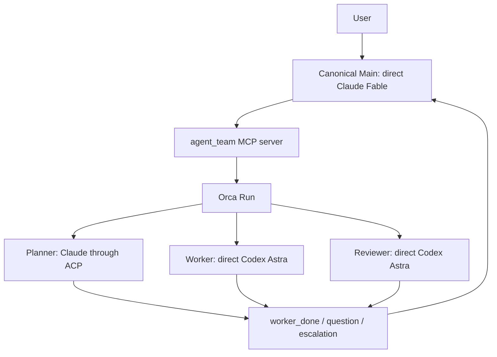

# アーキテクチャ

[English](architecture.md) · [README](../README_JA.md) ·
[設定リファレンス](configuration_JA.md)

## runtimeを明示的に選択する

`agent-team`はオーケストレーションとAgent実行を分け、設定の`runtime`でbackendを選択します。
version 3の`runtime = "orca"`は既存の4 role固定構成を使い、version 5は名前付きOrcaの`agent`/`serial`と`agent`/`parallel`にも対応します。
version 3の`runtime = "tmux"`、`"herdr"`、`"zellij"`は実験的なnative pathで、direct Claude Mainを必須とし、verified Claude ACPの
Planner、Worker、Reviewerを任意に追加できます。native Workerのassignmentにはconfigの
`[[tasks]]` catalogにあるTaskSpecとの完全一致が必要です。その他の未対応native profileは、
state、Task、Dispatch、processに影響する前に拒否します。

### 固定version 3のOrca runtime

OrcaはRun、Task、Dispatch、message、terminalを管理します。launcherはrole別の起動引数と
private runtime stateを管理し、ACPの完了をOrcaの`worker_done`へ変換します。



### 名前付きOrcaにも共通のタスク規則を適用する

Version 5の名前付きOrca `agent`/`serial`は、`runtime = "orca"`を持つversion 4のstateを保存します。
名前付き`agent`/`parallel`は同じruntime tagを持つversion 5のstateを使います。
Mainはdirect Claude、background nodeはscoped Claude ACPを使い、node IDと役割の設定を固定します。
Codex ACPの内部実装もありますが、公開設定では拒否します。
`orca_dispatch`はOrcaのTaskとterminalを作り、Dispatchの識別情報を保存してからrunnerの起動commandを送ります。
論理的なTaskSpec IDとOrca Task IDは、別のfieldと名前空間で管理します。

`orca_acp`は信頼する出力とproviderの終了確認を`orca_result`へ保存します。
`notification_expected`が表すのは`worker_done`を送る判断であり、配達済みの証拠ではありません。
`orca_tasks`は実際のDeliveryと結果を照合し、read → release → ACKの順を強制します。
端末の終了証拠を保存するため、ローカルファイルの削除だけ失敗しても、端末を二重に閉じず再試行できます。
レビュー判断、回数上限、承認済みworkspace revision、固定argv検証には共通のタスク処理を使います。

Claudeの質問は既存のprivate socketを使い、フォームの全fieldをOrcaの質問1件にまとめます。
MainがJSONの回答を返してDeliveryをACKした後、workerは保存済み回答のIDと本文を照合します。
一致を確認してから同じACP sessionへ回答を渡します。Codexの質問は無効です。

Deliveryの待機・読み取りとstatus/attachの照合中は、stateの排他制御を解放します。返信、ACK、最終的なterminalのfocus操作では、停止との競合を防ぐため排他制御を保持します。
`pending_orca_effect`には返信・ACKの識別情報と回答のhashを外部操作の前に保存します。
結果が不明なら再送、進行、停止を拒否し、`status`の`cleanup_pending`に記録を表示します。
起動途中の失敗も`pending_role_start`へ残します。これらの記録だけで外部操作の完了を証明せず、不明な操作の自動復旧も行いません。
停止ではproviderの終了確認を待ち、既存の完了Deliveryを消費するか、該当するcontext-only Dispatchと所有端末を停止します。
各経路の契約テストは成功しています。直近の実機試験ではMain起動とprompt受付まで確認しましたが、名前付きOrcaの実モデル全工程は未確認です。

### 名前付きOrcaのagent/parallelはRun単位で受領する

名前付きOrcaの`agent`/`parallel`はstate version 5を使い、TaskSpec、TaskBatch、レビュー、検証の規則を共有します。
direct ClaudeのMainが`task_batch_open`で対象batchを開き、Planner、Worker、Reviewerはscoped Claude ACPで動きます。
Orcaの`program`構成は引き続き拒否します。

`role_wait`には実行中のnodeを指定しますが、返すのはRun内で最も古い未ACKのDeliveryに含まれる全eventです。
他のnodeのeventも含みます。runtimeは各messageを保存済みのTask、Dispatch、端末、結果または質問のoutboxと照合し、
保存前にもassignmentの世代を再確認します。Mainは返されたeventの識別情報とTaskDispatchのreceiptを使い、操作対象のnodeを選びます。

rootの`orca_delivery_batch`には、共有Delivery ID、各ownerの識別情報、messageの件数とhash、phase、長さを制限したerrorを保存します。
nodeごとのstateには結果、質問、未確定のreply effectを保持します。Mainは完了した全ownerをread/releaseし、すべての質問に回答してから、
Delivery全体を1回だけACKします。未知または矛盾するmessageがあれば、既知のmemberも部分的には処理せず、不正なbatchとして保持します。
古い待機応答を新しいassignmentへ保存することも拒否します。

未回答の質問や結果未確定のreply/ACKがある間は、共有ACKを行えません。
`stop`はproviderの終了を確認できたpeerの所有資源を解放できますが、未解決のbatchとownerは保持します。
ACKの応答を受け取れなかった場合も、送信記録と全ownerを残し、自動再送しません。

providerを呼ばない試験`run_2f5e3cc0197f`では、異なる2件のDispatchから送ったmessageが、2回のcheckで同じDeliveryとして返ることを確認しました。
両ownerのread/releaseと端末closeの後、1回のACKで未読が0になりました。PID、process group、待機用scriptが残っていないことも別途照合しています。
内部の検証記録は`orca-fifo-protocol-complete-proof.json`で、配布物には含めていません。この試験で確認したのはOrcaのFIFOと終了処理で、実モデルの全工程や認証動作は対象外です。

最終の正式な`tests/run.sh`は、Python 3.13.15で732.993秒、3.11.15で642.654秒かかり、両方とも成功しました。
対象はpackage 1,246件、CLI 33件、MCP 33件、compact runner 8件と、shell・設定の検証です。
各回で同じ233ファイルが変更されていないことを確認しています。独立レビューで見つかった古い不正batchの保存、
activeな質問と通知対象結果の同居、回答receiptの上書きは、この最終検証前に修正しました。
検証後の更新は文書だけで、実装とテストの内容は同じです。名前付きOrcaの実モデルparallel受入は未完了です。

### 名前付きOrca直列実行の検証

下記のplatform用テスト修正後、正式な`tests/run.sh`はPython 3.13.15で728.473秒、3.11.15で736.282秒かかり、両方とも成功しました。
各環境でパッケージ1,192件、CLI 33件、MCP 33件、compact runner 8件と、適用対象のshell・source state・rendered home・Nix検証を実行しました。
実行中はsource manifestの222項目が不変でした。ログには意図した負例の出力とplatformによるskipも含まれます。
この検証だけでは、Orcaでの実機全工程を確認したことにはなりません。

Python 3.11の空の環境へ導入したパッケージは`dotfiles-agent-team` 0.1.0だけで、追加のPython依存はありません。
runtimeの76ファイルはsource・wheel・導入先で一致し、sdist、著者、対応Python、README metadata、lockfileの検証も成功しました。
隔離したCLI検証ではruntime stateを作らず、検証後に環境を削除しました。buildとCIの対象commitは
[PR #7](https://github.com/iamtatsuki05/dotfiles/pull/7)に記載します。

最初の実機試験2回は、Orca 1.4.190と選択したClaude Code 2.1.263で行いました。
最初の`run_a372c9ef428f`は新規repositoryのtrust画面で停止し、名前付きチームの進行には到達していません。
公開stopは成功し、通常のClaudeの確認対象4pathに変化はありませんでした。
2回目の`run_70c45e0282db`では、既に信頼済みのrepositoryに専用worktreeを作成しました。
Main端末`term_a26f70d6-d450-438c-9335-afb448ea0af1`はtrust画面なしで起動し、3,178 byteの初期promptを受け付けました。
その後Fableの利用上限が表示され、TaskDispatch・Worker・Reviewerは0件でした。
モデル応答、質問、レビュー、固定argv検証、タスク完了は確認していません。

2回目は表示された自動再開の前に公開stopが成功し、保存state、稼働中のMain端末、記録した3 PIDの不在を独立に確認しました。
観測scriptはstate消失で終了し、その後の重複stopはlocalで失敗しました。新たな外部操作は発生していません。
Orcaには閉じた端末の履歴情報が残る場合があります。再試験に使う専用worktree、初期shell、選択済みの導入環境は保持しており、
試験用資源をすべて削除したという意味ではありません。

2回目の試験では`~/.claude.json`のcache、起動統計、OAuth profile metadata等が更新されました。
選択repositoryのtrust値とsettingsファイル2件のhashは不変でした。確認対象のcredentialsファイルは試験前後とも存在しませんでした。
Keychainの内容は比較しておらず、OAuth subjectの試験前後の同一性も完全には確認できていません。
既存のTeam subscription認証のstatusは、実際の課金記録の確認とは区別します。login、trust付与、権限・課金契約の変更は要求していません。
名前付きOrcaの実モデル全工程と、残るbackend・harnessの受入条件は未達です。

以前の表示にあった再開時刻を過ぎてから、3回目の`run_6389a0782d6b`を実行しました。
Mainはpromptを受け付けましたが、再びFableの利用上限が表示され、自動再開時刻は2026-09-09の14:10 JSTに変わりました。
TaskDispatchとモデル応答は0件です。自動再開前に公開stopが成功し、記録した3 PID、そのプロセスグループ、稼働中のMain端末、stateの不在を独立に確認しました。
今回はaccount UUIDとorganization UUIDのhashを試験前後に取得し、両方の一致を確認しています。
settingsファイルのhashとrepositoryのtrust値は不変で、確認対象のcredentialsファイルも不在のままでした。
Keychainの内容と実際の課金は未確認です。再試験用worktree、初期shell、選択済みの導入環境は保持しています。

最初のCIでは、`38f6ec9`の新しい依存確認テスト1件がUbuntuの両Python版で失敗しました。
実装は既存仕様どおり`orca-ide`を選んでいましたが、テストがmacOSの`orca`を期待していたためです。
テストを両platformの明示的な期待値に直し、SDK欠如時のエラーとfallback未使用の確認を維持しました。
runtimeの動作は変更せず、正式なlocal検証を両Pythonで再実行して成功を確認しています。

### 実験的なnative terminal runtime

`NativeBackend`はMain/ACP/task lifecycleを共有し、選択した`TmuxBackend`、`HerdrBackend`、
`ZellijBackend`がterminal driverを提供します。`native_main`は所有する
Mainまたはprogram coordinatorのprocess groupを監督し、共有MCP framing layerは保存済みstateからOrcaまたはnative
backendを遅延選択します。native ACPのPlanner、Worker、Reviewerはlauncherが所有する
background processとして動き、完了を`publish_completion`で通知します。terminal paneの文字列は
lifecycle eventとして解釈しません。agent teamではMainにattachし、Mainなしのprogram teamでは`attach --coordinator`を使います。
ACP background roleにはattachできるTTYはありません。native pathでは、
OrcaとCodexがない環境、空白を含むworkspace path、削除済みconfigを使ったmodelなしの
start/status/stop smokeが成功しています。

Herdr driverはversion `0.8.2`とprotocol 20のhandshakeを厳密に確認します。Main自然終了で
Herdrのpaneやworkspaceが消える場合がありますが、paneの不在だけではstop成功とみなさず、
所有するserver/socketとtrusted Mainのcleanupを確認します。

Zellij driverは`0.44.1`でcompatibilityを確認した対象です。preflightはCLIのexact versionを要求せず、
detached mode、persistent clientなし、`--max-panes 1`なしを使います。Main metadataを保持し、
terminalを1つと既知のsuppressed `zellij:link` pluginだけを受け入れ、未知のpane/pluginはunknownのままにします。

HerdrとZellijはnative terminal driverとして利用できます。名前付きnodeのagent/serialとagent/parallel、program/serial、
program/parallel構成をversion 5で接続しています。nativeのagent/parallelはMainが正確なTaskSpec IDの`agent_batch`を明示してから
named writerとReviewerをdispatchします。program構成にはMain roleを置かず、選択したterminal上で既存の`native_main`
supervisorが固定argvの`_program-run` coordinatorを監督します。2つのmodeの間にschedulerや暗黙の変換はありません。
名前付きOrcaのagent/parallelは上記のversion 5 Run FIFO contractを使います。Orcaのprogram構成と10 harnessの大半は、現在の実行対象外です。
2つのsystemで同じWorkerを分担すると、完了判定とcleanupの責任が曖昧になります。

native Claude ACPの質問応答は、既存のTask/Dispatch内で動きます。実モデルでの質問応答はtmuxで確認済みです。
HerdrとZellijでは、実際の端末と模擬プロバイダーを使って契約を検証しています。名前付きnativeのReviewer相談回答と
serial/parallel program coordinatorもfocused testで接続しています。boundedな端末・fake providerのparallel coverageは下記に
過去runの証拠として記載し、今回のMain parallel live受入は下記にまとめます。実モデルのparallel受入と全ハーネスへの対応は引き続き未完了です。
上記の名前付きOrca protocol proofはprovider-freeであり、実モデル受入のgateを閉じるものではありません。

### 名前付きnodeとTaskSpecの担当指定

[Version 5](configuration-v5_JA.md)では、`NodeRef(node_id, kind)`と固定の役割種別`Role`を分けます。
IDはnode、assignment、資源、質問、結果、通知を識別し、kindは工程と権限を決めます。
provider/model/effort/prompt/permissionはnodeごとに保持します。MainはMCPに正確なnode IDを渡し、
taskのrouteは計画・実装それぞれのwriterとreviewerを指定します。計画担当の組を宣言した場合は、
計画の承認後に実装へ進みます。その組を省略したrouteではPlannerを省けます。

configはversion 5、名前付きserial stateはversion 4、名前付きOrcaの`agent`/`parallel`とnativeのagent/parallel・program/parallel stateはversion 5です。
名前付きOrca parallel stateはRun単位の`orca_delivery_batch`を所有します。graphと`role_specs`は設定済みの全nodeを含み、version 5の`roles`にはactive assignmentとnodeごとのresult、question、
pending Delivery containerを保存します。native runtimeのTask UUIDと論理的な`TaskSpec.task_id`は別物で、
dispatch IDが結果と対象taskを結び付けます。stateの読み取り、通知の保存、taskの遷移では、ID・kindの欠落や不一致を拒否します。
version 3のstateは従来の契約を維持し、自動移行しません。

実モデルのtmux run `ea85a811-dd06-4bd3-a1d6-f6156f5670ef`では、direct ClaudeのMain `lead`、
Worker `write-sum`/`write-product`、Reviewer `review-sum`/`review-product`の5nodeすべてに
Fable/highを明示指定しました。Mainは設定一覧の先頭ではありません。両Workerの実装後にレビューを始め、
`write-sum`は2問へのMainの回答と受領確認後、同じACPセッションで作業を再開しました。
4つの別セッションから、成功と後始末を示す型付き結果を取得しています。両taskの承認と宣言済み固定argvの検証は、
同じ統合revision `73f695e5defd84158855ea581793b125263b7cac884d336bbba34637e4647f07`で成立しました。
読み取り専用のobserverは、変更が許可したfixtureの2ファイルだけであり、workspaceのHEAD・index・その他のmanifest項目が
変わらないことを確認しました。入力configとpromptを削除した後の公開stopも成功し、独立した照合で所有process、
process group、state、provider root、snapshot、fixture資源の不在を確認しています。

これは過去runに対するnativeのagent/serial構成の受入結果です。nativeのprogram/serial進行管理も実装とfocused contract testへ接続しています。
nativeのprogram/parallelはversion 5 stateを使い、activeなnodeごとにDelivery containerを持ちます。
`max_active`、正確なnode identity、重ならないWorker write scopeでadmissionを判定し、pending questionは自分のassignmentだけを止めます。
条件を満たす独立peerは継続できます。完了Deliveryは`role_read` → `role_release` → `delivery_ack`の順で処理し、
release後のassignmentも一致するackまでstateに残します。privateなparallel Stopは`native.phase=stopping`を保存して安全なassignmentを同じ順でdrainし、
identity不明、typed result不足、cleanup未確認のnodeを保持したまま安全なpeerを続けます。

両program modeはMain role、Main model、専用CLIを作らず、選択したterminalと保存済みcoordinator identityを使います。
`program_wave`は宣言順と依存関係から`task_ids`、`phase`、`revision`を保持し、wave内の全writer完了、同じrevisionの全Reviewer承認、
fixed argv検証の順に進みます。focused testと過去のboundedな実端末・fake providerのcaseでnative program parallelのcontractを確認していますが、
実モデルのparallel受入は未実施です。

agent/parallelでは、Mainが任意順の空でない一意な宣言済みIDを`task_batch_open`に渡し、保存するIDをcatalog順に正規化して
`{task_ids, phase, revision}`を保存します。dependencyはbatchの外でcompletedでなければなりません。最初のfinal review dispatchは
全writerとDeliveryをdrainしてからbatchをsealし、同じsealed workspace revisionの全Reviewer承認後に全roleとDeliveryを消費してfixed argv検証へ進みます。
implementation routeの中間plan reviewはwriter phaseで行い、plan-only routeのplan本文SHA-256（`record.revision`）と
コードの`workspace_revision`は別に保存します。`changes_requested`、回答済みconsultation、確認済み`verification_failed`のretryでは、
全roleとDeliveryをdrainし、必要なconsultationへの回答と全memberの残りreview roundを確認してから、Mainが元のwriterへ`task_dispatch`を呼びます。
その1回のrequestが、`completed`済みpeerを含む正確なpeer集合のreopenと要求したwriterのdispatchを原子的に行います。peerは自動dispatchしません。
公開reopen toolはなく、`task_batch_open`で未完了batchをreopenまたは置換することもできません。不正なTaskSpec、route、message、review limit、dependency inputではstateを変更しません。
parallelの`role_prompt`はread-only調査も含めて拒否し、serialのread-only `role_prompt`は維持します。`task_batch_open`はparallel Mainの
明示的な`--tools`と`--allowedTools`にだけ追加します。今回のMain parallel live受入は下記に記載します。実モデルの名前付きOrca、
Orca/native shared progression、実Main Astra/provider受入は未解決です。provider-freeの名前付きOrca protocol proofは上記に記載しています。

Reviewerの相談は、名前付きnativeで独立した操作として扱います。`status`にはopaqueな相談ID、findings、task/stage、回答状態を表示し、
`answer --consultation-id ID --body ...`で`agent`と`program`の両方へ回答できます。IDはrun、TaskSpec digest、review stage、正確なreview Dispatchに束縛し、
本文は16,000文字以内です。同じ本文だけをidempotentに再送できます。本文置換と古いIDは拒否し、元のwriterの再dispatchとboundedな再reviewを要求します。
review roundの上限到達後は回答を保存できても、再dispatchを許可しません。

### native programの限定実機試験

serial programの実機試験`b239945b-283e-403b-aba5-84ba984c8469`では、選択したtmux terminalと宣言済みの`write-sum`を使いました。
taskは2問を返し、CLIで2件の`--message-id`回答を受理し、同じACP session
`b43cc938-c08a-432d-99ec-f6a4c6c2a8bd`が`received`まで進みました。その後ClaudeがFableの利用上限で失敗しました。
coordinatorはfailed resultを公開し、`read` → `release` → `ack`を処理して終了コード1で終了しました。実装、review、fixed argv検証には到達していません。
したがって、これはlifecycleと失敗処理の試験であり、program全工程の成功受入ではありません。

configとpromptを削除した後の公開`stop`はreturn code 0、0.406秒で完了しました。独立した`ps`とpathの確認では、所有PID、process group、
private path、fixture、virtual environmentは残りませんでした。observer自身にcommand identity errorがあり、独立したtyped receipt fieldは保持できていません。
cleanupの主張は、native clientが受理したresult、公開stopの結果、process/path確認に限定します。model切替とbilling変更は行わず、通常authのwrite経路も未検証です。
利用上限後の実モデルread-only plan-only試験は実行していません。

program contract focused testでは、serialとparallelのadmission、assignmentごとのstate、Delivery順序、
canonical wave遷移、private Stopを確認しています。これは実装とcontractの検証であり、失敗したserialの実機試験を
実モデルのprovider workflow成功へ変えるものではありません。

### 過去のnative program/parallel限定端末受入

過去の独立監査では、fake Node・client・providerを使い、実際のtmux、Herdr、Zellij terminal driverで8件の成功ケースを確認しました。
これはterminalとlifecycleの証拠です。SDK wire、実モデル、認証、provider billing、OS sandboxの証拠ではありません。

| ケース | terminal / Python | run ID |
|---|---|---|
| writers → review → fixed argv検証 → stop | Zellij / 3.13 | `ab237f28-c06f-4922-913a-2d4e4e776e11` |
| writers → review → fixed argv検証 → stop | Herdr / 3.13 | `b321d505-0fef-475b-b546-446f59601ccb` |
| writers → review → fixed argv検証 → stop | tmux / 3.13 | `0b1b54ab-4f03-4a45-94d0-fe556c6cc64c` |
| writers → review → fixed argv検証 → stop | tmux / 3.11 | `6a22a03f-43da-47d8-9840-c5f65e554491` |
| Aは未回答、Bは継続、stop | Zellij / 3.13 | `ca873b0e-b63d-47e5-a78b-7e5f9a23a57b` |
| Aは未回答、Bは継続、stop | Herdr / 3.13 | `9262e0da-041d-4dfc-a4b1-d1b010bfac2e` |
| Aは未回答、Bは継続、stop | tmux / 3.13 | `1b0fb484-2b37-4878-a9b7-f34fb5adf92c` |
| Aは未回答、Bは継続、stop | tmux / 3.11 | `62b0e835-2c43-4e70-8cff-dd08051d5bd4` |

通常ケースでは、2つのwriterが同時にactiveとなり、互いに異なるfileへ書き込みました。
writerをdrainしてcanonical waveをsealし、同じ統合revision
`98795fc4bcb4f6e7e15d48e8d8470b73160bd858382ce1349103d3f6e9bdb082`をreviewし、
fixed argvの読み取りと出力assertを通過して2つのtaskをcompletedにし、public Stopまで完了しました。
独立監査では、各通常ケースで既知のPID 11件、process group 9件、path 20件の不在を確認しました。
fixture rootは消失し、source manifestは不変でした。

questionケースでは、B側のbarrierをreleaseする前に、両runnerとclientのPID/argv、process group、kernel parentを取得しました。
Aを未回答のまま保持し、Bは出力とackまで進みました。public Stopは回答もacknowledgmentも捏造せず、Aの状態を保持しました。
Stop前のsnapshotではAがrunning、Bがawaiting implementation reviewでした。どちらもTask completionとは扱っていません。
各questionケースで既知のPID 7件、process group 5件、path 12件が不在となり、fixture rootは消失し、source manifestは不変でした。

最新matrixには、atomicなreadの`lstat` → `open`で正当なrenameを同じguard内で初回を含めて最大3回試行する修正と、
process exit後に`_wait`がfreshなstateを読み、matching publicationを検証する修正を含みます。再現例:

```
AGENT_TEAM_RUN_LIVE_NATIVE=1 AGENT_TEAM_RUN_LIVE_PROGRAM=1 \
AGENT_TEAM_LIVE_RUNTIME=tmux \
uv run --locked --project scripts/agent-team python -m unittest discover \
-s scripts/agent-team/tests -p live_parallel_program.py -v
```

この過去監査のfocused test snapshot（Python 3.11と3.13で各263件）と正式な`tests/run.sh` snapshot（パッケージ1,025件、
CLI 33件、MCP 33件、compact runner 8件、source manifest 194項目）は、commit `1314cc4`時点のhistorical baselineです。
旧PR #7のCI/build記録と上記のquestion/program run IDも、同じcommit時点の記録であり、現在のsourceの結果ではありません。

以前のnative Main並列commit `8b7d17b`では、正式な`tests/run.sh`がPython 3.11と3.13で通過しました。各環境でパッケージ1,055件、CLI 33件、MCP 33件、
compact runner 8件と、適用対象のshell・source state・rendered home・Nix検証を実行しています。
両実行中はsource manifestの199項目が不変でした。変更周辺のテスト293件も両Pythonで成功しています。
終了後はこの文書の検証結果だけを更新して再確認し、実装・テストは変更していません。build・clean install・CIの結果は
[PR #7](https://github.com/iamtatsuki05/dotfiles/pull/7)を参照し、記載された対象commitが確認中のコードと一致することを確かめてください。
agent/parallelの端末試験は下記に分けて記録し、実モデルのparallel受入は未確認です。

最初のZellij run `f678e9f5-9fbb-4376-a18a-1855612ba69b`はreview前に終了し、正確な理由は保持できませんでした。
後のstartup capture `1d4a1e5b-9c8f-4c4e-be00-84eb69a12df1`ではchild receiptがなく、public Stopも失敗しました。
manualのexact-owned server cleanupでは、既知のPID、process group、path、workload scopeの不在を確認しましたが、
`descendants_stopped=false`は保持しています。これらの失敗記録から、未観測descendantのcleanupや最初の終了の因果関係は主張しません。
stateとterminalは消失し、inertなfailed fixtureは保持しています。

それ以前のterminal/fake provider suiteは、上記8件のparallel監査とは別のhistorical evidenceです。
providerや認証を呼び出さず、tmux、Herdr、Zellijでlifecycleとquestionの5件を確認しました。
Zellijでは一時名のsuffixが`_`Bで始まる場合も検証し、生成側のprefixは有効な形に保っています。
この過去の記録は、未実施の実モデルparallel受入を置き換えません。

### native agent/parallelの限定live受入

次の8件は、Mainとproviderを模擬し、MCP childと選択したnative terminal driverを実際に動かして、
Mainが調整するnative `agent`/`parallel`経路を確認したものです。8件は同じ190件のproject file集合を使いました。
これは`tmux`、Herdr、Zellijのlifecycle、batch barrier、fixed argv、cleanupに関する証拠です。
実Main/model、Claude SDK、Astra、provider、OS sandboxの証拠ではありません。

| terminal | Python | normal run | unanswered-question run |
|---|---|---|---|
| tmux | 3.13 | `846e0cd9-687d-4335-aef0-7d12602e8edc` | `4b8cc319-fbe4-47d6-9fcc-b842a577e8e2` |
| Herdr | 3.13 | `a75710cd-a4de-4d85-a57f-9942325af8ba` | `56a92452-70b5-4d55-9112-c9e09ab24c84` |
| Zellij | 3.13 | `d83535b1-2fd4-491c-b7ac-257c3768ea29` | `6eef0e01-118d-40f4-aa85-8f0dbf0eff81` |
| tmux | 3.11 | `2252a0cf-3b08-432f-8a3a-f6375c4af232` | `c38a91a9-7aed-4bec-977e-a5761c8e8d47` |

normal runでは、両writerが同時に動きました。Main自身が各completionをwait、read、release、ACKし、
全Reviewerが同じ統合revisionをreviewし、固定argv 2件が成功し、両taskが`completed`になった後、public Stopを完了しました。
独立監査では、各normal runで12 PID、9 process group、20 pathの不在を確認しました。

質問ケースでは、Mainがworker Aの未回答の質問をwaitで観測し、worker Bの完了通知だけを処理しました。
停止前のsnapshotでは、Aは`running`、Bは`awaiting_implementation_review`でした。公開`stop`は質問への回答や質問通知のACKを作らずに
実行を取り消し、runtime stateを削除しました。各ケースで既知のPID 8件、process group 5件、path 12件の不在を確認しています。
この質問ケースは、タスク全体の完了を確認した試験には含めません。

選択したtmux live suiteは次で再現できます。

```bash
AGENT_TEAM_RUN_LIVE_NATIVE=1 AGENT_TEAM_RUN_LIVE_AGENT_PARALLEL=1 \
AGENT_TEAM_LIVE_RUNTIME=tmux \
uv run --locked --project scripts/agent-team python -m unittest discover \
-s scripts/agent-team/tests -p live_parallel_agent.py -v
```

初期のPython 3.11 question run
`a0c47346-a91d-4c07-8e9f-d23af4213b4d`は、この8件には含めません。最初の公開`stop`はworker Aのcleanup未確認で失敗しました。
テストの後処理で2回目の`stop`を実行した後、stateの消失と、既知のプロセス・所有リソースの不在を独立に確認しています。
ただし、初回の詳細理由と2回目の停止応答は保存されておらず、原因は未特定です。失敗ログと停止前snapshotを含むfixtureは保持しています。
後続4件の診断試験は表の8件とは別枠です。後続試験の成功は、初回失敗の原因を解消した証拠にはなりません。
現在のfixtureは各停止応答と失敗直後に残るstateを保存し、公開例外には既存のsanitizedな`retained.error`を含めます。

### 実モデルを使ったtmuxでの質問応答受入

run `dc101afd-87bf-4697-9bbb-0d1339d381a8`では、Main、Worker、ReviewerにFable・effort `high`を使い、Plannerを省略しました。
MainがWorkerの質問2件に回答して受領確認すると、同じWorkerのACPセッションが再開しました。
Reviewerの承認後、同じリビジョン`983bcea3d92dcdd37212f3ba72f6e54092f2323aa1170a11da67cbbe98dc900e`で宣言済みの固定コマンドが成功し、86.762秒でTaskが完了しました。
変更は許可された計算用ファイルだけです。設定とプロンプトを削除してから公開`stop`を実行し、1.513秒で停止しました。
担当2件の型付き結果からACPセッションの終了を確認し、所有するプロセス、グループ、パス、状態、試験用ファイル、隔離環境が
残っていないことを独立に照合しました。この試験には、協調的な停止と通知待機時のロック競合を修正した実装を使っています。

別のrun `e808db06-50b0-4744-a24d-0ebf7408b63d`では、質問2件を未回答・未受領確認のまま、公開コマンドで停止しました。
停止は1.435秒で完了し、型付きACP記録の`cleanup_confirmed=true`、対応するセッション、クライアントの終了コードを検証できました。
観測した所有プロセス7件とプロセスグループ3件がすべて終了し、状態、一時パス、試験用ファイル、隔離環境、プロセスからの参照が
残っていないことも独立に照合しました。試験に使ったwheelは実装63ファイルと一致し、Python 3.11のインストール確認では
`dotfiles-agent-team`だけを含む環境で基本操作が通りました。

それ以前の質問待ち停止、`1000018d-3ae0-4d62-b2af-a5c89be31c6a`と
`c945f3f5-8dcf-4643-a05a-72d1a62bab78`は失敗しています。ACP記録には`cleanup_confirmed=true`がありましたが、
Pythonがクライアントの終了コードを失い、完了結果を確定できませんでした。公開`stop`の`returncode=1`から、クライアントの終了コードは判断できません。
処理プロセスは終了し、所有する待機中のtmux端末は後から回収しました。失敗時の状態、一時領域、スナップショット、結果ファイル、
試験用ファイルは保持しています。今回の再試験が成功しても、過去の失敗を成功に変更することはありません。

## componentごとに責務を限定する

| Component | 責務 |
|---|---|
| `config.toml` | 固定role、provider、transport、model、effort、prompt、permission、nativeの`[[tasks]]`を宣言する。 |
| `agent_team/config_v4.py`, `topology.py` | 名前付きteam一覧を検証し、graphを描画する。起動可能な項目は、対応するversion-3起動設定を明示参照する。 |
| `agent_team/config_roles.py`, `config_v5.py`, `named_graph.py` | nodeごとの役割設定、graphの識別子、taskの担当を検証し、選択したversion 5のteamを起動設定に変換する。graph描画も担う。 |
| `agent_team/cli.py` | config/引数をparse・検証し、`WorkflowEngine(OrcaBackend)`または選択したnative terminal backendを選び、互換JSONを描画し、ACP turnを実行する。 |
| `agent_team/backend.py` | Orcaの`start`/`status`/`attach`/`stop` adapter、state v3のidentity検証、互換receiptを担当する。 |
| `agent_team/native_backend.py` | 共通nativeの`start`/`status`/`attach`/`stop`、native ACP assignment、完了通知、cleanup確認を担当する。 |
| `agent_team/native_terminal.py` | 共通terminalのreceipt、inspection、presence、close protocolを定義する。 |
| `agent_team/tmux_backend.py`, `herdr_backend.py`, `zellij_backend.py` | NativeBackendを選択したterminal driverへ束縛する。 |
| `agent_team/herdr.py`, `zellij.py` | Herdrのversion 0.8.2/protocol 20のhandshakeと、0.44.1でcompatibilityを確認したZellijのidentity/cleanup contractを検証する。 |
| `agent_team/native_main.py` | 所有するnative Mainのprocess group、またはprogram coordinator childを監督し、終了receiptを保存する。 |
| `agent_team/native_program.py`, `program_policy.py` | Main modelや別task ledgerを作らず、保存済みnative `program` graphをserialまたはparallelのTaskSpec waveとして進める。 |
| `agent_team/native_delivery.py` | version 3/4のroot Deliveryと、version 5のnodeごとのresult、question、pending Delivery containerを解決する。 |
| `agent_team/parallel_admission.py` | version 5の`max_active`、exact node、重ならないWorker scopeのadmissionを検査する。 |
| `agent_team/orca.py` | 固定Orca argv/envelope decoderを担当する。MCP role操作は持たない。 |
| `agent_team/tmux.py` | nonceを付けたprivate tmux serverとMain paneの作成・検査を担当する。 |
| `agent_team/locking.py` | teamごとのstable lifecycle reservationを担当する。backendをimportせず、stateの書き込みとruntime操作で共有する。 |
| `agent_team/cleanup.py` | private stop journal、startup recovery sidecar、local cleanup/rollbackのexact phaseを担当する。 |
| `agent_team/mcp_protocol.py` | 共通MCP schema、JSON-RPC framing、backendに依存しない遅延serveを担当する。 |
| `agent_team/mcp_server.py`, `runtime_mcp.py` | Mainのtool入力を解釈する。固定Orcaは`mcp_server`、nativeと名前付きOrcaは共通の`runtime_mcp`と選択したbackendを使う。 |
| `agent_team/orca_dispatch.py`, `orca_acp.py`, `orca_tasks.py`, `orca_questions.py` | scoped ACPをOrcaのTask・Dispatch・terminalに結び付け、結果、質問、停止、Deliveryの処理順を強制する。version 5のparallel stateではrootの`orca_delivery_batch`とroleごとのjournalも管理する。 |
| `agent_team/orca_delivery.py`, `orca_parallel_stop.py` | OrcaのDelivery ownerを選び、parallel Runの停止時にbatchを処理する。 |
| `agent_team/role_snapshot.py`, `task_verification.py` | 選択した設定のsnapshotと承認済みrevisionの検証をnative・名前付きOrcaで共有する。 |
| `agent_team/task_spec.py` | immutable TaskSpecのexact schemaとpath/verification fieldを検証する。 |
| `agent_team/task_execution.py` | TaskSpec digest、dependency admission、review decision、stage別round limitを保存する。 |
| `agent_team/task_verification.py` | approved workspace revisionでfixed argvを実行し、bounded evidenceを保存する。 |
| `agent_team/workspace_revision.py` | boundedなGit workspace revisionを作り、symlinkとspecial fileを拒否する。 |
| `agent_team/scoped_acp.py`, `scoped_policy.mjs` | nativeのrole設定を固定し、TaskSpecのpath検査を共有する。 |
| `agent_team/claude_scoped_agent.mjs`, `scoped_file_tools.mjs` | それぞれClaudeのtool hookと、Codex向けの4つのホストfile toolを制御する。 |
| `agent_team/scoped_acp_client.mjs`, `scoped_question_client.mjs` | native assignmentごとにpublic ACP SDK接続を1本作り、選択したClaudeのform elicitationとcleanupを確認する。 |
| `agent_team/native_question_channel.py`, `native_questions.py` | boundedなprivate question socketと、native questionのdurable outbox/receipt contractを担当する。 |
| `agent_team/native_acp_dependencies.py` | 選択したnative providerのNode、ACP adapter、SDK、必要なprovider実行fileだけを解決し、fingerprintを固定する。 |
| `agent_team/codex_preflight.py`, `codex_acp.py` | 既存の認証file・設定を検証し、Codex専用の起動fileを固定する。公開設定ではCodex ACPを無効にしている。 |
| `agent_team/codex_scoped_launch.mjs`, `codex_scoped_inspect.mjs`, `codex_scoped_transport.mjs`, `codex_scoped_bridge.mjs` | app-serverの起動設定を固定し、有効な設定の検査、通信の制限、file tool要求の仲介を担う。[Codex ACPの実装状況](acp_JA.md#範囲を制限したcodex-acpの実装公開設定では未有効)を参照。 |
| `agent_team/runtime.py` | identity、private file、state v3/v4/v5、command、environment、cleanupの安全helperを共有する。state writeは、callerがreservationを保持していない限り共有lockを取得する。 |
| `agent_team/process_identity.py` | LinuxとmacOSでprocessのexact argvを読み、表示文字列に依存しないnative所有権検査を提供する。 |
| `agent_team/registry.py` | 認識済みharnessと検証済みrole profileを記録し、別providerへのfallthroughを行わない。 |
| `agent_team/adapters.py` | provider非依存のbackground seam、出力制限付きprocess runner、exact identity検証、Copilot/OpenCode read-only adapterを提供する。Orca lifecycleの権限は持たない。 |
| `agent_team/acp_dependencies.py` | 選択したACPの依存関係だけを解決し、exact package manifestと、absoluteな実行ファイルpath・SHA-256 fingerprintを検証する。 |
| `agent_team/defaults/` | user configが選ばれていない場合に使うbundled configと日本語prompt。 |
| `prompts/*.md` | 日本語のrole contractを定義する。 |
| Orca | Run、Task、Dispatch、terminalのlifecycleを保存・管理する。 |
| Node.js、`acpx`、`claude-agent-acp` | 保存した実行ファイルbindingを通じて固定したOrca Claude ACP adapterを実行し、最終本文とexit statusを返す。 |

OrcaのCopilot read-only Planner/Reviewerは、Orca共通lifecycleとstate v3のsnapshot統合を通して実行できます。
OpenCodeのprovider adapterも実装済みですが、profile固有の境界とlifecycleを実機で検証するまでは拒否します。
native runtimeではこれらのprofileを有効にしません。direct ClaudeのMainと、任意のverified Claude ACP
read-only Planner/Reviewer、scoped workspace-write Workerだけを受け付けます。direct background
profileはTUI terminalやACP sessionではなく、各turnで新しいread snapshotに固定provider commandを
実行します。snapshotからは`.git`、symlink、special file、gitignore対象、secret-like path、provider設定、
Agent instructionを除外します。native Workerのscopeは宣言済みTaskSpecから作ります。

## canonical Mainはdirect Claudeで、ユーザーと対話するroleは1つだけ

canonical configのMainはdirect Claudeとして起動します。`agent_team` MCP serverを
利用できますが、Bash toolは持ちません。custom configではdirect Codex Mainも選べます。
その場合もMCP surfaceは同じですが、起動方法とpermissionはCodex用です。どちらの場合も、
ユーザーと対話するroleはMainだけです。native Mainのinstructionにはuserが宣言した
`[[tasks]]` catalogが含まれ、dispatch時にtask ID、scope、dependency、verification commandを
発明できません。

bundled defaultでは、MainとPlannerに`fable`、WorkerとReviewerに`gpt-6-astra`を使います。
role graphは、このlaunch configのmodel選択を変更しません。

通常のMCP serverが公開するtoolは10個です。version 5のnativeまたは名前付きOrcaの`agent`/`parallel`では、
11個目の`task_batch_open`だけを追加します。他のmodeでは広告しません。

- `task_get`
- `task_verify`
- `task_dispatch`
- `role_get`
- `role_prompt`
- `role_wait`
- `role_read`
- `role_release`
- `delivery_ack`
- `message_reply`
- `task_batch_open`（version 5のnativeまたは名前付きOrcaの`agent`/`parallel`だけ）

このMCP経由では、任意commandや任意role名を指定できません。nativeの`task_dispatch`は
configに宣言したTaskSpecとの完全一致だけを受け付けます。固定したsurfaceによって、Agentの
出力とprocess controlの権限を分離します。

Claude Mainの起動では、選択したversion 5 graphがnativeまたは名前付きOrcaの`agent`/`parallel`の場合だけ、
`task_batch_open`を明示的な`--tools`と`--allowedTools`の両方へ追加します。
serial、program、declaration-onlyのtool listは変わりません。

## Orcaのdirect roleはOrcaが監督するterminalで動く

固定version 3の`runtime = "orca"`では、WorkerとReviewerはdirect Codexです。

1. MCP bridgeがOrca Taskを作ります。
2. launcher専用のCodex terminalを、隔離した`CODEX_HOME`で起動します。
3. TUIと設定済みmodel/effortがreadyになるまで待ちます。
4. `worker-start`がterminalとTaskを結び、Dispatchを作ります。
5. OrcaがTaskとlifecycle commandをAgentへ渡します。
6. roleが`worker_done`、`question`、`escalation`のいずれかを返します。

Codex roleは組み込みの`:workspace`か`:read-only`を継承します。追加で許可する
network endpointは、現在のOrca Unix socketだけです。agent-teamは外部domainを
許可しません。

native runtimeでは、direct ClaudeのMainを選択したterminal backendと`native_main`が
監督します。nativeのWorkerとReviewerはClaude ACPのbackground assignmentであり、direct
Workerやdirect Reviewerではありません。

## ACP roleはbare Dispatchとtrusted runnerで動く

固定version 3の`runtime = "orca"`では、canonical PlannerがClaude ACPで動きます。acpxはOrcaが認識する
TUIではないため、native agentに見せかけず、bare terminalで実行します。native runtimeでは、
選択したClaude ACPのPlanner、Worker、Reviewerにpublic SDK clientを使います。TTYや
paneの文字列を完了判定には使いません。

固定version 3のOrcaでACP roleを起動する前に、Node.js `22.13.0`以降と、exactな`acpx@0.13.2`、
`@agentclientprotocol/claude-agent-acp@0.70.0` packageが必要です。Orcaは選択したroleの
`node`、`acpx`、`claude-agent-acp`を解決し、package manifestを確認してabsoluteなpathと
SHA-256 fingerprintを保存します。Orcaのrole起動経路はOrca Taskを作る前にbindingを再検証します。

native runtimeは別bindingを使います。Node.js `22.0.0`以降、
`@agentclientprotocol/claude-agent-acp@0.70.0`、その依存の
`@agentclientprotocol/sdk@1.3.0`を解決し、Node、Claude ACP entryと`dist/lib.js`、SDKのpathとfingerprintを保存します。
nativeはacpxを選択せず、`npm`や`npx`をruntimeから呼びません。directだけの起動ではACP依存関係を
解決しません。

Orcaの場合:

1. MCP bridgeがTaskとprivate prompt sidecarを作ります。
2. launcherが所有するbare terminalを作ります。
3. `orchestration dispatch`が`injected=false`でTaskとterminalを結びます。
4. assignmentをstateへ保存してから、trusted runner commandを送ります。
5. runnerがacpx sessionを作り、modelとeffortを選び、stdinからpromptを渡します。
   完了本文は`--format quiet`で受け取ります。
6. runnerが自分のacpx sessionをcloseし、exact commandでpruneします。
7. Agentの本文ではなくrunnerが、対応するOrca `worker_done`を1回だけ送ります。

nativeの場合、private pipeで子プロセスを待機させ、backendがPID、専用process group、
正確なargvを検証してstateへ保存した後にだけACP runnerを実行します。起動時のrollbackで
process groupを停止するのは、所有権を確認できた場合だけです。不明なstateは保持します。
runnerは保存済みpublic SDK entryをimportし、assignmentごとに1本の接続を使います。

```text
initialize -> session/new -> model/effort設定 -> prompt -> session/close
-> connection closeとbounded child cleanup
```

その後、Run、Task、Dispatch、terminal、nonceが一致する`publish_completion`を呼びます。
`native_backend`はこの永続化された結果を共通の`worker_done` eventへ変換します。terminal paneの
文字列は完了証拠になりません。native SDK persistenceは`persistSession=false`、
`autoMemoryEnabled=false`に固定します。interactive Mainの通常Claude historyは通常のstoreに残ります。
これはpublic SDKへの直接接続であり、providerのdirect/model transportではありません。

Agent commandにはteam、role、nonceのmarkerを含めます。prune対象をそのcommandへ
限定するため、他のacpx sessionを削除しません。nativeにはacpx session storeがなく、cleanupでは
runnerのexact argvとprivate process groupを検証します。

### native Claudeのquestionは同じassignment内で処理する

選択したnative providerがClaude ACP 0.70.0の場合、SDK 1.3.0 clientはClaudeの
`AskUserQuestion`を既存ACPのform elicitation requestとして受け取れます。この機能を有効にするのは、
assignmentがprivateな`q.sock`を所有している場合だけです。Task、Dispatch、role、permission、
TaskSpecは変わりません。Codex ACPにはquestion socketもquestion capabilityもありません。

通信の順序は固定です。

```text
AskUserQuestion/form -> private q.sock -> native question outboxをdurableに保存
  -> role_wait(question) -> すべてのmessage_idへmessage_reply
  -> delivery_ack -> q.sockへanswer -> Nodeのreceived
  -> Pythonがreceipt（identity/hashのみ）をdurableに保存
     （protected outboxは保持） -> Nodeのrecorded
  -> 同じACP sessionを再開
```

`message_reply`は回答をNodeへ渡す前に保存します。同じ`message_id`に同じ本文を再送した場合は
idempotentに成功し、異なる本文は拒否します。Mainはbatch内の全questionへ回答してから
`delivery_ack`を呼びます。1 batchは1〜4問、各question/answerは20,000文字以内、各JSONL frameは
512 KiB以内、1 assignmentあたり最大64 batchです。消費後のassignment receiptにはmessage、session、
delivery、tool-callのidentityとquestion/answerのhashだけを残します。protected outboxには、replace後の
fsyncや`recorded`公開の失敗から復旧できるよう、次のquestionまたはterminal completionまでquestion/answer
本文を保持する場合があります。receipt自体にはraw本文を含めません。

questionのDeliveryが保留中は、そのassignmentの`role_read`、`role_release`、別のdispatchを拒否します。
questionは同じassignmentの追加通信であり、既存のfile scope、Bash policy、その他のexternal-tool policyを
広げません。ACP clientが消費するまでは、そのassignmentのsuccessful completionも拒否します。version 3/4のnative serial stateでは、
questionが消費されるまでrun全体の次のdispatchも止まります。version 5のnative `agent`/`parallel`と`program`/`parallel`では、
`max_active`とwrite scopeのadmissionを通る独立assignmentを継続できますが、batch/coordinatorの検証barrierは全active assignmentとDeliveryのdrainが終わるまで
run全体で拒否します。通常の完了経路は引き続き
`role_wait(worker_done)` → `role_read` → `role_release` → `delivery_ack`です。

`role_wait`は、自身の待機期限内で質問・完了通知の保存ロックを待ちます。
ロック取得後に状態と通知の識別子を再確認します。期限切れでは通知を観測・受領確認せず、
保存済みの停止状態や不正なロックは引き続きエラーとして返します。

question中のstopはoutboxを明示的にcancellingへ進め、acknowledgeを偽装しません。provider、process group、
socket、private rootのcleanupを確認できた場合だけassignmentとstateを削除します。cleanupが不明なら
stateを保持して調査します。Mainが根拠を持って答えられるquestionと、ユーザーだけが決められるquestionは
区別します。名前付きnative Reviewerの`decision=consult`では、保存済みstatusにboundedなopaque相談IDとfindingsを出します。
`answer --consultation-id ID --body ...`は現在のreview Dispatchへ回答を束縛し、同じ本文の再送だけをidempotentに受け付けます。
本文置換と古いIDは拒否し、元のwriterを再実行してからReviewerの再判定を要求します。review roundはリセットせず、上限到達後の回答は再dispatchを許可しません。

native clientは通常のstdoutを書く前に、private root固定の`client-result.json`を公開します。
現在user所有のmode 0600、atomicかつ上書き不可で、1 MiB以下です。artifactはlaunch nonce、要求したmodel、
effortに束縛します。終了code 0はtyped success、1はtyped failure、2は公開不確実を示します。
Pythonはartifact、client exit status、取得時のstdout parity、session identity、process groupの証明をすべて
検証します。signal、Event、artifactのいずれか単独ではcleanupの証拠になりません。artifactの欠落、破損、identity不一致、
exit 2、cleanup不確認があれば、assignmentとprivate rootを保持します。

scoped native runnerのsignal handlerは、runごとの`threading.Event`を設定するだけです。明示的なProcessRunner checkpointが
cleanupを一度だけ開始し、cleanup開始後は非同期例外で中断しません。runnerはNode clientのleaderへsignalしてACP promptのcancelと
session closeを進め、client streamを上限時間までdrainし、それでもleaderが生きている場合だけ所有process groupへ段階的に
escalateします。Eventは制御要求であり、cleanup完了の証拠ではありません。raw signalを管理する別APIは公開しません。

channel内部では`received`をclient receiptの検証後に保存し、`recorded`は`recorded` frameの送信成功後にだけ保存します。
`received`の段階で失敗した場合はraw protected outboxを保持し、wire fieldは増やしません。

native publication writerは競合時にreservation取得を最大1.5秒待機し、provider/state operation自体はretryしません。
status、attach、resume、stop準備ではresourceをlock外でread-onlyに検査し、その後lockを再取得してcurrent `run_id`、
`main_process`、phase、receiptを再確認します。final stopの直列化は維持します。callbackの例外は長さを制限した非機微なtyped failureへ
正規化し、result memoryはpublication、cleanup、stdout parityの照合に必要なtyped receipt/artifactだけを保持します。

`process_attempted`は`Popen`前に記録し、`completed_returncode`はprocess終了とgroup確認後にだけ記録します。attempt後もartifact、
client exit、session identity、stdout parity、process groupの全確認を必須にします。public stopはsignal前に`native.phase=stopping`を保存し、
publication reservation内では明示的なstopをprovider successより優先します。Reviewer evidenceを破棄し、保存済みoutcomeを`failed`にし、
回答や受領確認は捏造しません。CLIの終了コード0/1は保存済みのoutcomeから決めます。

native Claudeのprovider-private rootは、呼び出し元の深い`TMPDIR`の下ではなく`/tmp`直下に作ります。
macOSではcanonical pathが`/private/tmp`になります。これにより、`TMPDIR`が長くてもprivateな`q.sock`が
Unix socket pathの上限を超えません。rootはmode 0700、socketはmode 0600を維持します。Codexのallocationは
設定済みtemporary directoryを使い、既存のtemporary-provider cleanupではUID、object type、directory descriptorの
所有権を引き続き検査します。user configの変更項目ではありません。

過去に完了した実Claude workflow、その成功receipt、確認済みのstop観測は、各runについて引き続き有効です。
ここで狭めているのは過去のactive-cancel evidenceの解釈だけで、完了済みworkflowの証拠を取り消すものではありません。

## native TaskSpecとreview gateはdurableに保存する

native runtimeのuserは、version 3 configの`[[tasks]]` tableとしてcompleteなTaskSpecを宣言し、
各taskの固定検証を1つ以上の`[[tasks.verification]]` tableで記述します。fieldは`task_id`、
`objective`、`acceptance_criteria`、`allowed_paths`、`forbidden_paths`、`dependencies`、
`verification`、`evidence_requirements`、`consultation_conditions`です。

起動前にtask ID、exact field、宣言済みdependency、dependency cycleを検証し、stateやprovider
effectを作りません。catalogはnative Mainのstartup instructionに含めます。`task_dispatch`は
宣言済みTaskSpecとの完全一致だけを受け付け、task ID、path、dependency、evidence、verification
argvを追加・変更できません。`[[tasks]]`がないnative configでは、serial stateのread-only
`role_prompt`は使えますが、structured task dispatchは拒否します。native `agent`/`parallel`では
空のcatalogをdependencyやprofile確認より前に拒否し、read-onlyを含む`role_prompt`も拒否します。
parallelの調査には宣言済みplan-only TaskSpecを使います。選択したdependency bindingとrole profileの
確認も、batchやtaskのdurable effectより前に完了します。固定version 3のOrcaはtop-levelの`tasks`を拒否し、名前付きOrcaはteamのcatalogを使います。

通常のnative flowは次のとおりです。

```text
task_dispatch（PlannerまたはWorker）
  -> role_wait -> role_read -> role_release -> delivery_ack
  -> task_get
  -> task_dispatch（planまたはimplementation review）
  -> request_changes後はPlannerまたはWorkerへ戻る
  -> implementation approval後にtask_verify
```

Planner/Worker resultは`awaiting_plan_review`または`awaiting_implementation_review`になります。
Reviewerは`task_id`、`stage`、`revision`、`decision`、`findings`だけのexact JSONを返します。
`approve`はstageを進め、`request_changes`は元のwriterへ戻し、`consult`はuser判断を要求します。
planとimplementationのreview roundは別々に数え、どちらも`max_review_rounds`に従います。

implementation reviewはReviewer assignment準備時に取得したworkspace revisionへ束縛します。
`task_verify`はimplementation approval、active role/Deliveryなし、同じrevisionを要求します。
宣言済みargvを`shell=False`で実行し、commandの前後でrevisionを確認し、bounded errorとstdout/
stderr SHA-256 hashを保存します。全command成功とcleanup確認がそろった場合だけ`completed`になります。

## identityが一致したときだけlifecycleを進める

Orcaとnative serial state（version 3/4）では、background roleは同時に1つしか動きません。
active assignmentや未acknowledgeのDeliveryがある場合、次のroleは起動できません。
version 5のnative `agent`/`parallel`と`program`/`parallel`では、各modeの契約に従ってadmissionを通ったassignmentを
`max_active`まで保持できます。

```text
role_prompt
  -> role_wait
     -> worker_done: role_read -> role_release -> delivery_ack
     -> question: message_reply（全message_id） -> delivery_ack
        -> q.sockのanswer -> received -> recorded -> 同じACP session -> role_wait
     -> escalation: 証拠を保持してユーザー判断を待つ
```

`worker_done`は、Task、Dispatch、sender terminal、Runがactive assignmentと一致した
場合だけ受理します。`question`と`escalation`は完了ではありません。failed outcomeは
そのDispatchの終端ですが、作業成功ではありません。

native backendも`role_read` → `role_release` → `delivery_ack`の順序を使います。
`native.last_ack`はacknowledgeしたDeliveryのreceipt markerを1つ記録するだけです。
Taskの完了や、ユーザーのgoal全体の完了を示すものではありません。

native questionでは、すべての回答をdurableに保存してacknowledgeするまでDeliveryを保留します。
その後にだけprivate channelが保存済み回答を送り、clientの`received`/`recorded` handshakeを記録してから
ACP promptを続けます。同じassignmentとACP sessionを再開し、新しいDispatchは作りません。
`received` receiptはhashだけのreceiptを記録し、protected outboxは次のquestionまたはterminal completionまで
利用可能です。

channel内部では`received` → `recorded`を区別します。client receiptの検証後に`received`を保存し、
`recorded` frameの送信成功後にだけ`recorded`を保存します。`received`の段階で失敗した場合は復旧用の
raw protected outboxを保持します。wire fieldは増やしません。

## stateはprivateなlaunch snapshotとして保存する

launcherはversion 3のruntime stateを次へ保存します。

```text
$XDG_STATE_HOME/agent-team/<team-id>/state.json
```

既定のbaseは`~/.local/state/agent-team/`です。stateにはworkspace、config path、
Run、Main terminal、role spec、active assignmentを保存します。model、effort、
permission、instructionsは起動時に固定します。同じteamの実行中にconfigを変更しても、
ACP runnerが新しい値を読み直すことはありません。

固定version 3のOrca ACP specには、解決した`node`、`acpx`、`claude-agent-acp`のabsolute pathとSHA-256
fingerprintを保存します。native ACP roleには`node`、Claude ACP entryとlibrary、SDKのpathとfingerprintを
保存します。各runnerは自分のbindingを検証し、fileの不足や変更があればfail-closedで停止します。

ACP prompt sidecarとstate fileは、現在のuserだけが読めるprivate fileです。stateは
atomicに書き込み、replace後にparent directoryをfsyncします。promptはsymlinkを辿らないfile descriptorから読みます。
Codexのruntime homeも同じteam directoryの下へ隔離します。
replace後のdurabilityが不明でもstateはpublish済みとして扱い、startup markerを残して管理操作で再試行します。

OrcaのMainは、空のterminalを作成し、Runとstateを保存してから起動commandを一度だけ送ります。
送信に失敗した場合や成否が不明な場合は、Mainの起動記録と準備済みresourceのIDを保持します。
自動再送やterminalの削除は行いません。Orcaのidle receiptだけでは、MCP clientの接続成功は判断しません。

実際のMain起動時には、呼び出し元で実行ファイルの絶対pathを確定し、native Mainと同じallowlistの
環境変数を渡します。Orca側のshell設定によって別の実行ファイルやAPI認証情報が選ばれるのを防ぎます。
設定検証とdry-runでは、実行ファイルの解決は行いません。

native stateには選択したterminalのreceiptと、監督対象のMain process receiptを保存します。
nativeの所有権検査はsaved executable、private process group、exact argv、固定した
`supervisor_argv`を比較します。
`process_identity.py`はLinuxとmacOSでこのargv検査を行います。ACP assignmentのrunner PID、
process group、argv、prompt sidecar、TaskSpec scope、question socket、private cleanup rootは、
`role_release`または明示的なcancellationでcleanupを確認するまで保持します。消費済みquestionのreceiptには
identityとhashだけを残し、rawのquestion/answer本文は次のquestionまたはterminal completionまでprotected
outboxにだけ保持します。

## 失敗時はfail-closedで後始末する

- role起動の取り消しで停止効果を確認できない場合は、assignmentとprivate資源を保持します。
  assignmentが揃う前の不確実な起動は、`pending_role_start`に取得済みの資源IDだけを記録します。
  `status`は`cleanup_pending`を表示し、次のrole起動とteam stateの削除を防ぎます。
  不明な停止結果の解決は自動化していません。再起動のために記録を削除しないでください。
- partial startでは、返却されたexact IDのresourceだけをstop/closeします。
- cleanup failureは元のfailureと一緒に報告します。
- CLIとMCPのstateful operationは、削除対象のstate root外にあるstableなteam別reservationを共有します。管理操作はそのlock下でstateを再読し、MCPはremote effectとsave/rollbackまでlockを保持します。
- worker-stopとterminal-closeはtypedなidentity/process-stop verdictを必須とします。worker-stopがagent terminalを閉じた場合は二重closeせず、PTY停止を確認できない場合はjournalとlocal resourceをrecovery用に保持します。
- `terminal_*`、`dispatch_not_found`、`run_not_found`、`task_not_found`のmethod-specific absence codeはread-only absenceとして正規化します。stopは該当stageをunknownとして保存し、不在をprocess成功とは扱いません。
- Main terminal作成前にdurableなstartup markerを置きます。create responseを失った場合はlocal preparationを保持し、no-tab closeの`ptyKilled=true` receiptをdurableに確認するまで次のstartを拒否します。
- startup recoveryでは、read-onlyなterminal showのstale/goneだけをprocess停止証拠とはみなしません。verifiedなclose receiptを保持するまでlocal homeを残します。
- active Mainへsignalするには、保存済み`supervisor_argv`、PID/PGID、launch nonce、phaseが必要です。
  古いnative stateでfieldが欠ける場合は保持してfail-closedにし、自動再構成やmigrationは行いません。
  upgrade前に一致するexecutable/versionで停止してください。
- CLIのruntime errorは固定分類と上限付きの既存`ERROR: <message>`本文を使い、Orcaのstderr/stdout、argv、ID、path、制御文字を表示しません。redactionと旧本文のgoldenはCLI互換テストで確認します。
- ACP subprocessとnative Mainはprivateなprocess groupで動かし、正常終了、cancel、
  timeout/output-limit時にdescendantを確認・reapしてから戻します。
- native WorkerのRead/Glob/Grepは、保護pathやlink・file typeの検査を除き、workspace内を
  読めます。TaskSpecの`allowed_paths`と`forbidden_paths`はWrite/Editだけを制限し、書き込みでは
  禁止pathを優先します。Bash、terminal、その他のRPCは拒否します。
  これはin-bandのtool境界であり、同じuserのhostile processによる同時file差し替えは防ぎません。
- workspace revisionはsymlinkとspecial fileを拒否し、5,000 file、1 file 10 MB、合計100 MBに
  制限します。任意repository全体のcoverageは主張しません。
- Orcaとnative runtimeはWindowsで即時に拒否します。contractはPOSIXのUnix socketまたは
  process groupを必要とします。
- Orca CLI名はplatformごとに固定します。macOSは`orca`、Linuxは`orca-ide`で、暗黙のPATH fallbackや
  環境変数overrideは行いません。
- ACP childへ渡す環境変数を限定します。ambient Claude loginに必要な`HOME`は残し、
  API keyとOrca control用の変数は渡しません。
- `stop`はprivate team rootを検証し、symlinkを辿らずに削除します。special fileや
  owner不一致がある場合は削除を拒否します。
- stop後もOrca Runは監査記録として残します。native runtimeは、所有するMainとACP resourceの
  終了を確認した後にlocal stateを削除します。
- verificationが中断またはcleanup不確認の場合は、Taskを`verifying`または`verification_failed`
  にevidenceとともに残します。saved evidenceに従ってnew role、verification、stopをblockし、
  自動recoveryは主張しません。実行済みcommandの証拠とcleanupを確認できた`verification_failed` taskは、
  implementationのreview round上限内でWorkerへ戻せます。

CLIの起動・管理操作は`runtime`で選択したbackendを`WorkflowEngine`へ渡します。固定Orcaのrole操作は
`mcp_server`が処理します。`runtime_mcp`はnativeの操作を`native_backend`へ、名前付きOrcaの操作を
`OrcaBackend`/`orca_tasks`へ渡します。これらの
pathがtyped contract、state、reservation helperを共有します。抽象backend contractのrole
methodは、別のuser-facing protocolではありません。

共通MCP protocolでは観測したDeliveryを記録し、結果の読み取り、所有するrole resourceの解放、
完了通知の受領確認という順序を強制します。native questionは全`message_reply`後に受領確認し、
`delivery_ack`後にだけprivate channelが回答を渡してconsumed receiptを記録します。質問中はそのassignmentの
`role_read`、`role_release`、別dispatch、verificationをblockします。version 5のnative `agent`/`parallel`と`program`/`parallel`では、
条件を満たす独立assignmentを継続できますが、batch/coordinatorの検証barrierは全active assignmentとDeliveryのdrainが終わるまで
run全体でblockします。escalationは保留します。
操作が失敗した場合は未処理状態を保持します。MCPのframingとtool schemaはbackendを選択せずに
読み込めます。最初のstateful callで保存済みstateからOrcaまたは選択したnative runtimeを選びます。
nativeの`status`、`attach`、`stop`は選択したdriverの所有resourceを検査または操作します。

Orcaで`retained`が返った場合は割り当てを保持し、terminalを閉じません。launcherが作った
Orca background terminalで`no_owned_resource`になる経路は、所有権を確認して解放する処理が
未接続です。この場合の後始末を成功とは扱いません。nativeのreleaseは、ACP runnerの終了と
cleanup receiptの確認が済むまでassignmentを削除しません。

role起動やreleaseの応答を受け取れなかった場合は、再試行前に記録されたDispatchとterminalを
確認してください。role操作には、crash後の自動再実行やexactly-onceの保証はありません。
SQLiteによる調整、schema移行、汎用のbackup/restoreは対象外です。調整はOrcaが担当し、
launcherは既存のprivateなversion-3 stateを使います。

## security上の限界を明示する

ACPは通信protocolであり、sandboxではありません。native Workerはpublic SDK tool callの周囲に
in-bandのpolicyを置きます。Read/Glob/Grepは保護pathやlink・file typeの検査を除き
workspace内を読め、TaskSpecのpath一覧では制限しません。Write/Editは`allowed_paths`内に
限定し、書き込みでは`forbidden_paths`を優先します。Bash、terminal、その他のRPCは拒否しますが、
同じuserのhostile processによる同時file差し替えをkernel levelで防ぐものではありません。
Orcaのworkspace-writeはprovider native permissionを使うdirect Codexであり、nativeの書き込みは
scoped Workerに限定します。
質問応答は追加のcommunicationだけであり、TaskSpecのfile scopeを広げたり、Bash、terminal、
その他のexternal toolを有効にしたりしません。question socketは所有するassignmentのprivateなsocketで、
Claudeだけに有効です。Codexのquestion capabilityは無効のままです。

以前のモデルを使わないtmuxの端末試験は、OrcaとCodexがない環境、空白を含むworkspace path、
削除済みconfigで確認しました。2026-09-07には、Python 3.13.15のwheel-only環境で、実際の
Claude Code 2.1.261を使い、`fable`/`high`のMainからnative Claude ACP Planner/Worker/Reviewerを
6 assignment呼び出しました。意図的な`a-b`実装は差し戻され、`a+b`が同じrevisionで承認され、
trusted fixed-argv verificationも成功しました。元のconfigとpromptを削除した後のpublic stopで、
所有processとartifactは0件でした。再試験は、起動時catalog、PID/PGID/argvの
gate、4 fileの依存bindingを含む実装で行いました。専用npm環境には選択したClaude ACPと
その依存だけを導入しました。別のactive cancel probeでは同じ最終runtimeのWorkerを
停止し、所有processとartifactは0件でした。live SDK probeではallowed pathの編集と
forbidden pathの拒否を確認し、SDK persistenceとauto-memoryを無効にしました。これは`308b1ba`時点の
以前のtmux generation proofです。過去のactive-cancel probeが確認したのは、所有するOS process groupと
pathのcleanupだけです。明示的なACP session closeは確認しておらず、以前のPython stop経路はprocess groupの
終了をsession cleanupとして昇格していたため、session closeの証拠にはなりません。
以前の2.1.112での拒否は`claude_code_version_too_old`であり、既に導入済みの2.1.261では
同じ`fable`が成功しました。`claude.ai`の既存loginをAPI keyなしで利用しましたが、providerの
subscription billing ledgerは確認していません。

別のpublic CLI testでは、modelを呼ばないfake Main/Nodeを使い、Python 3.11と3.13でtmux、Herdr、
Zellijそれぞれのread/release/ack、active cancel、Main自然終了後の元config/prompt削除とcold
status/stopを確認しました。PID、socket、state、config、private rootは独立に消失しました。
これはfake providerのterminal evidenceだけです。

別の実Claude Code 2.1.261 workflowでは、HerdrとZellijをPython 3.13.15のisolated wheel-only環境で実行し、
Node 22.23.2、Claude ACP 0.70.0、SDK 1.3.0、Claude SDK 0.3.232だけを選択しました。各direct Claude Mainは
Claude Max header付きのFable 5.1、effort `high`で動き、Planner、Reviewer、Workerの6 assignmentを自律完了しました。
trusted fixed-argv verificationは`FIXED_ARGV_OK`を返し、catalog、Worker scope、protected file、kernel identityを確認しました。
元のconfigとpromptを削除してからpublic stopを実行し、所有PID/PGID、state、socket、private pathが残っていないことを確認しました。
通常のinteractive Main historyは残り、自動SDK callには`persistSession=false`を使いました。runtime package 51 fileはbuilt wheelとbyte-levelで一致しました
（`655c3bc3c24a278c366cd6282bb2870d10129806f6f312d765329463b47afb7b`）。
選択したACP依存のpackage metadataを122件確認しました。未選択packageの不在は依存一覧で照合し、
未選択CLIと`npm`、`npx`、`uv`の不在は実行時の`PATH`で別に検査しました。Herdrの初回はtextとEnterを同時に
pasteしたもののtextが貼付欄に残ったため、同じ初回messageを別のEnterで送信しました。追加の指示は送らず、typed verificationは完了しましたが、
停止前に最終画面の`NATIVE_WORKFLOW_OK` markerは観測していません。Zellijは初回submissionからworkflow全体が自動で進み、最終markerを観測しました。
従来の実モデルtmux proofは`308b1ba`時点のrunです。

別の実Herdr active-cancel probeでは、public MCPからWorkerをdispatchし、`CANCEL_STARTED`を観測したうえで、live kernel PID/PGIDとnative resultの不在を
stop直前に再確認しました。独立readbackで所有PID/PGID、process reference、pathが残っていないことを確認しました。これはHerdrのClaude ACP cancelに関する
代表的な証拠であり、すべてのharnessの証拠ではありません。確認したのはOS group/pathのcleanupだけで、
明示的なACP session closeは確認していません。古いprocess groupベースのcleanup判定にも同じ限界があります。

## 合意済み要件と残る実証

以下は合意した範囲から除外した項目ではなく、残る実装・実証項目です。Issue #8、#9、#11で追跡します。

- 全10harnessで必要なprofileと実機証拠
- 実装・review・fixed argv検証まで通る実モデルprogram run。下記のserial試験はprovider failureで停止しました
- 実モデルのread-only plan-only run
- 実モデルのnative `program`/`parallel`受入
- 実モデル/providerを使うnative `agent`/`parallel`受入、実モデルの名前付きOrca構成、Orcaとnativeの共有progression
- crashやcleanup不明後の自動recovery

## 意図的な対象外

- configからの任意ACP server command登録
- provider/transportの自動fallback
- commit、push、publish、deployの自動実行
- 同じworkspaceで複数configを同時実行すること
