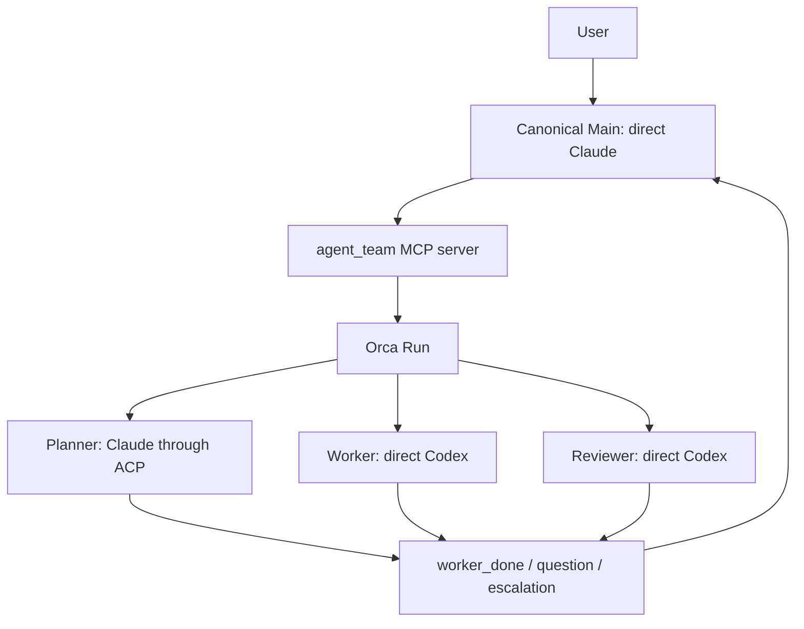

# アーキテクチャ

[English](architecture.md) · [README](../README_JA.md) ·
[設定リファレンス](configuration_JA.md)

## オーケストレーションはOrcaだけが担当する

`agent-team`は、オーケストレーションとAgent実行を分けています。Run、Task、
Dispatch、message、terminalはOrcaが管理します。launcherはrole別の起動引数と
private runtime stateを管理し、ACPの完了をOrcaの`worker_done`へ変換します。



HerdrやZellijは外側のterminalとして使えます。ただし、agent-teamの
オーケストレーションbackendではありません。2つのsystemが同じworkerを所有すると、
完了判定とcleanupの責任が曖昧になるためです。

repositoryにはtmuxのterminal driverと、そのdriverだけを検証する実機testもあります。
teamの起動やオーケストレーションにはまだ接続していません。このtestに通っても端末操作の
確認にとどまり、team全体のworkflowを証明するものではありません。

## componentごとに責務を限定する

| Component | 責務 |
|---|---|
| `config.toml` | 固定role、provider、transport、model、effort、prompt、permissionを宣言する。 |
| `agent_team/config_v4.py`, `topology.py` | 名前付きteam一覧を検証し、graphを描画する。起動可能な項目は、対応するversion-3起動設定を明示参照する。 |
| `agent_team/cli.py` | config/引数をparse・検証し、`WorkflowEngine(OrcaBackend)`を構成し、互換JSONを描画し、ACP turnを実行する。 |
| `agent_team/backend.py` | CLIの`start`/`status`/`attach`/`stop` adapter、state v3のidentity検証、互換receiptを担当する。 |
| `agent_team/orca.py` | 固定Orca argv/envelope decoderを担当する。MCP role操作は持たない。 |
| `agent_team/locking.py` | teamごとのstable lifecycle reservationを担当する。backendをimportせず、stateの書き込みとruntime操作で共有する。 |
| `agent_team/cleanup.py` | private stop journal、startup recovery sidecar、local cleanup/rollbackのexact phaseを担当する。 |
| `agent_team/mcp_server.py` | Main向けの7 toolを公開しrole操作をOrcaへ変換する。state loadからremote effect、save/rollbackまで共有lifecycle reservationを保持する。同じ`agent-team _mcp-server` entrypointから起動する。 |
| `agent_team/runtime.py` | identity、private file、state v3、command、environment、cleanupの安全helperを共有する。state writeは、callerがreservationを保持していない限り共有lockを取得する。 |
| `agent_team/registry.py` | 認識済みharnessと検証済みrole profileを記録し、別providerへのfallthroughを行わない。 |
| `agent_team/adapters.py` | provider非依存のbackground seam、出力制限付きprocess runner、exact identity検証、Copilot/OpenCode read-only adapterを提供する。Orca lifecycleの権限は持たない。 |
| `agent_team/acp_dependencies.py` | 選択したACPの依存関係だけを解決し、exact package manifestと、absoluteな実行ファイルpath・SHA-256 fingerprintを検証する。 |
| `agent_team/defaults/` | user configが選ばれていない場合に使うbundled configと日本語prompt。 |
| `prompts/*.md` | 日本語のrole contractを定義する。 |
| Orca | Run、Task、Dispatch、terminalのlifecycleを保存・管理する。 |
| Node.js、`acpx`、`claude-agent-acp` | 保存した実行ファイルbindingを通じて固定したClaude ACP adapterを実行し、最終本文とexit statusを返す。 |

Copilotのread-only Planner/Reviewerは、Orca共通lifecycleとstate v3のsnapshot統合を通して実行できます。
OpenCodeのprovider adapterも実装済みですが、profile固有の境界とlifecycleを実機で検証するまでは拒否します。
background profileはTUI terminalやACP sessionではなく、各turnで新しいread snapshotに固定provider commandを
実行します。snapshotからは`.git`、symlink、special file、gitignore対象、secret-like path、provider設定、
Agent instructionを除外します。

## canonical Mainはdirect Claudeで、ユーザーと対話するroleは1つだけ

canonical configのMainはdirect Claudeとして起動します。`agent_team` MCP serverを
利用できますが、Bash toolは持ちません。custom configではdirect Codex Mainも選べます。
その場合もMCP surfaceは同じですが、起動方法とpermissionはCodex用です。どちらの場合も、
ユーザーと対話するroleはMainだけです。

bundled defaultでは、MainとPlannerに`fable`、WorkerとReviewerに`gpt-6-astra`を使います。
role graphは、このlaunch configのmodel選択を変更しません。

MCP serverが公開するtoolは次の7つです。

- `role_get`
- `role_prompt`
- `role_wait`
- `role_read`
- `role_release`
- `delivery_ack`
- `message_reply`

このMCP経由では、任意commandや任意role名を指定できません。固定したsurfaceに
よって、Agentの出力とprocess controlの権限を分離します。

## direct roleはOrcaが監督するterminalで動く

現在のWorkerとReviewerはdirect Codexです。

1. MCP bridgeがOrca Taskを作ります。
2. launcher専用のCodex terminalを、隔離した`CODEX_HOME`で起動します。
3. TUIと設定済みmodel/effortがreadyになるまで待ちます。
4. `worker-start`がterminalとTaskを結び、Dispatchを作ります。
5. OrcaがTaskとlifecycle commandをAgentへ渡します。
6. roleが`worker_done`、`question`、`escalation`のいずれかを返します。

Codex roleは組み込みの`:workspace`か`:read-only`を継承します。追加で許可する
network endpointは、現在のOrca Unix socketだけです。agent-teamは外部domainを
許可しません。

## ACP roleはbare Dispatchとtrusted runnerで動く

現在のPlannerはClaude ACPです。acpxはOrcaが認識するTUIではないため、native agentに
見せかけず、bare terminalで実行します。

Orca Runを作る前のACP起動検査では、Node.js `22.13.0`以降と、exactな
`acpx@0.13.2`、`@agentclientprotocol/claude-agent-acp@0.70.0` packageが必要です。
選択したACP roleについてだけ`node`、`acpx`、`claude-agent-acp`を解決し、package manifestを
確認したうえで、absoluteなpathとSHA-256 fingerprintを保存します。role起動経路はOrca Taskを作る
前にbindingを再検証し、runnerもACP実行の前に再検証して、各session operationで同じfileを使います。
`npm`や`npx`は呼び出さず、directだけの起動ではACP依存関係を解決しません。

1. MCP bridgeがTaskとprivate prompt sidecarを作ります。
2. launcherが所有するbare terminalを作ります。
3. `orchestration dispatch`が`injected=false`でTaskとterminalを結びます。
4. assignmentをstateへ保存してから、trusted runner commandを送ります。
5. runnerがacpx sessionを作り、modelとeffortを選び、stdinからpromptを渡します。
   完了本文は`--format quiet`で受け取ります。
6. runnerが自分のacpx sessionをcloseし、exact commandでpruneします。
7. Agentの本文ではなくrunnerが、対応するOrca `worker_done`を1回だけ送ります。

Agent commandにはteam、role、nonceのmarkerを含めます。prune対象をそのcommandへ
限定するため、他のacpx sessionを削除しません。

## identityが一致したときだけlifecycleを進める

background roleは同時に1つしか動きません。active assignmentや未acknowledgeの
Deliveryがある場合、次のroleは起動できません。

```text
role_prompt
  -> role_wait
     -> worker_done: role_read -> role_release -> delivery_ack
     -> question: message_reply -> delivery_ack -> role_wait
     -> escalation: 証拠を保持してユーザー判断を待つ
```

`worker_done`は、Task、Dispatch、sender terminal、Runがactive assignmentと一致した
場合だけ受理します。`question`と`escalation`は完了ではありません。failed outcomeは
そのDispatchの終端ですが、作業成功ではありません。

## stateはprivateなlaunch snapshotとして保存する

launcherはversion 3のruntime stateを次へ保存します。

```text
$XDG_STATE_HOME/agent-team/<team-id>/state.json
```

既定のbaseは`~/.local/state/agent-team/`です。stateにはworkspace、config path、
Run、Main terminal、role spec、active assignmentを保存します。model、effort、
permission、instructionsは起動時に固定します。同じteamの実行中にconfigを変更しても、
ACP runnerが新しい値を読み直すことはありません。

ACP roleのspecには、解決した`node`、`acpx`、`claude-agent-acp`のabsolute pathとSHA-256
fingerprintも保存します。runnerはすべてのACP lifecycle operationでこのbindingを使って検証し、
fileの不足や変更があればfail-closedで停止します。

ACP prompt sidecarとstate fileは、現在のuserだけが読めるprivate fileです。stateは
atomicに書き込み、replace後にparent directoryをfsyncします。promptはsymlinkを辿らないfile descriptorから読みます。
Codexのruntime homeも同じteam directoryの下へ隔離します。
replace後のdurabilityが不明でもstateはpublish済みとして扱い、startup markerを残して管理操作で再試行します。

## 失敗時はfail-closedで後始末する

- role起動の取り消しで停止効果を確認できない場合は、assignmentとprivate資源を保持します。
  assignmentが揃う前の不確実な起動は、`pending_role_start`に取得済みの資源IDだけを記録します。
  `status`は`cleanup_pending`を表示し、次のrole起動とteam stateの削除を防ぎます。
  不明な停止結果の解決は自動化していません。再起動のために記録を削除しないでください。
- partial startでは、返却されたexact IDのresourceだけをstop/closeします。
- cleanup failureは元のfailureと一緒に報告します。
- CLIとMCPのstateful operationは、削除対象のstate root外にあるstableなteam別reservationを共有します。管理操作はそのlock下でstateを再読し、MCPはremote effectとsave/rollbackまでlockを保持します。
- worker-stopとterminal-closeはtypedなidentity/process-stop verdictを必須とします。worker-stopがagent terminalを閉じた場合は二重closeせず、PTY停止を確認できない場合はjournalとlocal resourceをrecovery用に保持します。
- `terminal_*`、`dispatch_not_found`、`run_not_found`、`task_not_found`のmethod-specific absence codeはread-only absenceとして正規化します。stopは該当stageをunknownとして保存し、不在をprocess成功とは扱いません。
- Main terminal作成前にdurableなstartup markerを置きます。create responseを失った場合はlocal preparationを保持し、no-tab closeの`ptyKilled=true` receiptをdurableに確認するまで次のstartを拒否します。
- startup recoveryでは、read-onlyなterminal showのstale/goneだけをprocess停止証拠とはみなしません。verifiedなclose receiptを保持するまでlocal homeを残します。
- CLIのruntime errorは固定分類と上限付きの既存`ERROR: <message>`本文を使い、Orcaのstderr/stdout、argv、ID、path、制御文字を表示しません。redactionと旧本文のgoldenはCLI互換テストで確認します。
- ACP subprocessは独立process groupで動かし、正常終了時もtimeout/output-limit時もdescendantを確認・reapしてから戻します。
- Orca lifecycleとbounded provider runnerはWindowsで即時に拒否します。現在のcontractはUnix socketと
  POSIX process groupを必要とします。
- Orca CLI名はplatformごとに固定します。macOSは`orca`、Linuxは`orca-ide`で、暗黙のPATH fallbackや
  環境変数overrideは行いません。
- ACP childへ渡す環境変数を限定します。ambient Claude loginに必要な`HOME`は残し、
  API keyとOrca control用の変数は渡しません。
- `stop`はprivate team rootを検証し、symlinkを辿らずに削除します。special fileや
  owner不一致がある場合は削除を拒否します。
- stop後もOrca Runは監査記録として残します。

CLIの起動・管理操作は`WorkflowEngine(OrcaBackend)`を使います。role操作はMCP server内の
Orca実装を使い、stateと排他制御のhelperを共有します。抽象backend contractのroleメソッドは、
このMCP経路を置き換える実装にはなっていません。

MCP経路では観測したDeliveryを記録し、結果の読み取り、所有するroleリソースの解放、
完了通知の受領確認という順序を強制します。質問は回答後に受領確認し、escalationは保留します。
操作が失敗した場合は未処理状態を保持します。CLIの設定確認や一覧表示ではOrca実装を
読み込まず、外部プロセスも起動しません。

`retained`が返った場合は割り当てを保持し、terminalを閉じません。launcherが作った
background terminalで`no_owned_resource`になる経路は、所有権を確認して解放する処理が
未接続です。この場合の後始末を成功とは扱いません。

role起動やreleaseの応答を受け取れなかった場合は、再試行前に記録されたDispatchとterminalを
確認してください。role操作には、crash後の自動再実行やexactly-onceの保証はありません。
SQLiteによる調整、schema移行、汎用のbackup/restoreは対象外です。調整はOrcaが担当し、
launcherは既存のprivateなversion-3 stateを使います。

## security上の限界を明示する

ACPは通信protocolであり、sandboxではありません。互換性probeでは、ACP clientを
read-only/deny-allにしても、Codex internal toolの書き込みを止められませんでした。
このためCodex ACPとworkspace-write ACPを拒否しています。書き込み可能なroleは、
provider native permissionを使うdirect Codexのままです。

Claude ACPは、API keyを渡さず、ambientな`claude.ai` Max loginで実turnを確認しました。
これは観測した認証経路の証拠であり、providerのsubscription billing ledgerを確認した
ものではありません。

## non-goalを決めてruntimeを小さく保つ

- Herdr fallback
- 任意role graphとbackground roleの並列実行
- configからの任意ACP server command登録
- provider/transportの自動fallback
- commit、push、publish、deployの自動実行
- 同じworkspaceで複数configを同時実行すること
