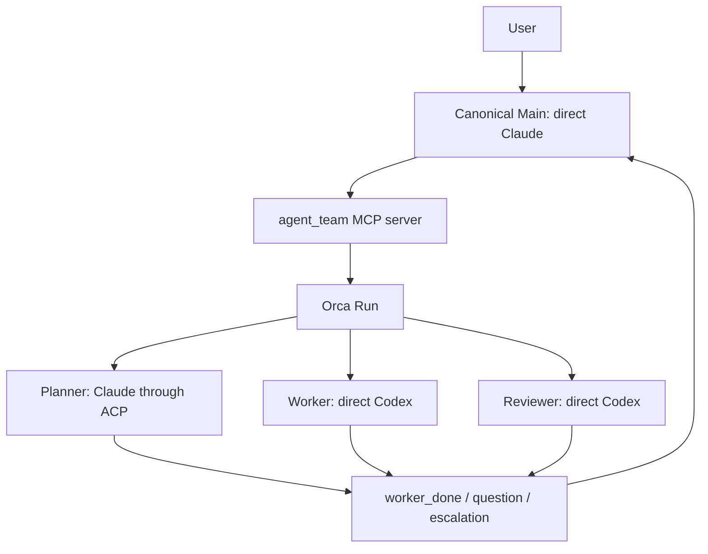

# アーキテクチャ

[English](architecture.md) · [README](../README_JA.md) ·
[設定リファレンス](configuration_JA.md)

## runtimeを明示的に選択する

`agent-team`はオーケストレーションとAgent実行を分け、version 3の`runtime`でbackendを
選択します。`runtime = "orca"`は既存の4 role固定のOrca contractを使います。
`runtime = "tmux"`は実験的なnative pathで、Mainを必須とし、verified Claude ACPの
read-only Planner/Reviewerだけを任意に追加できます。Workerとその他のnative profileは、
state、Task、Dispatch、processに影響する前に拒否します。

### Orca runtime

OrcaはRun、Task、Dispatch、message、terminalを管理します。launcherはrole別の起動引数と
private runtime stateを管理し、ACPの完了をOrcaの`worker_done`へ変換します。



### 実験的なnative tmux runtime

`TmuxBackend`はMain用のprivate tmux serverを1つ所有します。`native_main`は所有する
Mainのprocess groupを監督し、共有MCP framing layerは保存済みstateからOrcaまたはnative
backendを遅延選択します。native ACPのPlanner/Reviewerはlauncherが所有するbackground
processとして動き、完了を`publish_completion`で通知します。tmux paneの文字列はlifecycle
eventとして解釈しません。TTYへattachできるのはMainだけです。native pathでは、Orcaと
Codexがない環境、空白を含むworkspace path、削除済みconfigを使ったmodelなしの
start/status/stop smokeが成功しています。ただしnative/provider end-to-end turnの証明では
ありません。

HerdrとZellijは、現在のagent-team runtimeではありません。今後の方向には、これらに加えて
10 harness、native Worker、任意のrole graph、Mainなしの構成、TaskSpec/review/verification/
parallel workflowを含めていますが、このcheckoutでは未実装です。2つのsystemが同じworkerを
所有すると、完了判定とcleanupの責任が曖昧になります。

## componentごとに責務を限定する

| Component | 責務 |
|---|---|
| `config.toml` | 固定role、provider、transport、model、effort、prompt、permissionを宣言する。 |
| `agent_team/config_v4.py`, `topology.py` | 名前付きteam一覧を検証し、graphを描画する。起動可能な項目は、対応するversion-3起動設定を明示参照する。 |
| `agent_team/cli.py` | config/引数をparse・検証し、`WorkflowEngine(OrcaBackend)`または`WorkflowEngine(TmuxBackend)`を選択し、互換JSONを描画し、ACP turnを実行する。 |
| `agent_team/backend.py` | Orcaの`start`/`status`/`attach`/`stop` adapter、state v3のidentity検証、互換receiptを担当する。 |
| `agent_team/native_backend.py` | 実験的なtmuxの`start`/`status`/`attach`/`stop`、native ACP assignment、完了通知、cleanup確認を担当する。 |
| `agent_team/native_main.py` | 所有するnative Mainのprocess groupを監督し、終了receiptを保存する。 |
| `agent_team/orca.py` | 固定Orca argv/envelope decoderを担当する。MCP role操作は持たない。 |
| `agent_team/tmux.py` | nonceを付けたprivate tmux serverとMain paneの作成・検査を担当する。 |
| `agent_team/locking.py` | teamごとのstable lifecycle reservationを担当する。backendをimportせず、stateの書き込みとruntime操作で共有する。 |
| `agent_team/cleanup.py` | private stop journal、startup recovery sidecar、local cleanup/rollbackのexact phaseを担当する。 |
| `agent_team/mcp_protocol.py` | 共通MCP schema、JSON-RPC framing、backendに依存しない遅延serveを担当する。 |
| `agent_team/mcp_server.py`, `native_mcp.py` | Main向けの7 toolを選択したOrcaまたはnative backendへ変換し、共通のlifecycle reservationを維持する。 |
| `agent_team/runtime.py` | identity、private file、state v3、command、environment、cleanupの安全helperを共有する。state writeは、callerがreservationを保持していない限り共有lockを取得する。 |
| `agent_team/process_identity.py` | LinuxとmacOSでprocessのexact argvを読み、表示文字列に依存しないnative所有権検査を提供する。 |
| `agent_team/registry.py` | 認識済みharnessと検証済みrole profileを記録し、別providerへのfallthroughを行わない。 |
| `agent_team/adapters.py` | provider非依存のbackground seam、出力制限付きprocess runner、exact identity検証、Copilot/OpenCode read-only adapterを提供する。Orca lifecycleの権限は持たない。 |
| `agent_team/acp_dependencies.py` | 選択したACPの依存関係だけを解決し、exact package manifestと、absoluteな実行ファイルpath・SHA-256 fingerprintを検証する。 |
| `agent_team/defaults/` | user configが選ばれていない場合に使うbundled configと日本語prompt。 |
| `prompts/*.md` | 日本語のrole contractを定義する。 |
| Orca | Run、Task、Dispatch、terminalのlifecycleを保存・管理する。 |
| Node.js、`acpx`、`claude-agent-acp` | 保存した実行ファイルbindingを通じて固定したClaude ACP adapterを実行し、最終本文とexit statusを返す。 |

OrcaのCopilot read-only Planner/Reviewerは、Orca共通lifecycleとstate v3のsnapshot統合を通して実行できます。
OpenCodeのprovider adapterも実装済みですが、profile固有の境界とlifecycleを実機で検証するまでは拒否します。
native tmuxではこれらのprofileを有効にしません。direct ClaudeのMainと、任意のverified Claude ACP
read-only Planner/Reviewerだけを受け付けます。background profileはTUI terminalやACP sessionではなく、
各turnで新しいread snapshotに固定provider commandを実行します。snapshotからは`.git`、symlink、special
file、gitignore対象、secret-like path、provider設定、Agent instructionを除外します。

## canonical Mainはdirect Claudeで、ユーザーと対話するroleは1つだけ

canonical configのMainはdirect Claudeとして起動します。`agent_team` MCP serverを
利用できますが、Bash toolは持ちません。custom configではdirect Codex Mainも選べます。
その場合もMCP surfaceは同じですが、起動方法とpermissionはCodex用です。どちらの場合も、
ユーザーと対話するroleはMainだけです。

bundled defaultでは、MainとPlannerに`fable`、WorkerとReviewerに`gpt-6-astra`を使います。
role graphは、このlaunch configのmodel選択を変更しません。

MCP serverが公開するtoolは次の7つです。

- `role_get`
- `role_prompt`
- `role_wait`
- `role_read`
- `role_release`
- `delivery_ack`
- `message_reply`

このMCP経由では、任意commandや任意role名を指定できません。固定したsurfaceに
よって、Agentの出力とprocess controlの権限を分離します。

## Orcaのdirect roleはOrcaが監督するterminalで動く

`runtime = "orca"`では、WorkerとReviewerはdirect Codexです。

1. MCP bridgeがOrca Taskを作ります。
2. launcher専用のCodex terminalを、隔離した`CODEX_HOME`で起動します。
3. TUIと設定済みmodel/effortがreadyになるまで待ちます。
4. `worker-start`がterminalとTaskを結び、Dispatchを作ります。
5. OrcaがTaskとlifecycle commandをAgentへ渡します。
6. roleが`worker_done`、`question`、`escalation`のいずれかを返します。

Codex roleは組み込みの`:workspace`か`:read-only`を継承します。追加で許可する
network endpointは、現在のOrca Unix socketだけです。agent-teamは外部domainを
許可しません。

`runtime = "tmux"`では、direct ClaudeのMainをprivate tmux serverと`native_main`が
監督します。native tmuxにはdirect Workerやdirect Reviewerはありません。

## ACP roleはbare Dispatchとtrusted runnerで動く

`runtime = "orca"`では、canonical PlannerがClaude ACPで動きます。acpxはOrcaが認識する
TUIではないため、native agentに見せかけず、bare terminalで実行します。`runtime = "tmux"`
では、選択したPlannerまたはReviewerに同じtrusted runnerを使います。TTYやpaneの文字列を
完了判定には使いません。

ACP roleを起動する前に、Node.js `22.13.0`以降と、exactな`acpx@0.13.2`、
`@agentclientprotocol/claude-agent-acp@0.70.0` packageが必要です。選択したACP roleについてだけ
`node`、`acpx`、`claude-agent-acp`を解決し、package manifestを確認したうえで、absoluteなpathと
SHA-256 fingerprintを保存します。Orcaのrole起動経路はOrca Taskを作る前に、nativeのrole起動経路は
ACP runnerを起動する前にbindingを再検証します。runnerは各session operationで同じfileを使います。
`npm`や`npx`は呼び出さず、directだけの起動ではACP依存関係を解決しません。

Orcaの場合:

1. MCP bridgeがTaskとprivate prompt sidecarを作ります。
2. launcherが所有するbare terminalを作ります。
3. `orchestration dispatch`が`injected=false`でTaskとterminalを結びます。
4. assignmentをstateへ保存してから、trusted runner commandを送ります。
5. runnerがacpx sessionを作り、modelとeffortを選び、stdinからpromptを渡します。
   完了本文は`--format quiet`で受け取ります。
6. runnerが自分のacpx sessionをcloseし、exact commandでpruneします。
7. Agentの本文ではなくrunnerが、対応するOrca `worker_done`を1回だけ送ります。

nativeの場合、backendがassignmentを保存してからlauncher所有のACP runnerを起動します。
runnerは同じpinned ACP操作を行い、Run、Task、Dispatch、terminal、nonceが一致する
`publish_completion`を呼びます。`native_backend`はこの永続化された結果を共通の
`worker_done` eventへ変換します。tmux paneの文字列は完了証拠になりません。

Agent commandにはteam、role、nonceのmarkerを含めます。prune対象をそのcommandへ
限定するため、他のacpx sessionを削除しません。native cleanupではrunnerのexact argvと
private process groupも検証します。

## identityが一致したときだけlifecycleを進める

background roleは同時に1つしか動きません。active assignmentや未acknowledgeの
Deliveryがある場合、次のroleは起動できません。

```text
role_prompt
  -> role_wait
     -> worker_done: role_read -> role_release -> delivery_ack
     -> question: message_reply -> delivery_ack -> role_wait
     -> escalation: 証拠を保持してユーザー判断を待つ
```

`worker_done`は、Task、Dispatch、sender terminal、Runがactive assignmentと一致した
場合だけ受理します。`question`と`escalation`は完了ではありません。failed outcomeは
そのDispatchの終端ですが、作業成功ではありません。

native backendも`role_read` → `role_release` → `delivery_ack`の順序を使います。
`native.last_ack`はacknowledgeしたDeliveryのreceipt markerを1つ記録するだけです。
Taskの完了や、ユーザーのgoal全体の完了を示すものではありません。

## stateはprivateなlaunch snapshotとして保存する

launcherはversion 3のruntime stateを次へ保存します。

```text
$XDG_STATE_HOME/agent-team/<team-id>/state.json
```

既定のbaseは`~/.local/state/agent-team/`です。stateにはworkspace、config path、
Run、Main terminal、role spec、active assignmentを保存します。model、effort、
permission、instructionsは起動時に固定します。同じteamの実行中にconfigを変更しても、
ACP runnerが新しい値を読み直すことはありません。

ACP roleのspecには、解決した`node`、`acpx`、`claude-agent-acp`のabsolute pathとSHA-256
fingerprintも保存します。runnerはすべてのACP lifecycle operationでこのbindingを使って検証し、
fileの不足や変更があればfail-closedで停止します。

ACP prompt sidecarとstate fileは、現在のuserだけが読めるprivate fileです。stateは
atomicに書き込み、replace後にparent directoryをfsyncします。promptはsymlinkを辿らないfile descriptorから読みます。
Codexのruntime homeも同じteam directoryの下へ隔離します。
replace後のdurabilityが不明でもstateはpublish済みとして扱い、startup markerを残して管理操作で再試行します。

native stateにはnonce付きのtmux receiptと、監督対象のMain process receiptを保存します。
nativeの所有権検査はsaved executable、private process group、exact argvを比較します。
`process_identity.py`はLinuxとmacOSでこのargv検査を行います。ACP assignmentのrunner PID、
process group、argv、prompt sidecar、private cleanup rootは、`role_release`でcleanupを
確認するまで保持します。

## 失敗時はfail-closedで後始末する

- role起動の取り消しで停止効果を確認できない場合は、assignmentとprivate資源を保持します。
  assignmentが揃う前の不確実な起動は、`pending_role_start`に取得済みの資源IDだけを記録します。
  `status`は`cleanup_pending`を表示し、次のrole起動とteam stateの削除を防ぎます。
  不明な停止結果の解決は自動化していません。再起動のために記録を削除しないでください。
- partial startでは、返却されたexact IDのresourceだけをstop/closeします。
- cleanup failureは元のfailureと一緒に報告します。
- CLIとMCPのstateful operationは、削除対象のstate root外にあるstableなteam別reservationを共有します。管理操作はそのlock下でstateを再読し、MCPはremote effectとsave/rollbackまでlockを保持します。
- worker-stopとterminal-closeはtypedなidentity/process-stop verdictを必須とします。worker-stopがagent terminalを閉じた場合は二重closeせず、PTY停止を確認できない場合はjournalとlocal resourceをrecovery用に保持します。
- `terminal_*`、`dispatch_not_found`、`run_not_found`、`task_not_found`のmethod-specific absence codeはread-only absenceとして正規化します。stopは該当stageをunknownとして保存し、不在をprocess成功とは扱いません。
- Main terminal作成前にdurableなstartup markerを置きます。create responseを失った場合はlocal preparationを保持し、no-tab closeの`ptyKilled=true` receiptをdurableに確認するまで次のstartを拒否します。
- startup recoveryでは、read-onlyなterminal showのstale/goneだけをprocess停止証拠とはみなしません。verifiedなclose receiptを保持するまでlocal homeを残します。
- CLIのruntime errorは固定分類と上限付きの既存`ERROR: <message>`本文を使い、Orcaのstderr/stdout、argv、ID、path、制御文字を表示しません。redactionと旧本文のgoldenはCLI互換テストで確認します。
- ACP subprocessとnative Mainはprivateなprocess groupで動かし、正常終了、cancel、
  timeout/output-limit時にdescendantを確認・reapしてから戻します。
- Orcaとnative tmux runtimeはWindowsで即時に拒否します。contractはPOSIXのUnix socketまたは
  process groupを必要とします。
- Orca CLI名はplatformごとに固定します。macOSは`orca`、Linuxは`orca-ide`で、暗黙のPATH fallbackや
  環境変数overrideは行いません。
- ACP childへ渡す環境変数を限定します。ambient Claude loginに必要な`HOME`は残し、
  API keyとOrca control用の変数は渡しません。
- `stop`はprivate team rootを検証し、symlinkを辿らずに削除します。special fileや
  owner不一致がある場合は削除を拒否します。
- stop後もOrca Runは監査記録として残します。native tmuxは、所有するMainとACP resourceの
  終了を確認した後にlocal stateを削除します。

CLIの起動・管理操作は`runtime`で選択したbackendを`WorkflowEngine`へ渡します。Orcaのrole操作は
`mcp_server`、nativeのrole操作は`native_mcp`を通じて`native_backend`が処理します。両方の
pathがtyped contract、state、reservation helperを共有します。抽象backend contractのrole
methodは、別のuser-facing protocolではありません。

共通MCP protocolでは観測したDeliveryを記録し、結果の読み取り、所有するrole resourceの解放、
完了通知の受領確認という順序を強制します。質問は回答後に受領確認し、escalationは保留します。
操作が失敗した場合は未処理状態を保持します。MCPのframingとtool schemaはbackendを選択せずに
読み込めます。最初のstateful callで保存済みstateからOrcaまたはnative tmuxを選択します。
nativeの`status`、`attach`、`stop`は所有するtmux resourceを検査または操作します。

Orcaで`retained`が返った場合は割り当てを保持し、terminalを閉じません。launcherが作った
Orca background terminalで`no_owned_resource`になる経路は、所有権を確認して解放する処理が
未接続です。この場合の後始末を成功とは扱いません。nativeのreleaseは、ACP runnerの終了と
cleanup receiptの確認が済むまでassignmentを削除しません。

role起動やreleaseの応答を受け取れなかった場合は、再試行前に記録されたDispatchとterminalを
確認してください。role操作には、crash後の自動再実行やexactly-onceの保証はありません。
SQLiteによる調整、schema移行、汎用のbackup/restoreは対象外です。調整はOrcaが担当し、
launcherは既存のprivateなversion-3 stateを使います。

## security上の限界を明示する

ACPは通信protocolであり、sandboxではありません。互換性probeでは、ACP clientを
read-only/deny-allにしても、Codex internal toolの書き込みを止められませんでした。
このためCodex ACPとworkspace-write ACPを拒否しています。書き込み可能なroleは、
provider native permissionを使うdirect Codexのままです。

modelなしのnative tmux lifecycleは、OrcaとCodexがない環境、空白を含むworkspace path、
削除済みconfigで確認しました。2026-09-06には、実際のClaude Code 2.1.261を使い、
`fable`/`high`のMainからClaude ACP Plannerを呼び出すMCPの一巡と公開stopが成功しました。
所有プロセス、state、socket、prompt、一時directoryの残存がないことを独立に確認しています。
以前の2.1.112での拒否は`claude_code_version_too_old`であり、既に導入済みの2.1.261では
同じ`fable`が成功しました。確認できたのは読み取り専用の経路で、未実装の変更作成・レビューの
全工程ではありません。`claude.ai`の既存loginをAPI keyなしで利用しましたが、providerの
subscription billing ledgerは確認していません。

## 合意済み要件の未実装部分

以下は合意した範囲から除外した項目ではなく、残る実装要件です。Issue #8、#9、#11で追跡します。

- HerdrとZellijのruntime
- native Workerと必要なReviewerの実行経路
- 全10harnessで必要なprofileと実機証拠
- 任意role graph、Mainなしの実行、明示的な並列task
- TaskSpec、レビュー判定と回数制限、依存順序、レビューしたrevisionへの固定argv検証と完了判定

## 意図的な対象外

- configからの任意ACP server command登録
- provider/transportの自動fallback
- commit、push、publish、deployの自動実行
- 同じworkspaceで複数configを同時実行すること
