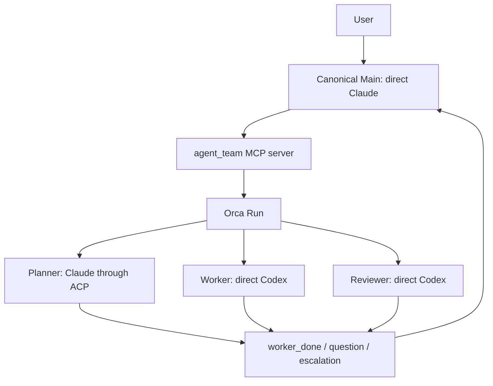

# アーキテクチャ

[English](architecture.md) · [README](../README_JA.md) ·
[設定リファレンス](configuration_JA.md)

## オーケストレーションはOrcaだけが担当する

`agent-team`は、オーケストレーションとAgent実行を分けています。Run、Task、
Dispatch、message、terminalはOrcaが管理します。launcherはrole別の起動引数と
private runtime stateを管理し、ACPの完了をOrcaの`worker_done`へ変換します。



HerdrやZellijは外側のterminalとして使えます。ただし、agent-teamの
オーケストレーションbackendではありません。2つのsystemが同じworkerを所有すると、
完了判定とcleanupの責任が曖昧になるためです。

## componentごとに責務を限定する

| Component | 責務 |
|---|---|
| `config.toml` | 固定role、provider、transport、model、effort、prompt、permissionを宣言する。 |
| `agent_team/cli.py` | config検証、Mainのstart/stop、state snapshot、ACP turnを担当する。 |
| `agent_team/mcp_server.py` | Main向けの7 toolを公開し、role操作をOrcaへ変換する。同じ`agent-team _mcp-server` entrypointから起動する。 |
| `agent_team/runtime.py` | identity、private file、state、command、environment、cleanupの安全helperを共有する。 |
| `agent_team/registry.py` | 認識済みharnessと検証済みrole profileを記録し、別providerへのfallthroughを行わない。 |
| `agent_team/adapters.py` | provider非依存のbackground seam、出力制限付きprocess runner、exact identity検証、Copilot/OpenCode read-only adapterを提供する。Orca lifecycleの権限は持たない。 |
| `agent_team/defaults/` | user configが選ばれていない場合に使うbundled configと日本語prompt。 |
| `prompts/*.md` | 日本語のrole contractを定義する。 |
| Orca | Run、Task、Dispatch、terminalのlifecycleを保存・管理する。 |
| acpx | 固定したClaude ACP adapterを実行し、最終本文とexit statusを返す。 |

Copilotのread-only Planner/Reviewerは、Orca共通lifecycleとstate v3のsnapshot統合を通して実行できます。
OpenCodeのprovider adapterも実装済みですが、profile固有の境界とlifecycleを実機で検証するまでは拒否します。
background profileはTUI terminalやACP sessionではなく、各turnで新しいread snapshotに固定provider commandを
実行します。snapshotからは`.git`、symlink、special file、gitignore対象、secret-like path、provider設定、
Agent instructionを除外します。

## canonical Mainはdirect Claudeで、ユーザーと対話するroleは1つだけ

canonical configのMainはdirect Claudeとして起動します。`agent_team` MCP serverを
利用できますが、Bash toolは持ちません。custom configではdirect Codex Mainも選べます。
その場合もMCP surfaceは同じですが、起動方法とpermissionはCodex用です。どちらの場合も、
ユーザーと対話するroleはMainだけです。

MCP serverが公開するtoolは次の7つです。

- `role_get`
- `role_prompt`
- `role_wait`
- `role_read`
- `role_release`
- `delivery_ack`
- `message_reply`

このMCP経由では、任意commandや任意role名を指定できません。固定したsurfaceに
よって、Agentの出力とprocess controlの権限を分離します。

## direct roleはOrcaが監督するterminalで動く

現在のWorkerとReviewerはdirect Codexです。

1. MCP bridgeがOrca Taskを作ります。
2. launcher専用のCodex terminalを、隔離した`CODEX_HOME`で起動します。
3. TUIと設定済みmodel/effortがreadyになるまで待ちます。
4. `worker-start`がterminalとTaskを結び、Dispatchを作ります。
5. OrcaがTaskとlifecycle commandをAgentへ渡します。
6. roleが`worker_done`、`question`、`escalation`のいずれかを返します。

Codex roleは組み込みの`:workspace`か`:read-only`を継承します。追加で許可する
network endpointは、現在のOrca Unix socketだけです。agent-teamは外部domainを
許可しません。

## ACP roleはbare Dispatchとtrusted runnerで動く

現在のPlannerはClaude ACPです。acpxはOrcaが認識するTUIではないため、native agentに
見せかけず、bare terminalで実行します。

1. MCP bridgeがTaskとprivate prompt sidecarを作ります。
2. launcherが所有するbare terminalを作ります。
3. `orchestration dispatch`が`injected=false`でTaskとterminalを結びます。
4. assignmentをstateへ保存してから、trusted runner commandを送ります。
5. runnerがacpx sessionを作り、modelとeffortを選び、stdinからpromptを渡します。
   完了本文は`--format quiet`で受け取ります。
6. runnerが自分のacpx sessionをcloseし、exact commandでpruneします。
7. Agentの本文ではなくrunnerが、対応するOrca `worker_done`を1回だけ送ります。

Agent commandにはteam、role、nonceのmarkerを含めます。prune対象をそのcommandへ
限定するため、他のacpx sessionを削除しません。

## identityが一致したときだけlifecycleを進める

background roleは同時に1つしか動きません。active assignmentや未acknowledgeの
Deliveryがある場合、次のroleは起動できません。

```text
role_prompt
  -> role_wait
     -> worker_done: role_read -> role_release -> delivery_ack
     -> question: message_reply -> delivery_ack -> role_wait
     -> escalation: 証拠を保持してユーザー判断を待つ
```

`worker_done`は、Task、Dispatch、sender terminal、Runがactive assignmentと一致した
場合だけ受理します。`question`と`escalation`は完了ではありません。failed outcomeは
そのDispatchの終端ですが、作業成功ではありません。

## stateはprivateなlaunch snapshotとして保存する

launcherはversion 3のruntime stateを次へ保存します。

```text
$XDG_STATE_HOME/agent-team/<team-id>/state.json
```

既定のbaseは`~/.local/state/agent-team/`です。stateにはworkspace、config path、
Run、Main terminal、role spec、active assignmentを保存します。model、effort、
permission、instructionsは起動時に固定します。同じteamの実行中にconfigを変更しても、
ACP runnerが新しい値を読み直すことはありません。

ACP prompt sidecarとstate fileは、現在のuserだけが読めるprivate fileです。stateは
atomicに書き込みます。promptはsymlinkを辿らないfile descriptorから読みます。
Codexのruntime homeも同じteam directoryの下へ隔離します。

## 失敗時はfail-closedで後始末する

- partial startでは、返却されたexact IDのresourceだけをstop/closeします。
- cleanup failureは元のfailureと一緒に報告します。
- ACP subprocessは独立process groupで動かし、timeout時に終了させます。
- ACP childへ渡す環境変数を限定します。ambient Claude loginに必要な`HOME`は残し、
  API keyとOrca control用の変数は渡しません。
- `stop`はprivate team rootを検証し、symlinkを辿らずに削除します。special fileや
  owner不一致がある場合は削除を拒否します。
- stop後もOrca Runは監査記録として残します。

## security上の限界を明示する

ACPは通信protocolであり、sandboxではありません。互換性probeでは、ACP clientを
read-only/deny-allにしても、Codex internal toolの書き込みを止められませんでした。
このためCodex ACPとworkspace-write ACPを拒否しています。書き込み可能なroleは、
provider native permissionを使うdirect Codexのままです。

Claude ACPは、API keyを渡さず、ambientな`claude.ai` Max loginで実turnを確認しました。
これは観測した認証経路の証拠であり、providerのsubscription billing ledgerを確認した
ものではありません。

## non-goalを決めてruntimeを小さく保つ

- Herdr fallback
- 任意role graphとbackground roleの並列実行
- configからの任意ACP server command登録
- provider/transportの自動fallback
- commit、push、publish、deployの自動実行
- 同じworkspaceで複数configを同時実行すること
