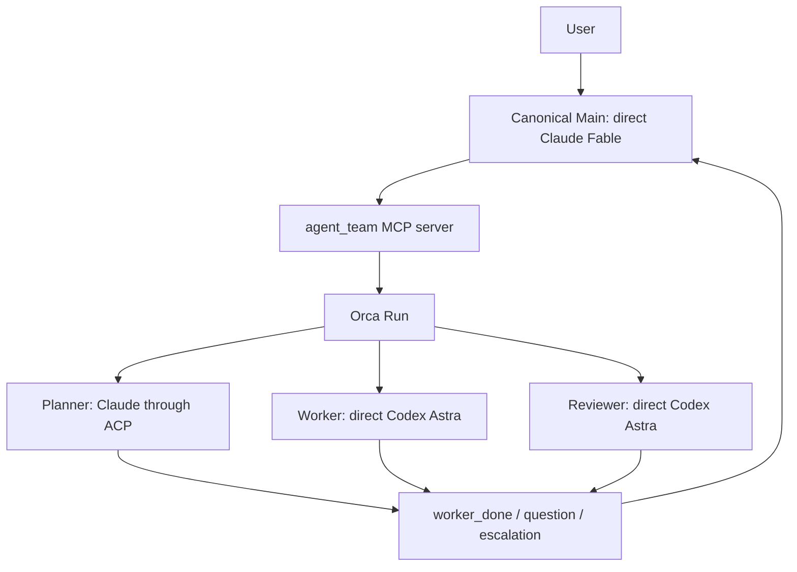

# アーキテクチャ

[English](architecture.md) · [README](../README_JA.md) ·
[設定リファレンス](configuration_JA.md)

## runtimeを明示的に選択する

`agent-team`はオーケストレーションとAgent実行を分け、version 3の`runtime`でbackendを
選択します。`runtime = "orca"`は既存の4 role固定のOrca contractを使います。
`runtime = "tmux"`は実験的なnative pathで、direct Claude Mainを必須とし、verified Claude ACPの
Planner、Worker、Reviewerを任意に追加できます。native Workerのassignmentにはconfigの
`[[tasks]]` catalogにあるTaskSpecとの完全一致が必要です。その他の未対応native profileは、
state、Task、Dispatch、processに影響する前に拒否します。

### Orca runtime

OrcaはRun、Task、Dispatch、message、terminalを管理します。launcherはrole別の起動引数と
private runtime stateを管理し、ACPの完了をOrcaの`worker_done`へ変換します。



### 実験的なnative tmux runtime

`TmuxBackend`はMain用のprivate tmux serverを1つ所有します。`native_main`は所有する
Mainのprocess groupを監督し、共有MCP framing layerは保存済みstateからOrcaまたはnative
backendを遅延選択します。native ACPのPlanner、Worker、Reviewerはlauncherが所有する
background processとして動き、完了を`publish_completion`で通知します。tmux paneの文字列は
lifecycle eventとして解釈しません。TTYへattachできるのはMainだけです。native pathでは、
OrcaとCodexがない環境、空白を含むworkspace path、削除済みconfigを使ったmodelなしの
start/status/stop smokeが成功しています。

HerdrとZellijは、現在のagent-team runtimeではありません。今後の実装課題には、任意role graph、
Mainなしの構成、明示的なparallel workflow、10 harnessの大半、native ACPのquestion処理が
残っています。これらの未実装部分を2つのsystemで分担すると、完了判定とcleanupの責任が曖昧になります。

## componentごとに責務を限定する

| Component | 責務 |
|---|---|
| `config.toml` | 固定role、provider、transport、model、effort、prompt、permission、nativeの`[[tasks]]`を宣言する。 |
| `agent_team/config_v4.py`, `topology.py` | 名前付きteam一覧を検証し、graphを描画する。起動可能な項目は、対応するversion-3起動設定を明示参照する。 |
| `agent_team/cli.py` | config/引数をparse・検証し、`WorkflowEngine(OrcaBackend)`または`WorkflowEngine(TmuxBackend)`を選択し、互換JSONを描画し、ACP turnを実行する。 |
| `agent_team/backend.py` | Orcaの`start`/`status`/`attach`/`stop` adapter、state v3のidentity検証、互換receiptを担当する。 |
| `agent_team/native_backend.py` | 実験的なtmuxの`start`/`status`/`attach`/`stop`、native ACP assignment、完了通知、cleanup確認を担当する。 |
| `agent_team/native_main.py` | 所有するnative Mainのprocess groupを監督し、終了receiptを保存する。 |
| `agent_team/orca.py` | 固定Orca argv/envelope decoderを担当する。MCP role操作は持たない。 |
| `agent_team/tmux.py` | nonceを付けたprivate tmux serverとMain paneの作成・検査を担当する。 |
| `agent_team/locking.py` | teamごとのstable lifecycle reservationを担当する。backendをimportせず、stateの書き込みとruntime操作で共有する。 |
| `agent_team/cleanup.py` | private stop journal、startup recovery sidecar、local cleanup/rollbackのexact phaseを担当する。 |
| `agent_team/mcp_protocol.py` | 共通MCP schema、JSON-RPC framing、backendに依存しない遅延serveを担当する。 |
| `agent_team/mcp_server.py`, `native_mcp.py` | Main向けの10 toolを選択したOrcaまたはnative backendへ変換し、共通のlifecycle reservationを維持する。native task toolはnative backendが処理し、Orcaはsilentにemulateしない。 |
| `agent_team/task_spec.py` | immutable TaskSpecのexact schemaとpath/verification fieldを検証する。 |
| `agent_team/task_execution.py` | TaskSpec digest、dependency admission、review decision、stage別round limitを保存する。 |
| `agent_team/task_verification.py` | approved workspace revisionでfixed argvを実行し、bounded evidenceを保存する。 |
| `agent_team/workspace_revision.py` | boundedなGit workspace revisionを作り、symlinkとspecial fileを拒否する。 |
| `agent_team/scoped_acp.py`, `claude_scoped_agent.mjs` | native Worker policyを作り、model tool callをTaskSpec scopeへ束縛する。 |
| `agent_team/scoped_acp_client.mjs` | native assignmentごとにpublic ACP SDK接続を1本作り、cleanupを確認する。 |
| `agent_team/native_acp_dependencies.py` | Node、Claude ACP 0.70.0、その依存のSDK 1.3.0をexact fingerprint付きで解決する。 |
| `agent_team/runtime.py` | identity、private file、state v3、command、environment、cleanupの安全helperを共有する。state writeは、callerがreservationを保持していない限り共有lockを取得する。 |
| `agent_team/process_identity.py` | LinuxとmacOSでprocessのexact argvを読み、表示文字列に依存しないnative所有権検査を提供する。 |
| `agent_team/registry.py` | 認識済みharnessと検証済みrole profileを記録し、別providerへのfallthroughを行わない。 |
| `agent_team/adapters.py` | provider非依存のbackground seam、出力制限付きprocess runner、exact identity検証、Copilot/OpenCode read-only adapterを提供する。Orca lifecycleの権限は持たない。 |
| `agent_team/acp_dependencies.py` | 選択したACPの依存関係だけを解決し、exact package manifestと、absoluteな実行ファイルpath・SHA-256 fingerprintを検証する。 |
| `agent_team/defaults/` | user configが選ばれていない場合に使うbundled configと日本語prompt。 |
| `prompts/*.md` | 日本語のrole contractを定義する。 |
| Orca | Run、Task、Dispatch、terminalのlifecycleを保存・管理する。 |
| Node.js、`acpx`、`claude-agent-acp` | 保存した実行ファイルbindingを通じて固定したOrca Claude ACP adapterを実行し、最終本文とexit statusを返す。 |

OrcaのCopilot read-only Planner/Reviewerは、Orca共通lifecycleとstate v3のsnapshot統合を通して実行できます。
OpenCodeのprovider adapterも実装済みですが、profile固有の境界とlifecycleを実機で検証するまでは拒否します。
native tmuxではこれらのprofileを有効にしません。direct ClaudeのMainと、任意のverified Claude ACP
read-only Planner/Reviewer、scoped workspace-write Workerだけを受け付けます。direct background
profileはTUI terminalやACP sessionではなく、各turnで新しいread snapshotに固定provider commandを
実行します。snapshotからは`.git`、symlink、special file、gitignore対象、secret-like path、provider設定、
Agent instructionを除外します。native Workerのscopeは宣言済みTaskSpecから作ります。

## canonical Mainはdirect Claudeで、ユーザーと対話するroleは1つだけ

canonical configのMainはdirect Claudeとして起動します。`agent_team` MCP serverを
利用できますが、Bash toolは持ちません。custom configではdirect Codex Mainも選べます。
その場合もMCP surfaceは同じですが、起動方法とpermissionはCodex用です。どちらの場合も、
ユーザーと対話するroleはMainだけです。native Mainのinstructionにはuserが宣言した
`[[tasks]]` catalogが含まれ、dispatch時にtask ID、scope、dependency、verification commandを
発明できません。

bundled defaultでは、MainとPlannerに`fable`、WorkerとReviewerに`gpt-6-astra`を使います。
role graphは、このlaunch configのmodel選択を変更しません。

MCP serverが公開するtoolは次の10個です。

- `task_get`
- `task_verify`
- `task_dispatch`
- `role_get`
- `role_prompt`
- `role_wait`
- `role_read`
- `role_release`
- `delivery_ack`
- `message_reply`

このMCP経由では、任意commandや任意role名を指定できません。nativeの`task_dispatch`は
configに宣言したTaskSpecとの完全一致だけを受け付けます。固定したsurfaceによって、Agentの
出力とprocess controlの権限を分離します。

## Orcaのdirect roleはOrcaが監督するterminalで動く

`runtime = "orca"`では、WorkerとReviewerはdirect Codexです。

1. MCP bridgeがOrca Taskを作ります。
2. launcher専用のCodex terminalを、隔離した`CODEX_HOME`で起動します。
3. TUIと設定済みmodel/effortがreadyになるまで待ちます。
4. `worker-start`がterminalとTaskを結び、Dispatchを作ります。
5. OrcaがTaskとlifecycle commandをAgentへ渡します。
6. roleが`worker_done`、`question`、`escalation`のいずれかを返します。

Codex roleは組み込みの`:workspace`か`:read-only`を継承します。追加で許可する
network endpointは、現在のOrca Unix socketだけです。agent-teamは外部domainを
許可しません。

`runtime = "tmux"`では、direct ClaudeのMainをprivate tmux serverと`native_main`が
監督します。nativeのWorkerとReviewerはClaude ACPのbackground assignmentであり、direct
Workerやdirect Reviewerではありません。

## ACP roleはbare Dispatchとtrusted runnerで動く

`runtime = "orca"`では、canonical PlannerがClaude ACPで動きます。acpxはOrcaが認識する
TUIではないため、native agentに見せかけず、bare terminalで実行します。`runtime = "tmux"`
では、選択したClaude ACPのPlanner、Worker、Reviewerにpublic SDK clientを使います。TTYや
paneの文字列を完了判定には使いません。

OrcaのACP roleを起動する前に、Node.js `22.13.0`以降と、exactな`acpx@0.13.2`、
`@agentclientprotocol/claude-agent-acp@0.70.0` packageが必要です。Orcaは選択したroleの
`node`、`acpx`、`claude-agent-acp`を解決し、package manifestを確認してabsoluteなpathと
SHA-256 fingerprintを保存します。Orcaのrole起動経路はOrca Taskを作る前にbindingを再検証します。

native tmuxは別bindingを使います。Node.js `22.13.0`以降、
`@agentclientprotocol/claude-agent-acp@0.70.0`、その依存の
`@agentclientprotocol/sdk@1.3.0`を解決し、Node、Claude ACP entryと`dist/lib.js`、SDKのpathとfingerprintを保存します。
nativeはacpxを選択せず、`npm`や`npx`をruntimeから呼びません。directだけの起動ではACP依存関係を
解決しません。

Orcaの場合:

1. MCP bridgeがTaskとprivate prompt sidecarを作ります。
2. launcherが所有するbare terminalを作ります。
3. `orchestration dispatch`が`injected=false`でTaskとterminalを結びます。
4. assignmentをstateへ保存してから、trusted runner commandを送ります。
5. runnerがacpx sessionを作り、modelとeffortを選び、stdinからpromptを渡します。
   完了本文は`--format quiet`で受け取ります。
6. runnerが自分のacpx sessionをcloseし、exact commandでpruneします。
7. Agentの本文ではなくrunnerが、対応するOrca `worker_done`を1回だけ送ります。

nativeの場合、private pipeで子プロセスを待機させ、backendがPID、専用process group、
正確なargvを検証してstateへ保存した後にだけACP runnerを実行します。起動時のrollbackで
process groupを停止するのは、所有権を確認できた場合だけです。不明なstateは保持します。
runnerは保存済みpublic SDK entryをimportし、assignmentごとに1本の接続を使います。

```text
initialize -> session/new -> model/effort設定 -> prompt -> session/close
-> connection closeとbounded child cleanup
```

その後、Run、Task、Dispatch、terminal、nonceが一致する`publish_completion`を呼びます。
`native_backend`はこの永続化された結果を共通の`worker_done` eventへ変換します。tmux paneの
文字列は完了証拠になりません。native SDK persistenceは`persistSession=false`、
`autoMemoryEnabled=false`に固定します。interactive Mainの通常Claude historyは通常のstoreに残ります。
これはpublic SDKへの直接接続であり、providerのdirect/model transportではありません。

Agent commandにはteam、role、nonceのmarkerを含めます。prune対象をそのcommandへ
限定するため、他のacpx sessionを削除しません。nativeにはacpx session storeがなく、cleanupでは
runnerのexact argvとprivate process groupを検証します。

## native TaskSpecとreview gateはdurableに保存する

native tmuxのuserは、version 3 configの`[[tasks]]` tableとしてcompleteなTaskSpecを宣言し、
各taskの固定検証を1つ以上の`[[tasks.verification]]` tableで記述します。fieldは`task_id`、
`objective`、`acceptance_criteria`、`allowed_paths`、`forbidden_paths`、`dependencies`、
`verification`、`evidence_requirements`、`consultation_conditions`です。

起動前にtask ID、exact field、宣言済みdependency、dependency cycleを検証し、stateやprovider
effectを作りません。catalogはnative Mainのstartup instructionに含めます。`task_dispatch`は
宣言済みTaskSpecとの完全一致だけを受け付け、task ID、path、dependency、evidence、verification
argvを追加・変更できません。`[[tasks]]`がないnative configでは、read-onlyの`role_prompt`は
使えますが、structured task dispatchは拒否します。Orcaは`tasks` fieldを拒否します。

通常のnative flowは次のとおりです。

```text
task_dispatch（PlannerまたはWorker）
  -> role_wait -> role_read -> role_release -> delivery_ack
  -> task_get
  -> task_dispatch（planまたはimplementation review）
  -> request_changes後はPlannerまたはWorkerへ戻る
  -> implementation approval後にtask_verify
```

Planner/Worker resultは`awaiting_plan_review`または`awaiting_implementation_review`になります。
Reviewerは`task_id`、`stage`、`revision`、`decision`、`findings`だけのexact JSONを返します。
`approve`はstageを進め、`request_changes`は元のwriterへ戻し、`consult`はuser判断を要求します。
planとimplementationのreview roundは別々に数え、どちらも`max_review_rounds`に従います。

implementation reviewはReviewer assignment準備時に取得したworkspace revisionへ束縛します。
`task_verify`はimplementation approval、active role/Deliveryなし、同じrevisionを要求します。
宣言済みargvを`shell=False`で実行し、commandの前後でrevisionを確認し、bounded errorとstdout/
stderr SHA-256 hashを保存します。全command成功とcleanup確認がそろった場合だけ`completed`になります。

## identityが一致したときだけlifecycleを進める

background roleは同時に1つしか動きません。active assignmentや未acknowledgeの
Deliveryがある場合、次のroleは起動できません。

```text
role_prompt
  -> role_wait
     -> worker_done: role_read -> role_release -> delivery_ack
     -> question: message_reply -> delivery_ack -> role_wait
     -> escalation: 証拠を保持してユーザー判断を待つ
```

`worker_done`は、Task、Dispatch、sender terminal、Runがactive assignmentと一致した
場合だけ受理します。`question`と`escalation`は完了ではありません。failed outcomeは
そのDispatchの終端ですが、作業成功ではありません。

native backendも`role_read` → `role_release` → `delivery_ack`の順序を使います。
`native.last_ack`はacknowledgeしたDeliveryのreceipt markerを1つ記録するだけです。
Taskの完了や、ユーザーのgoal全体の完了を示すものではありません。

## stateはprivateなlaunch snapshotとして保存する

launcherはversion 3のruntime stateを次へ保存します。

```text
$XDG_STATE_HOME/agent-team/<team-id>/state.json
```

既定のbaseは`~/.local/state/agent-team/`です。stateにはworkspace、config path、
Run、Main terminal、role spec、active assignmentを保存します。model、effort、
permission、instructionsは起動時に固定します。同じteamの実行中にconfigを変更しても、
ACP runnerが新しい値を読み直すことはありません。

OrcaのACP roleのspecには、解決した`node`、`acpx`、`claude-agent-acp`のabsolute pathとSHA-256
fingerprintを保存します。native ACP roleには`node`、Claude ACP entryとlibrary、SDKのpathとfingerprintを
保存します。各runnerは自分のbindingを検証し、fileの不足や変更があればfail-closedで停止します。

ACP prompt sidecarとstate fileは、現在のuserだけが読めるprivate fileです。stateは
atomicに書き込み、replace後にparent directoryをfsyncします。promptはsymlinkを辿らないfile descriptorから読みます。
Codexのruntime homeも同じteam directoryの下へ隔離します。
replace後のdurabilityが不明でもstateはpublish済みとして扱い、startup markerを残して管理操作で再試行します。

native stateにはnonce付きのtmux receiptと、監督対象のMain process receiptを保存します。
nativeの所有権検査はsaved executable、private process group、exact argvを比較します。
`process_identity.py`はLinuxとmacOSでこのargv検査を行います。ACP assignmentのrunner PID、
process group、argv、prompt sidecar、TaskSpec scope、private cleanup rootは、`role_release`で
cleanupを確認するまで保持します。

## 失敗時はfail-closedで後始末する

- role起動の取り消しで停止効果を確認できない場合は、assignmentとprivate資源を保持します。
  assignmentが揃う前の不確実な起動は、`pending_role_start`に取得済みの資源IDだけを記録します。
  `status`は`cleanup_pending`を表示し、次のrole起動とteam stateの削除を防ぎます。
  不明な停止結果の解決は自動化していません。再起動のために記録を削除しないでください。
- partial startでは、返却されたexact IDのresourceだけをstop/closeします。
- cleanup failureは元のfailureと一緒に報告します。
- CLIとMCPのstateful operationは、削除対象のstate root外にあるstableなteam別reservationを共有します。管理操作はそのlock下でstateを再読し、MCPはremote effectとsave/rollbackまでlockを保持します。
- worker-stopとterminal-closeはtypedなidentity/process-stop verdictを必須とします。worker-stopがagent terminalを閉じた場合は二重closeせず、PTY停止を確認できない場合はjournalとlocal resourceをrecovery用に保持します。
- `terminal_*`、`dispatch_not_found`、`run_not_found`、`task_not_found`のmethod-specific absence codeはread-only absenceとして正規化します。stopは該当stageをunknownとして保存し、不在をprocess成功とは扱いません。
- Main terminal作成前にdurableなstartup markerを置きます。create responseを失った場合はlocal preparationを保持し、no-tab closeの`ptyKilled=true` receiptをdurableに確認するまで次のstartを拒否します。
- startup recoveryでは、read-onlyなterminal showのstale/goneだけをprocess停止証拠とはみなしません。verifiedなclose receiptを保持するまでlocal homeを残します。
- CLIのruntime errorは固定分類と上限付きの既存`ERROR: <message>`本文を使い、Orcaのstderr/stdout、argv、ID、path、制御文字を表示しません。redactionと旧本文のgoldenはCLI互換テストで確認します。
- ACP subprocessとnative Mainはprivateなprocess groupで動かし、正常終了、cancel、
  timeout/output-limit時にdescendantを確認・reapしてから戻します。
- native WorkerのRead/Glob/Grepは、保護pathやlink・file typeの検査を除き、workspace内を
  読めます。TaskSpecの`allowed_paths`と`forbidden_paths`はWrite/Editだけを制限し、書き込みでは
  禁止pathを優先します。Bash、terminal、その他のRPCは拒否します。
  これはin-bandのtool境界であり、同じuserのhostile processによる同時file差し替えは防ぎません。
- workspace revisionはsymlinkとspecial fileを拒否し、5,000 file、1 file 10 MB、合計100 MBに
  制限します。任意repository全体のcoverageは主張しません。
- Orcaとnative tmux runtimeはWindowsで即時に拒否します。contractはPOSIXのUnix socketまたは
  process groupを必要とします。
- Orca CLI名はplatformごとに固定します。macOSは`orca`、Linuxは`orca-ide`で、暗黙のPATH fallbackや
  環境変数overrideは行いません。
- ACP childへ渡す環境変数を限定します。ambient Claude loginに必要な`HOME`は残し、
  API keyとOrca control用の変数は渡しません。
- `stop`はprivate team rootを検証し、symlinkを辿らずに削除します。special fileや
  owner不一致がある場合は削除を拒否します。
- stop後もOrca Runは監査記録として残します。native tmuxは、所有するMainとACP resourceの
  終了を確認した後にlocal stateを削除します。
- verificationが中断またはcleanup不確認の場合は、Taskを`verifying`または`verification_failed`
  にevidenceとともに残します。saved evidenceに従ってnew role、verification、stopをblockし、
  自動recoveryは主張しません。実行済みcommandの証拠とcleanupを確認できた`verification_failed` taskは、
  implementationのreview round上限内でWorkerへ戻せます。

CLIの起動・管理操作は`runtime`で選択したbackendを`WorkflowEngine`へ渡します。Orcaのrole操作は
`mcp_server`、nativeのrole操作は`native_mcp`を通じて`native_backend`が処理します。両方の
pathがtyped contract、state、reservation helperを共有します。抽象backend contractのrole
methodは、別のuser-facing protocolではありません。

共通MCP protocolでは観測したDeliveryを記録し、結果の読み取り、所有するrole resourceの解放、
完了通知の受領確認という順序を強制します。質問は回答後に受領確認し、escalationは保留します。
操作が失敗した場合は未処理状態を保持します。MCPのframingとtool schemaはbackendを選択せずに
読み込めます。最初のstateful callで保存済みstateからOrcaまたはnative tmuxを選択します。
nativeの`status`、`attach`、`stop`は所有するtmux resourceを検査または操作します。

Orcaで`retained`が返った場合は割り当てを保持し、terminalを閉じません。launcherが作った
Orca background terminalで`no_owned_resource`になる経路は、所有権を確認して解放する処理が
未接続です。この場合の後始末を成功とは扱いません。nativeのreleaseは、ACP runnerの終了と
cleanup receiptの確認が済むまでassignmentを削除しません。

role起動やreleaseの応答を受け取れなかった場合は、再試行前に記録されたDispatchとterminalを
確認してください。role操作には、crash後の自動再実行やexactly-onceの保証はありません。
SQLiteによる調整、schema移行、汎用のbackup/restoreは対象外です。調整はOrcaが担当し、
launcherは既存のprivateなversion-3 stateを使います。

## security上の限界を明示する

ACPは通信protocolであり、sandboxではありません。native Workerはpublic SDK tool callの周囲に
in-bandのpolicyを置きます。Read/Glob/Grepは保護pathやlink・file typeの検査を除き
workspace内を読め、TaskSpecのpath一覧では制限しません。Write/Editは`allowed_paths`内に
限定し、書き込みでは`forbidden_paths`を優先します。Bash、terminal、その他のRPCは拒否しますが、
同じuserのhostile processによる同時file差し替えをkernel levelで防ぐものではありません。
Orcaのworkspace-writeはprovider native permissionを使うdirect Codexであり、nativeの書き込みは
scoped Workerに限定します。

modelなしのnative tmux lifecycleは、OrcaとCodexがない環境、空白を含むworkspace path、
削除済みconfigで確認しました。2026-09-07には、Python 3.13.15のwheel-only環境で、実際の
Claude Code 2.1.261を使い、`fable`/`high`のMainからnative Claude ACP Planner/Worker/Reviewerを
6 assignment呼び出しました。意図的な`a-b`実装は差し戻され、`a+b`が同じrevisionで承認され、
trusted fixed-argv verificationも成功しました。元のconfigとpromptを削除した後のpublic stopで、
所有processとartifactは0件でした。約282秒の再試験は、起動時catalog、PID/PGID/argvの
gate、4 fileの依存bindingを含む実装で行いました。専用npm環境には選択したClaude ACPと
その依存だけを導入しました。別のactive cancel probeでは同じ最終runtimeのWorkerを
1.306秒で停止し、所有processとartifactは0件でした。live SDK probeではallowed pathの編集と
forbidden pathの拒否を確認し、SDK persistenceとauto-memoryを無効にしました。
以前の2.1.112での拒否は`claude_code_version_too_old`であり、既に導入済みの2.1.261では
同じ`fable`が成功しました。`claude.ai`の既存loginをAPI keyなしで利用しましたが、providerの
subscription billing ledgerは確認していません。

## 合意済み要件の未実装部分

以下は合意した範囲から除外した項目ではなく、残る実装要件です。Issue #8、#9、#11で追跡します。

- HerdrとZellijのruntime
- 全10harnessで必要なprofileと実機証拠
- 任意role graph、Mainなしの実行、明示的な並列task
- native ACPのquestion/answer path
- crashやcleanup不明後の自動recovery

## 意図的な対象外

- configからの任意ACP server command登録
- provider/transportの自動fallback
- commit、push、publish、deployの自動実行
- 同じworkspaceで複数configを同時実行すること
